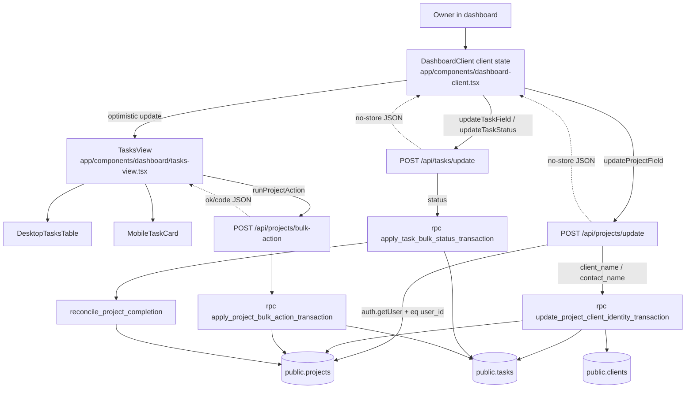
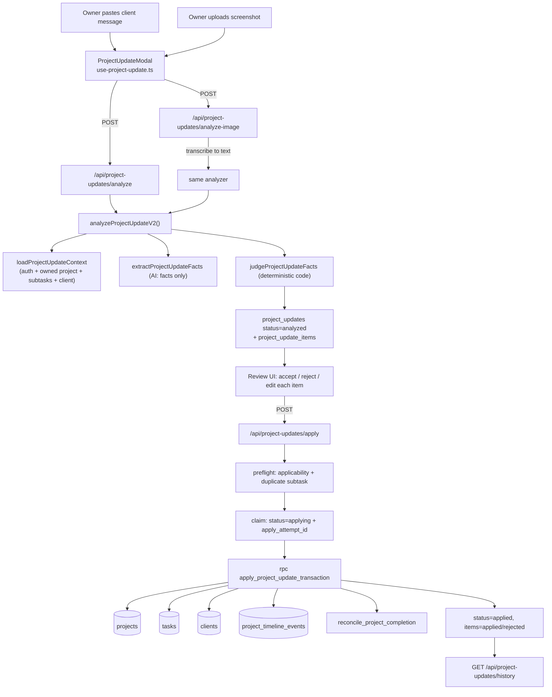
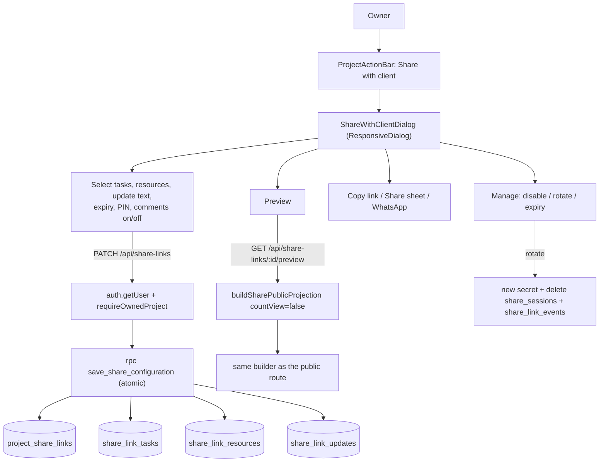
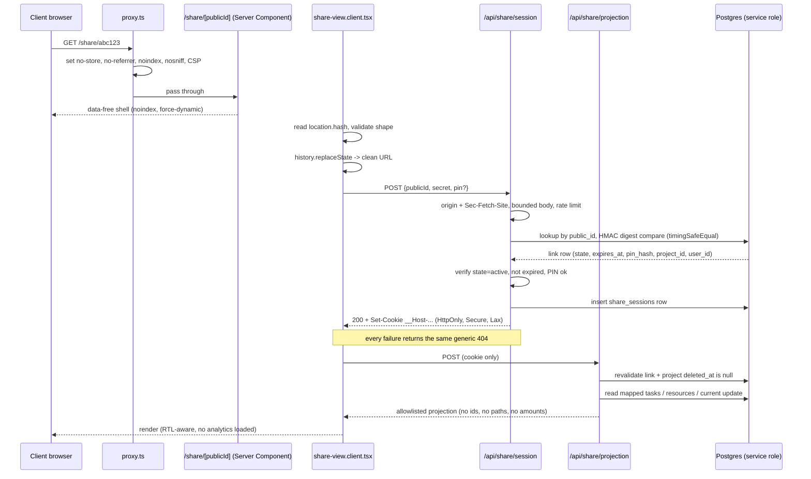
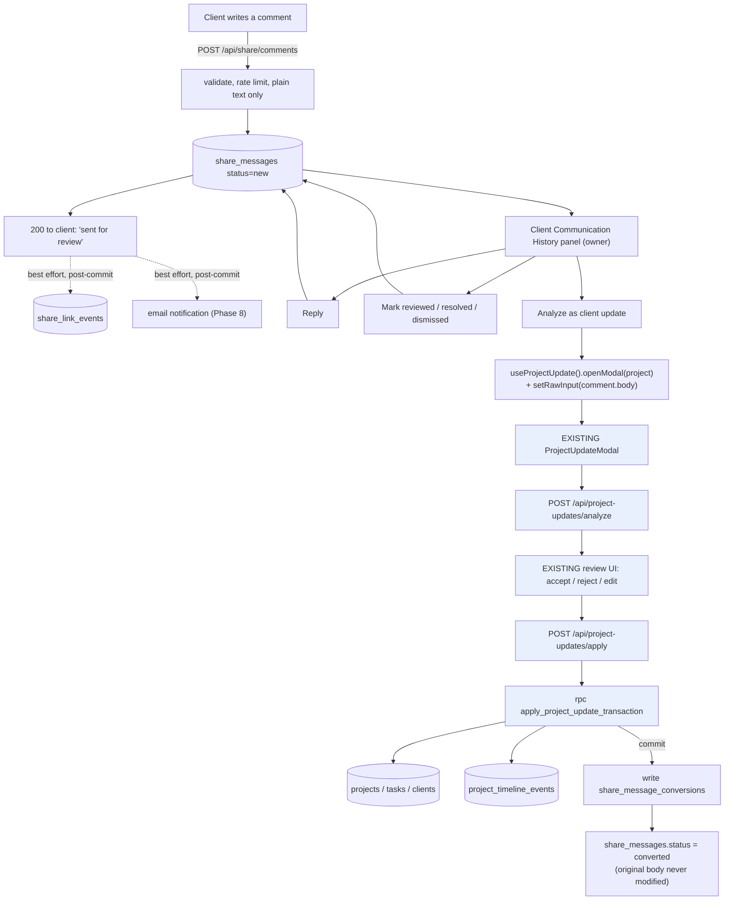

# Text2Task — Client Share Link / Client Project View: Phase 0 Repository Mapping

## 1. Title and status

| Field | Value |
|---|---|
| Document | Client Share Link / Client Project View — Phase 0 architecture, security, data-flow and integration mapping |
| Date | 2026-08-03 |
| Repository | `c:\Users\Home\projects\inboxshaper` |
| Branch | `main` (tracking `origin/main`) |
| HEAD at mapping time | `93d6a83` — "Correct internal linking report counts" |
| Status | **Mapping only. No application code, migration, configuration, or `AGENTS.md` was created or modified. The only file this task created is this report.** |
| Source-of-truth product document | `C:\Users\Home\Downloads\Text2Task\פיצ'רים\Text2Task_CLIENT_SHARE_LINK_FULL_HANDOFF_2026-07-28_v2.docx` — **successfully extracted and read in full** (54,500 characters, 807 lines, including Addendum A of 28 July 2026). Note: the document is **not** in the repository; it was located on the user's filesystem. A superseded 26 June 2026 version exists alongside it (`Text2Task_CLIENT_SHARE_LINK_FULL_HANDOFF_2026-06-26.docx`) and was not used. |
| Phase 1 readiness verdict | **READY WITH REQUIRED PRE-PHASE-1 DECISIONS** (see §26) |

### Evidence labelling convention used throughout

Every material claim in this report carries one of four labels:

- **[FACT]** — Verified repository fact, with an exact file path (and line/object name where it matters). Read directly from the working tree at `93d6a83`.
- **[HANDOFF]** — Product requirement stated in the 28 July 2026 handoff document. Not a repository fact.
- **[REC]** — Recommendation by this mapping. Not implemented, not agreed, not a fact.
- **[UNKNOWN]** — Could not be determined from the repository and requires manual validation (usually because the object lives only in the untracked Supabase base schema, in a third-party dashboard, or in production configuration).

---

## 2. Executive summary

**The feature is buildable on this repository without duplicating any existing system, and the repository already contains an unusually strong, directly reusable precedent for almost every hard part of it.** That precedent is the **Homepage Demo** subsystem (`lib/homepage-demo/**`, `app/api/homepage-demo/**`, `app/homepage-demo/review/**`): a production anonymous-access feature that already implements 256-bit opaque tokens, domain-separated SHA-256 token digests, HMAC-keyed privacy-preserving network identifiers, `__Host-` prefixed HttpOnly cookies, strict origin/`Sec-Fetch-Site` validation, bounded request bodies, per-scope rate-limit buckets, Turnstile challenge verification, service-role-only default-deny tables, no-store security headers, and — critically — **a public page that renders an empty shell and then reads a 43-character secret from the URL fragment, exchanges it over a POST endpoint, and strips the fragment from the visible URL** (`app/homepage-demo/review/HomepageDemoReviewClient.tsx:506-526`, `:483`). The handoff's proposed `/share/<public-id>#<secret>` design is therefore **not novel to this codebase — it is a variation on a pattern already shipped and running in production here.** That is the single most important finding of this mapping.

Six findings materially change the handoff's plan:

1. **There is no email infrastructure.** [FACT] No Resend, Nodemailer, SendGrid, Postmark, or Mailgun dependency exists in `package.json`; the only outbound email in the codebase is Supabase Auth's own confirmation resend (`app/api/auth/resend-confirmation/route.ts:77`). The handoff's §15.2 assumption of "the existing Resend setup" is **false against this repository**. Email notification for client comments is net-new infrastructure and should be deferred out of Phase 1.
2. **There is no RTL support anywhere.** [FACT] `app/layout.tsx` renders `<html lang="en">` with no `dir` attribute, and a repo-wide search for `dir=`, `direction: rtl`, `he-IL`, or any RTL logical-property usage returns nothing but `flex-direction: column` matches. Addendum A.2's "RTL-capable in V1" requirement is a **from-scratch build** on the public page, not a reuse.
3. **Analytics scripts are mounted in the root layout and would load on `/share/**` by default.** [FACT] `app/layout.tsx` renders `<GoogleAdsTag/>`, `<MicrosoftClarity/>`, `<AttributionCapture/>`, and `<ConsentAwareVercelAnalytics/>` for every route. Exclusion is centralised in a single function, `shouldSkipAnalyticsPath` in `lib/analytics/analytics-paths.ts`, which today only excludes `/admin*` and `/homepage-demo/review`. Adding `/share` there is a one-line change but is **mandatory and must be in Phase 1**, because Microsoft Clarity records `document.location.href` (which includes the fragment) and session-replays DOM content.
4. **The base schema is not in the repository.** [FACT] `supabase/migrations/` contains 24 tracked SQL migrations, and **none of them creates `projects`, `tasks`, `clients`, `users`, or `task_resources`**, nor the `task-resources` storage bucket or its storage policies. Those objects exist only in the untracked Supabase base schema. Every claim about their columns in this report is inferred from application queries, and every claim about their RLS/storage policies is **[UNKNOWN]** and must be verified in the Supabase dashboard before Phase 1 design is locked.
5. **The repository has never granted anything to the `anon` Postgres role for private data, and should not start.** [FACT] A survey of all `grant`/`revoke` statements across `supabase/migrations/*.sql` shows exactly one public-facing RLS policy in the entire schema — `"Public can view approved customer stories"` in `202605280002_customer_stories.sql:127` — and every other anonymous surface (the entire Homepage Demo) uses **RLS-enabled tables with no policies at all plus `grant … to service_role` only** (canonical example: `202606270003_homepage_demo_privilege_hardening.sql`). The share feature must follow the Homepage Demo pattern, not the customer-stories pattern.
6. **Project actions are duplicated across a desktop table and a mobile card that do not share an action component.** [FACT] `app/components/dashboard/tasks/desktop-tasks-table.tsx` renders Resources / Update / History / Archive / Restore / Delete; `app/components/dashboard/tasks/mobile-task-card.tsx` renders Resources / Update / History only, with its own separately-authored buttons and styles. Adding "Share with client" to only one of them would ship a broken mobile experience — and mobile is the primary channel the handoff targets.

**No blocker was found that prevents Phase 1 from starting.** Three decisions must be made first (§25): the storage-bucket and base-schema RLS verification, the share-secret HMAC key-management decision, and whether the public page ships as a separate route-group layout (required, because it must not reuse the dashboard shell and must not inherit the root layout's analytics).

Critical/High risk count: **6 Critical, 9 High** (§23).

---

## 3. Scope and non-actions

### 3.1 What this task did

- Located and fully extracted the handoff `.docx` (via `unzip` + a Node XML-to-text conversion run inside the session scratchpad, **not** inside the repository).
- Read the actual repository at `93d6a83`: 572 tracked non-`public/` files, 24 SQL migrations, 57 API route files, 199 component files, and the full `lib/` tree.
- Produced this one Markdown report.

### 3.2 Explicit non-actions (all verified in §30)

| Rule | Status |
|---|---|
| Did not implement the feature | Confirmed |
| Did not edit production code | Confirmed |
| Did not edit migrations | Confirmed |
| Did not edit configuration files | Confirmed |
| Did not edit `AGENTS.md` | Confirmed — and note `AGENTS.md` **does not exist** in this repository (nor does `CLAUDE.md`); see §27 |
| Did not install or update dependencies | Confirmed |
| Did not run database migrations | Confirmed |
| Did not access or modify production data | Confirmed |
| Did not run a full build | Confirmed |
| Did not run broad test suites | Confirmed — no `vitest` invocation of any kind |
| Did not commit, stage, reset, restore, clean, or discard | Confirmed |
| Preserved all pre-existing working-tree changes | Confirmed — see §4, the tree was already clean |
| Only filesystem change is this report | Confirmed |

### 3.3 Deviation from the task brief

The task brief stated the handoff document "should be somewhere in the repo" and supplied a working-tree snapshot listing modified/untracked Work Calendar files. **Neither was accurate at execution time.** The `.docx` was not in the repository (found under `C:\Users\Home\Downloads\Text2Task\פיצ'רים\`), and the working tree was already clean at a later HEAD than the snapshot's. Both are documented rather than worked around. Reading a file outside the repository was necessary to satisfy the brief's primary instruction (read the handoff) and was strictly read-only; the extraction artefacts were written to the session scratchpad, never to the repository.

---

## 4. Repository state before mapping

Commands run **before** any repository inspection:

```
$ git status --short
(no output — working tree clean)

$ git status -sb
## main...origin/main

$ git log --oneline -5
93d6a83 Correct internal linking report counts
df4f413 Strengthen internal links to priority SEO pages
efdf9da Clarify analytics visitor metrics
049c331 Document authenticated activity production rollout
401166b Clarify authenticated operational activity privacy
```

| Item | Value |
|---|---|
| Branch | `main`, tracking `origin/main`, no ahead/behind divergence reported |
| HEAD | `93d6a8374dff1c53735b6962826a0fd1d14144e8` |
| Pre-existing **modified** files | **None** |
| Pre-existing **staged** files | **None** |
| Pre-existing **untracked** files | **None** |
| Working tree | **Clean** |
| Files at risk from this task | **None** |

> **Discrepancy note.** The task brief's environment snapshot described six modified Work Calendar files (`calendar-agenda-item.tsx`, `selected-day-agenda*.tsx`, `work-calendar-client*.tsx`, `app/dashboard/calendar/page.test.tsx`), four untracked files, and HEAD at `6ac9166` ("Add manual calendar event form infrastructure"). **None of that is true of the tree as found.** `6ac9166` is not in `git log`'s recent history from `93d6a83`; the Work Calendar work described has evidently been committed, rebased, or the snapshot was taken from a different checkout. The three untracked files named in the snapshot (`app/components/dashboard/calendar/calendar-agenda-item.test.tsx`, `lib/calendar/load-calendar-options.client.ts`, `lib/calendar/load-calendar-options.client.test.ts`) **are all present and tracked** in the current tree, and `docs/TEXT2TASK_WORK_CALENDAR_PHASE_D_IMPLEMENTATION_REPORT.md` is present and tracked. The tree was clean before this task and (aside from this report) is clean after it. No pre-existing change could have been disturbed, because none existed.

---

## 5. Current architecture

### 5.1 Framework, language, tooling — all [FACT]

| Item | Value | Evidence |
|---|---|---|
| Framework | Next.js **16.1.6**, App Router | `package.json` |
| React | **19.2.3** | `package.json` |
| TypeScript | `^5`, `"strict": true`, `moduleResolution: "bundler"`, path alias `@/* → ./*` | `tsconfig.json` |
| Validation | **Zod `^4.3.6`** — the only validation library; used across API routes and shared contracts | `package.json`; e.g. `app/api/task-resources/route.ts:5-41`, `lib/activity/product-event-contracts.ts` |
| Supabase | `@supabase/ssr ^0.9.0`, `@supabase/supabase-js ^2.99.1` | `package.json` |
| Styling | Tailwind v4 via `@tailwindcss/postcss`, **plus** very heavy inline `CSSProperties` objects and injected `<style>` blocks throughout dashboard components | `postcss.config.mjs`; e.g. `app/components/dashboard/tasks-view.tsx:823-878` |
| Animation | `framer-motion ^12.38.0` | `package.json` |
| Toasts | `sonner ^2.0.7`, single `<Toaster>` in root layout | `app/layout.tsx` |
| Charts | `recharts ^3.8.0` (admin analytics only) | `package.json` |
| AI | `openai ^6.34.0` | `package.json`, `lib/openai.ts` |
| Queue libs present but **unused by product code** | `bullmq ^5.71.0`, `ioredis ^5.10.0` | `package.json` — no import of either found anywhere in `app/` or `lib/`. **[UNKNOWN]** whether these are vestigial or reserved. There is **no working background-job/outbox runner in the repository.** |
| Tests | **Vitest `^4.1.10`**, `@testing-library/react ^16.3.2`, `jsdom ^29.1.1` | `package.json`, `vitest.config.ts` |
| Build/scripts | `dev`/`build`/`start`/`lint`/`test` only. **No typecheck script, no CI config in-repo.** | `package.json` |
| `next.config.ts` | Contains **only** an `images.remotePatterns` entry for `logo.clearbit.com`. **No headers(), no redirects(), no rewrites(), no CSP.** | `next.config.ts` |

### 5.2 Route/middleware architecture — [FACT]

- **There is no `middleware.ts`.** Next.js 16 renames it: this repository uses **`proxy.ts`** at the repo root, exporting `export async function proxy(request: NextRequest)`.
- Its matcher is `["/((?!_next/static|_next/image|favicon.ico).*)"]` — i.e. **it runs on essentially every request, including any future `/share/**` route and every `/api/**` route.**
- Behaviour, in order (`proxy.ts`):
  1. `/api/homepage-demo/review` → `NextResponse.next()` immediately, **bypassing the Supabase auth call entirely**. This is the existing precedent for exempting an anonymous endpoint from the auth round-trip.
  2. `/homepage-demo/review` → `NextResponse.next()` with six security headers set: `Cache-Control: no-store, no-cache, max-age=0, must-revalidate`, `Pragma: no-cache`, `Expires: 0`, `X-Content-Type-Options: nosniff`, `Referrer-Policy: no-referrer`, `X-Robots-Tag: noindex, nofollow, noarchive` (`proxy.ts:9-16`). **This is the exact header set the handoff §17.2 requires, already implemented, on a public page.**
  3. Backslash/`%5C` path cleanup → 308 redirect.
  4. `/image` → 308 redirect to `/`.
  5. Otherwise: constructs a `createServerClient` and calls `supabase.auth.getUser()` on **every** request, then gates `/dashboard*` (unauthenticated → `/login`) and `/login`/`/signup` (authenticated → `/dashboard` or the homepage-demo claim continuation).
- **No CSP is set anywhere** — not in `proxy.ts`, not in `next.config.ts`, not per-route. [FACT]
- **No `frame-ancestors`, no `X-Frame-Options`, no `Permissions-Policy`** anywhere. [FACT]

### 5.3 Server/Client Component boundaries — [FACT]

- Marketing/SEO pages (`app/page.tsx`, `app/features/**`, `app/resources/**`, `app/use-cases/**`, `app/solutions/**`) are Server Components with `metadata` exports and CSS Modules.
- The authenticated app is almost entirely one giant Client Component: `app/dashboard/page.tsx` is a thin Server Component that calls `requireDashboardUser()` and renders `<DashboardClient>` (`app/components/dashboard-client.tsx`, **1,886 lines, `"use client"`**), which is an in-memory SPA with no per-view URLs.
- The one exception is `/dashboard/calendar` (`app/dashboard/calendar/page.tsx`), a genuinely routed page using `RoutedDashboardShell` (`app/components/dashboard/routed-dashboard-shell.tsx`) — the newer pattern.
- The public Homepage Demo review page is the model for a public feature: a Server Component shell with `robots: { index:false, follow:false, nocache:true }` metadata and `export const dynamic = "force-dynamic"` (`app/homepage-demo/review/page.tsx:8-23`), rendering one Client Component that does all data fetching over POST.

### 5.4 API route conventions — [FACT]

57 route files under `app/api/**`. The dominant shape:

```ts
export async function POST(req: NextRequest) {
  try {
    const supabase = await createClient();                 // @/lib/supabase/server
    const { data: { user }, error } = await supabase.auth.getUser();
    if (error || !user) return NextResponse.json({ error: "Unauthorized" }, { status: 401 });
    const parsed = SomeZodSchema.safeParse(await req.json());
    if (!parsed.success) return NextResponse.json({ error: "...", details: parsed.error.flatten() }, { status: 400 });
    // ... every query .eq("user_id", user.id)
  } catch (e) { console.error("...", e); return NextResponse.json({ error: "..." }, { status: 500 }); }
}
```

Variations worth noting:
- **Two response envelopes coexist.** Older routes return bare `{ error }` / `{ task }`; newer ones return a discriminated `{ ok: true, … } | { ok: false, code, error }` (`app/api/project-updates/apply/route.ts:66-84`, `app/api/projects/bulk-action/route.ts`). **[REC]** New share routes should use the `{ ok, code }` envelope.
- `export const dynamic = "force-dynamic"; export const revalidate = 0;` is used on data routes that must never be cached (`app/api/tasks/route.ts:18-19`, `app/api/project-updates/apply/route.ts:63-64`).
- The Homepage Demo public routes additionally set `export const runtime = "nodejs"` and apply an explicit `SECURITY_HEADERS` array to every response including errors (`app/api/homepage-demo/review/route.ts:22-32`, `app/api/homepage-demo/bootstrap/route.ts:20-29`).

### 5.5 Supabase client patterns — [FACT]

| Helper | File | Role |
|---|---|---|
| Browser client (anon key) | `lib/supabase/client.ts` | `createBrowserClient`. **Barely used** — the app talks to its own API routes, not to PostgREST from the browser. |
| Server client (anon key + cookies, RLS-bound to the caller) | `lib/supabase/server.ts` | `createServerClient` with Next `cookies()`. **The default for all authenticated API routes and Server Components.** |
| Admin client (service role) | `lib/supabase/admin.ts` | `import "server-only"` + `createClient(url, SUPABASE_SERVICE_ROLE_KEY, { auth: { persistSession:false, autoRefreshToken:false } })`, exported as a module-level singleton `supabaseAdmin`. |
| Ad-hoc public anon client | `lib/customer-stories/public-customer-stories.server.ts:33-47` | The **only** place a bare anon-key client is constructed for public reads. Feeds `unstable_cache` with a 1-hour revalidate. |

**Service-role usage is tightly bounded** [FACT]: `supabaseAdmin` is imported by exactly the analytics/activity writers and the Homepage Demo repositories — `lib/analytics/internal-events.server.ts`, `lib/activity/log-product-event.server.ts`, `lib/activity/owner-authenticated-activity.server.ts`, and `lib/homepage-demo/*repository.server.ts`. **No project/task/client/resource read or write anywhere in the product uses the service role.** All of those go through the RLS-bound server client with an explicit `.eq("user_id", user.id)`.

### 5.6 Auth helpers — [FACT]

| Helper | File | Behaviour |
|---|---|---|
| `requireDashboardUser()` | `lib/supabase/requireDashboardUser.ts` | Server Component guard: `getUser()`, `redirect("/login")` on failure or missing email, then `ensureUser()`. Used by `app/dashboard/page.tsx` and `app/dashboard/calendar/page.tsx`. |
| `ensureUser({id,email})` | `lib/supabase/ensureUser.ts` | Upserts/loads the `public.users` row, returns `AppUser` with `plan`. |
| `requireOwner()` | `lib/auth/owner.server.ts` | Admin-console guard. Compares `user.email` against the comma/space-separated `TEXT2TASK_OWNER_EMAILS` env list; calls `notFound()` (not `redirect`) on failure. Used by `app/admin/layout.tsx`. |
| Inline route guard | every `app/api/**` route | `supabase.auth.getUser()` + 401. **There is no shared `requireApiUser()` helper** — this is duplicated ~50 times. **[REC]** Phase 1 should not add a 51st copy; extract or reuse. |

**There is no per-project authorization helper.** [FACT] Ownership is asserted ad hoc, either as `.eq("user_id", user.id)` on the main query or via locally-defined `verifyProjectOwnership` / `verifyTaskOwnership` functions that are **defined twice, independently**, in `app/api/task-resources/route.ts:68-112` and `app/api/task-resources/upload-and-create/route.ts:118-162`. This is the single most important gap for a feature whose whole premise is "the owner selects what the public may see" (§7, §23-R2).

### 5.7 Transaction / RPC patterns — [FACT]

Multi-row mutations are pushed into PL/pgSQL functions so they commit atomically. Every one follows the same shape:

```sql
create or replace function public.<name>(...)
returns jsonb
language plpgsql
security invoker
set search_path = public, pg_temp
as $$ declare v_user_id uuid := auth.uid(); begin
  if v_user_id is null then raise exception using errcode='P0001', message='UNAUTHORIZED'; end if;
  ... end $$;

revoke all on function public.<name>(...) from public;
revoke all on function public.<name>(...) from anon;
grant  execute on function public.<name>(...) to authenticated;   -- or to service_role
comment on function public.<name>(...) is '...';
```

Canonical: `supabase/migrations/202606150002_transactional_project_bulk_actions.sql` (`apply_project_bulk_action_transaction`, lines 10-18 and 151-161).

Full RPC inventory (all in `supabase/migrations/`):

| RPC | Migration | Security | Granted to |
|---|---|---|---|
| `apply_project_bulk_action_transaction(text, uuid[])` | `202606150002` | invoker | `authenticated` |
| `apply_task_bulk_status_transaction(bigint[], text)` | `202606150003`, re-issued `202607270001` | invoker | `authenticated` |
| `import_projects_transaction(uuid, uuid, text, jsonb)` | `202606150005`, `…006`, `202607020004` | invoker | `service_role` (as of `…006`) |
| `update_project_client_identity_transaction(uuid, text, text)` | `202606150007` | invoker | `authenticated` |
| `apply_project_update_transaction(...)` | `202606150008`, `202606160001/2`, `202607020005`, `202607270001` | invoker | `authenticated` |
| `reconcile_project_completion(uuid, uuid, timestamptz)` | `202607270001` | invoker | (internal helper) |
| `enforce_calendar_event_relationship_integrity()` / `set_calendar_events_updated_at()` | `202607290001` | invoker | trigger functions |
| `process_creem_webhook_event(...)` | `202606270001` | **definer** | `service_role` |
| All `homepage_demo_*` RPCs (14 of them) | `2026062x`–`202607020003` | invoker | `service_role` |
| `get_owner_*` analytics RPCs (4) | `202606200001`, `202607210003`, `202608030002` | invoker | `service_role` |

**`security definer` is used exactly once in the entire schema** (`process_creem_webhook_event`). **[FACT]** This is a strong convention: the share feature should default to `security invoker` and explicitly justify any `definer` use.

**Nothing anywhere is granted to `anon`.** [FACT] Every `grant` in `supabase/migrations/*.sql` targets `authenticated` or `service_role`; `anon` appears only in `revoke` statements.

### 5.8 Error-handling conventions — [FACT]

- Client-facing errors are generic; internals are logged server-side with a structured `{ stage, category }` object and **deliberately no raw error object** in the sensitive paths (`app/api/project-updates/apply/route.ts:594-597`, `:731-735`, `:1343-1346`).
- The Homepage Demo public routes go further: a typed error union mapped through a single `mapReviewError()` function, plus a hand-built `createEmergencyReviewErrorResponse()` fallback that cannot itself throw (`app/api/homepage-demo/review/route.ts:99-233`). **This is the exact "fail closed, never leak existence" behaviour the handoff §24 requires, already implemented.**
- Optimistic UI + rollback on failure is standard in the dashboard (`app/components/dashboard-client.tsx:1067-1268`, `:1269-1409`).

### 5.9 Feature-flag pattern — [FACT]

One pattern only, and it is good: a frozen config object built from env at module load, with bounded parsing.

```ts
// lib/homepage-demo/config.server.ts
function parseEnabledFlag(v?: string) { return v?.trim().toLowerCase() === "true"; }
export const HOMEPAGE_DEMO_CONFIG = Object.freeze({
  enabled: parseEnabledFlag(process.env.TEXT2TASK_HOMEPAGE_DEMO_ENABLED),
  trialTtlSeconds: parseBoundedSeconds({ ... }),
});
```

…consumed by `assertHomepageDemoPublicExtractEnabled()` which throws a typed error mapped to a **404** (not 403) so a disabled feature is indistinguishable from a nonexistent one (`lib/homepage-demo/public-extract-request.server.ts:46-50`, `app/api/homepage-demo/review/route.ts:105`). **[REC]** `TEXT2TASK_CLIENT_SHARE_ENABLED` should follow this exactly.

The only other flag is the raw `NEXT_PUBLIC_TEXT2TASK_INTERNAL_ANALYTICS_ENABLED === "true"` check in `app/components/analytics/attribution-capture.tsx`.

Full env inventory found in code: `NEXT_PUBLIC_SUPABASE_URL`, `NEXT_PUBLIC_SUPABASE_ANON_KEY`, `SUPABASE_SERVICE_ROLE_KEY`, `OPENAI_API_KEY`, `CREEM_API_BASE_URL`/`_KEY`/`_PRODUCT_ID`/`_WEBHOOK_SECRET`, `NEXT_PUBLIC_APP_URL`, `NEXT_PUBLIC_SITE_URL`, `NEXT_PUBLIC_GA_MEASUREMENT_ID`, `NEXT_PUBLIC_GOOGLE_ADS_ID`, `NEXT_PUBLIC_MICROSOFT_CLARITY_ID`, `NEXT_PUBLIC_TEXT2TASK_INTERNAL_ANALYTICS_ENABLED`, `TEXT2TASK_OWNER_EMAILS`, `TEXT2TASK_HOMEPAGE_DEMO_ENABLED`, `TEXT2TASK_HOMEPAGE_DEMO_TRIAL_TTL_SECONDS`, `TEXT2TASK_HOMEPAGE_DEMO_SIGNUP_CONTINUATION_TTL_SECONDS`, `HOMEPAGE_DEMO_TURNSTILE_SITE_KEY`, `HOMEPAGE_DEMO_TURNSTILE_SECRET_KEY`, `HOMEPAGE_DEMO_TURNSTILE_ALLOWED_HOSTNAMES`, `TEXT2TASK_HOMEPAGE_DEMO_IDENTITY_HMAC_SECRET_V1`, `VERCEL`, `VERCEL_ENV`, `NODE_ENV`.

### 5.10 Test framework and placement — [FACT]

- Vitest, config at `vitest.config.ts`: `environment: "node"` by default; `.test.tsx` files opt into jsdom per-file via a `// @vitest-environment jsdom` docblock (the config comment explains `environmentMatchGlobs` was removed in Vitest v4).
- `include: ["**/*.test.ts", "**/*.test.tsx"]` — **tests live next to the file under test**, not in a `__tests__` directory.
- `server-only` is aliased to `node_modules/server-only/empty.js` so `.server.ts` files are importable in tests (`vitest.config.ts` resolve.alias).
- `vitest.setup.ts` registers jest-dom matchers, an explicit `afterEach(cleanup)`, and a structural `MediaQueryList` stub.
- **Migrations have `.test.ts` siblings.** [FACT] `202607230001_project_update_needs_review_type.test.ts`, `202607270001_project_completion_reconciliation.test.ts`, `202607290001_calendar_events.test.ts`, `202607310001_calendar_events_custom_names.test.ts`, `202608030001_authenticated_product_events.test.ts`, `202608030002_owner_authenticated_activity_report_rpc.test.ts`. These assert on the **SQL text** (naming, grants, constraints, comments) rather than executing against a database. **Any new share migration must ship with one.**

### 5.11 Middleware and security-header architecture — summary [FACT]

| Layer | What exists today |
|---|---|
| `next.config.ts` `headers()` | **Absent** |
| Global CSP | **Absent** |
| Global `Referrer-Policy` | **Absent** |
| Global `X-Content-Type-Options` | **Absent** |
| Frame protection | **Absent** |
| Per-route headers in `proxy.ts` | Only `/homepage-demo/review` |
| Per-route headers in route handlers | `SECURITY_HEADERS` arrays in `app/api/homepage-demo/{bootstrap,review,extract,claim/*}/route.ts`; `dashboardTasksNoStoreHeaders` in `lib/tasks/load-dashboard-tasks.server.ts:63-67` applied by `app/api/tasks/route.ts`, `app/api/project-updates/apply/route.ts`, `app/api/calendar/route.ts` |
| Page-level `noindex` | `metadata.robots` in `app/dashboard/layout.tsx` and `app/homepage-demo/review/page.tsx` |

---

## 6. Project UI map

Every surface below is a place where a project is represented to the owner and where **"Share with client"** could plausibly live. All paths are [FACT].

### 6.1 Surface inventory

| # | Surface | File | Component | Parent | S/C | Project actions it already offers |
|---|---|---|---|---|---|---|
| 1 | **Desktop project row** (the CRM table) | `app/components/dashboard/tasks/desktop-tasks-table.tsx` (1,376 lines) | `DesktopTasksTable` | `TasksView` | Client (via parent) | Resources, Add Client Update, History, Archive / Restore / Permanent Delete (via `TaskRowActions`) |
| 2 | **Mobile project card** | `app/components/dashboard/tasks/mobile-task-card.tsx` (1,311 lines) | `MobileTaskCard` | `TasksView` | Client | Resources, Add Client Update, History. **No archive/restore/delete.** |
| 3 | **Tasks view container** | `app/components/dashboard/tasks-view.tsx` (878 lines) | `TasksView` | `DashboardClient` | Client | Owns all modals and project action orchestration (`runProjectAction`, `openProjectResources`, `openProjectHistory`) |
| 4 | **Dashboard SPA root** | `app/components/dashboard-client.tsx` (1,886 lines) | `DashboardClient` | `app/dashboard/page.tsx` | **Client** | Owns all task/project state and every mutation callback |
| 5 | **Overview "Recent work" snapshot** | `app/components/dashboard/overview-v3/dashboard-projects-snapshot.tsx` | `DashboardProjectsSnapshot` | `DashboardOverviewV3` | Client | Expand details, "Open project" (`openTaskInNewWindow(project.id)`) |
| 6 | **Overview priority board** | `app/components/dashboard/overview-v3/dashboard-priority-work-board.tsx` | `DashboardPriorityWorkBoard` | `DashboardOverviewV3` | Client | Expand, "Open project" |
| 7 | **Overview urgent board** | `app/components/dashboard/overview-v3/dashboard-urgent-board.tsx` | `DashboardUrgentBoard` | `DashboardOverviewV3` | Client | Navigation only |
| 8 | **Project header editor** | `app/components/dashboard/tasks/project-header-editor.tsx` (347 lines) | `ProjectHeaderEditor` | desktop table + mobile card | Client | Inline title / client-name editing, calls `updateProjectField` |
| 9 | **Project meta editor** | `app/components/dashboard/tasks/project-meta-editor.tsx` (359 lines) | `ProjectMetaEditor` | desktop table + mobile card | Client | Inline amount / deadline / priority / status, calls `updateProjectField` |
| 10 | **Client contact editor** | `app/components/dashboard/tasks/client-contact-editor.tsx` | `ClientContactEditor` | project surfaces | Client | Phone / email / notes editing |
| 11 | **Resources modal** | `app/components/dashboard/resources/resource-manager-modal.tsx` (2,084 lines) | `ResourceManagerModal` | `TasksView` | Client | Full resource CRUD plus open/download |
| 12 | **Client Update modal** | `app/components/dashboard/tasks/project-updates/project-update-modal.tsx` | `ProjectUpdateModal` | `TasksView` | Client | Analyze, review, apply |
| 13 | **Client Update history modal** | `app/components/dashboard/tasks/project-updates/project-update-history-modal.tsx` | `ProjectUpdateHistoryModal` | `TasksView` | Client | Read-only internal timeline |
| 14 | **Archive tabs** | `app/components/dashboard/tasks/tasks-archive-tabs.tsx` | `TasksArchiveTabs` | `TasksView` | Client | Switch active / archived |
| 15 | **Bulk bar** | `app/components/dashboard/tasks/tasks-bulk-bar.tsx` | `TasksBulkBar` | `TasksView` | Client | Bulk status / archive / restore / delete |
| 16 | **Duplicate project modal** | `app/components/dashboard/duplicate-project-modal.tsx` | `DuplicateProjectModal` | extract flow | Client | Save-anyway confirmation |
| 17 | **Extract review panel** | `app/components/dashboard/extract/ai-project-review-panel.tsx` | `AiProjectReviewPanel` | `ExtractWorkspace` | Client | Pre-save project editing |
| 18 | **Work Calendar client** | `app/components/dashboard/calendar/work-calendar-client.tsx` | `WorkCalendarClient` | `app/dashboard/calendar/page.tsx` | Client | Project-linked calendar events |
| 19 | **Dashboard shell** | `app/components/dashboard/dashboard-shell.tsx` plus `dashboard-sidebar.tsx`, `dashboard-user-menu.tsx`, `dashboard-header.tsx` | `DashboardShell` | both nav patterns | Client | Sidebar, account menu, mobile drawer |
| 20 | **Routed shell** | `app/components/dashboard/routed-dashboard-shell.tsx` | `RoutedDashboardShell` | `/dashboard/calendar` | Client | Wraps `DashboardShell` for real routes |

### 6.2 The duplication problem: the most important UI finding

**[FACT]** Surfaces 1 and 2 are two independently authored renderings of the same project, with **no shared action component**:

- `desktop-tasks-table.tsx:413-492` renders its Resources button, `ProjectUpdateButton`, History button and `TaskRowActions` (archive/restore/delete) using locally defined inline styles and a locally held `hoveredHistoryProjectKey` state.
- `mobile-task-card.tsx:306-350` renders **its own** Resources / Update / History buttons with **its own** styles (`mobileUpdateActionButtonStyle`, `mobile-task-card.tsx:1105`) and renders **no archive, restore or delete affordance at all**. `TasksView` wires `onArchiveProject`/`onRestoreProject`/`onRequestProjectDelete` into `DesktopTasksTable` only (`tasks-view.tsx:654-683`), never into `MobileTaskCard` (`tasks-view.tsx:622-648`).
- The only shared piece, `TaskRowActions` (`app/components/dashboard/task-row-actions.tsx`), is **task-level**, not project-level: it takes `taskId: number` plus Copy/Archive/Restore/Delete callbacks.

**[REC] Do not add "Share with client" to only one surface.** Two acceptable orders:

- **Preferred.** Extract a single `ProjectActionBar` component (new file, e.g. `app/components/dashboard/tasks/project-action-bar.tsx`) rendered by both `DesktopTasksTable` and `MobileTaskCard`, taking a `TaskProjectGroup` plus a callback set; add the Share entry to that one component. This is a **prerequisite refactor** and should be its own commit **before** the share UI lands, so the refactor's regression surface and the feature's do not tangle.
- **Acceptable fallback.** Add the button to both files in parallel and record the duplication as debt. Higher long-term risk; this repository's own `docs/TEXT2TASK_WORK_CALENDAR_MAPPING.md` section 4.7 already flags desktop/mobile duplication as a known weakness.

### 6.3 Best future integration point

**[REC]** The share entry point belongs at **project-group level inside `TasksView`**, alongside `openProjectResources` and `openProjectHistory`:

- `TasksView` already owns `getResolvedProjectId(project)` (`tasks-view.tsx:749-762`), the exact helper needed to turn a `TaskProjectGroup` into a real project UUID, including the `project::` / `project:` key fallback. **Reuse it; never re-derive project ids.**
- `TasksView` already owns modal state for Resources, Update, History and delete confirmation. A `shareProject: TaskProjectGroup | null` state plus a `ShareWithClientDialog` rendered as a sibling of `ResourceManagerModal` (`tasks-view.tsx:689-707`) is the minimum-surprise placement.
- The dialog itself should be built on **`ResponsiveDialog`** (`app/components/dashboard/ui/responsive-dialog.tsx`), the newest shared primitive: desktop centred modal / mobile bottom sheet, portal based, focus trap, scroll lock, and a nested-overlay context so a date picker (for expiry) can be opened from inside it. `ResourceManagerModal` predates that primitive and hand-rolls its own overlay; **do not copy its modal mechanics.**

### 6.4 Per-surface risk notes

| Surface | Risk if the Share entry is placed here |
|---|---|
| Desktop table (1) | Row is already action dense; a sixth control needs layout work. Low functional risk. |
| Mobile card (2) | **Must** be included. WhatsApp sharing from a phone is the primary flow [HANDOFF section 6.1]. |
| Overview snapshot (5, 6) | These use a `ProjectSnapshotItem` whose `id` is a **task id**, not a project UUID (`dashboard-projects-snapshot.tsx:247` keeps `openProjectId: number \| null`). Wiring share from here would require an id-type change. **Defer.** |
| Archived view (14) | `MobileTaskCard` hides the Update button when `actionMode === "archived"` (`mobile-task-card.tsx:306-308`). Share management for archived projects must follow the same convention. See section 18. |
| Extract review (17) | The project does not exist yet, so no share link is possible. Exclude. |
| Work Calendar (18) | Out of scope; calendar events are not shareable in V1. |

---

## 7. Project/subtask/client data-flow map

### 7.1 Table inventory actually used by application code [FACT]

From a repo-wide scan of `.from("...")` calls:

| Table | Call sites | Created by a tracked migration? |
|---|---|---|
| `tasks` | 23 | **No** (untracked base schema) |
| `projects` | 19 | **No** (untracked base schema) |
| `users` | 13 | **No** (untracked base schema) |
| `task_resources` | 11 | **No** (untracked base schema) |
| `clients` | 10 | **No** (untracked base schema) |
| `project_updates` | 8 | `202605250001_project_update_engine.sql` |
| `project_import_attempts` | 6 | `202606150004_project_import_idempotency.sql` |
| `homepage_demo_claims` | 6 | `202607020001_homepage_demo_claim_model.sql` |
| `calendar_events` | 6 | `202607290001_calendar_events.sql` |
| `authenticated_product_events` | 5 | `202608030001_authenticated_product_events.sql` |
| `project_update_items` | 4 | `202605250001` |
| `analytics_events` | 4 | `202606190001_analytics_events.sql` |
| `project_timeline_events` | 3 | `202605250001` |
| `homepage_demo_trials`, `homepage_demo_drafts` | 2 each | `202606270002_homepage_demo_trials.sql` |
| `customer_stories` | 2 | `202605280002_customer_stories.sql` |

> **[UNKNOWN], load-bearing.** `projects`, `tasks`, `clients`, `users` and `task_resources` have **no `create table` anywhere in the repository**. `202607290001_calendar_events.sql:272-286` explicitly acknowledges this ("No tracked migration creates `projects.deadline_date`"). Their **RLS policies, grants, indexes and FK cascade behaviour are therefore unverifiable from the repository** and must be read from the Supabase dashboard before the share schema is finalised. Everything below about their columns is inferred from `select`/`insert` lists in application code.

### 7.2 Inferred `projects` shape [FACT, from query column lists]

Sources: `app/api/tasks/route.ts:742-765`, `app/api/projects/update/route.ts:145-165`, `app/api/project-updates/apply/route.ts:864-898`.

`id (uuid)`, `user_id (uuid)`, `client_id (uuid, nullable)`, `client_name (text)`, `contact_name (text, nullable)`, `title`, `summary`, `amount (text)`, `amount_value (numeric)`, `currency_code`, `deadline_text`, `deadline_date (date)`, `priority`, `priority_source`, `status`, `source`, `raw_input`, `created_at`, `updated_at`, `completed_at`, `is_archived (bool)`, `archived_at`, `deleted_at`.

### 7.3 Inferred `tasks` (subtasks) shape [FACT]

Source: `app/api/tasks/route.ts:689-719`. `id` is a **bigint** (confirmed independently by `project_update_items.target_task_id bigint`, `202605250001:94`), plus `user_id`, `client_id`, `client_name`, `contact_name`, `project_id (uuid)`, `subtask_order (int)`, `task_title`, `amount`, `amount_value`, `currency_code`, `deadline_text`, `deadline_date`, `priority`, `status`, `source`, `raw_input`, `is_archived`, `archived_at`, `completed_at`, `deleted_at`.

### 7.4 Inferred `clients` shape [FACT]

Source: `app/api/tasks/route.ts:499`. `id`, `user_id`, `name`, `contact_name`, `phone`, `email`, `notes`, `created_at`.

### 7.5 Inferred `task_resources` shape [FACT]

Source: `app/components/dashboard/resources/resource-api.ts:13-27` (the client-side type mirrors the row exactly). `id (uuid)`, `user_id`, `project_id (uuid|null)`, `task_id (bigint|null)`, `resource_type`, `title`, `url`, `storage_path`, `file_name`, `mime_type`, `size_bytes`, `notes`, `created_at`, `updated_at`.

### 7.6 Status and priority vocabularies [FACT]

- Task and project status: `New`, `In Progress`, `Review`, `Urgent`, `Done` (enforced in `app/api/project-updates/apply/route.ts:179-181`, `:200-202`, `:254-256`).
- Project priority: `Low`, `Medium`, `High` (`app/api/projects/update/route.ts:31-41`, `parseProjectPriority`).
- **`Urgent` is a status here, not a priority.** [HANDOFF section 9.3] forbids surfacing `Urgent` publicly, which is directly implementable because a public status mapper only has to special-case that one status value.
- "Done" is detected as `String(status || "").trim().toLowerCase() === "done"` (`app/api/tasks/route.ts:144-146`, `app/api/projects/update/route.ts:63-65`). A public projection must reuse this exact normalisation, never a strict `=== "Done"` comparison.

### 7.7 Lifecycle flows

**7.7.1 Load (dashboard).** `GET /api/tasks` calls `loadDashboardTasksForUser({supabase, userId, view, projectId?})` (`lib/tasks/load-dashboard-tasks.server.ts`), which selects `tasks` with embedded `clients` and `projects`, filtered by view (`active`/`archived`/`all`/`stats`), always scoped by `user_id`. The response carries `dashboardTasksNoStoreHeaders` (`lib/tasks/load-dashboard-tasks.server.ts:63-67`). Grouping into project groups happens **client-side** in `useTaskDerivedData` (`app/components/dashboard/tasks/use-task-derived-data.ts`).

> **[REC]** The public projection must **not** reuse `loadDashboardTasksForUser`. It selects `*` and embeds the entire client row. A dedicated, column-explicit loader is required.

**7.7.2 Create project.** `POST /api/tasks` with a project-shaped body: `isProjectCreateRequest()` then `checkProjectDuplicateBeforeSave()` (409 `DUPLICATE_PROJECT_DETECTED`) then `createProjectWithSubtasks()` (`app/api/tasks/route.ts:574-830`), which upserts the client, inserts `projects`, inserts `tasks[]`, inserts `task_resources[]`. **Not transactional**: three sequential inserts with no rollback.

**7.7.3 Edit project field.** `POST /api/projects/update` with `{projectId, field, value}` where `field` is one of `title, summary, amount, deadline, priority, status, client_name, contact_name` (`app/api/projects/update/route.ts:11-24`). Simple fields use a direct update scoped by `id + user_id + deleted_at is null`. `client_name`/`contact_name` route through `update_project_client_identity_transaction`, which fans the change out to `tasks` and `clients`. Priority edits also set `priority_source = "user"` (`:234`). A status change to Done sets `completed_at` **once and never clears it** (`:242-249`).

**7.7.4 Edit subtask.** `POST /api/tasks/update` with `{taskId, field, value}` where `field` is one of `task, amount, deadline, priority, status, phone, email, notes, archive, restore` (`app/api/tasks/update/route.ts:22-37`). Status changes route through `apply_task_bulk_status_transaction([taskId], status)` (`:453-458`) so project auto-completion reconciliation runs.

**7.7.5 Project completion reconciliation.** `supabase/migrations/202607270001_project_completion_reconciliation.sql` defines `reconcile_project_completion(p_project_id, p_user_id, p_now)`: it counts active (non-archived, non-deleted) subtasks against those whose `lower(btrim(status)) = 'done'` and writes project completion. It is called from both `apply_task_bulk_status_transaction` and `apply_project_update_transaction`. **This is the authoritative definition of "project is complete".** A public status mapper must derive from `projects.status` / `projects.completed_at` and never recompute completion itself.

**7.7.6 Archive / restore / soft delete (project).** `POST /api/projects/bulk-action` with `{action: "archive" | "restore" | "soft_delete", targets:[{kind:"project", projectId}]}` (`app/api/projects/bulk-action/route.ts:25-36`) calls `apply_project_bulk_action_transaction`. Semantics from `202606150002`:

- `archive`: `is_archived = true`, `archived_at = now()`
- `restore`: `is_archived = false`, `archived_at = null` (**does not clear `deleted_at`**)
- `soft_delete`: `deleted_at = now()`, `is_archived = true`, `archived_at = now()`

…applied to the project **and all of its tasks** inside one transaction.

**7.7.7 Permanent delete.** **There is no hard delete of a project anywhere in the repository.** [FACT] `POST /api/tasks/delete` with `mode:"permanent"` sets `deleted_at` on one task (`app/api/tasks/delete/route.ts:37-47`), so the UI's "Permanent delete" is still a soft delete at the database layer, and `TasksView.runProjectAction("delete")` maps to `soft_delete` (`tasks-view.tsx:325`). **Consequence for the share feature: there is no existing hard-delete hook to attach revocation to, and `deleted_at is null` filtering is the real deletion boundary.** Every public read must therefore re-check `deleted_at is null` at read time (section 18).

**7.7.8 Cache invalidation and revalidation.** [FACT] There is **no** `revalidatePath`, `revalidateTag` or `unstable_cache` usage anywhere in the project/task/client flows. The only `unstable_cache` in the repository is in `lib/customer-stories/public-customer-stories.server.ts`. Freshness comes from `no-store` headers plus client re-fetching. **[REC]** The share projection must follow the same discipline: `no-store`, no `unstable_cache`, no `revalidate`.

**7.7.9 Timeline events.** Written **only** inside `apply_project_update_transaction` and by `lib/project-updates/project-update-audit.server.ts` (`createProjectTimelineEvent`). Event types are a hard CHECK constraint of 17 values (`202605250001:206-228`).

**7.7.10 Analytics emitted.** `lib/analytics/internal-events.server.ts` holds a closed allowlist including `project_saved`, `client_update_created`, `client_update_applied`. `lib/activity/product-event-contracts.ts` holds a second closed allowlist including `project_details_expanded`, `project_resources_viewed`, `project_history_viewed`, `client_update_opened`.

### 7.8 Authoritative source per field [FACT]

| Field | Authoritative source |
|---|---|
| Project title, summary, status, priority, deadline, amount | `public.projects` |
| Project completion | `public.projects.completed_at` / `.status`, written by `reconcile_project_completion` |
| Subtask title, status, order, deadline | `public.tasks` |
| Client name, contact, phone, email, notes | `public.clients` (denormalised copies also live on `projects.client_name`/`contact_name` and `tasks.client_name`/`contact_name`) |
| Resource metadata and storage path | `public.task_resources` |
| Resource bytes | Supabase Storage bucket `task-resources` |
| Client Update raw input, AI plan, lifecycle | `public.project_updates` plus `public.project_update_items` |
| Internal work history | `public.project_timeline_events` |

### 7.9 Fields that must NEVER appear in a public projection

The handoff's section 8.1 denylist, resolved to real columns in this repository [FACT]:

| Forbidden item | Concrete column or object here |
|---|---|
| Amount, revenue, financial values | `projects.amount`, `projects.amount_value`, `projects.currency_code`, `tasks.amount`, `tasks.amount_value`, `tasks.currency_code` |
| Priority | `projects.priority`, `projects.priority_source`, `tasks.priority` |
| Raw input | `projects.raw_input`, `tasks.raw_input`, `project_updates.raw_input` |
| Source and extraction metadata | `projects.source`, `tasks.source`, `project_updates.source_type`, `project_updates.ai_summary` (which embeds `extractedFacts`, see `lib/project-updates/v2/project-update-v2-analyzer.server.ts:107-110`) |
| Client email, phone, notes | `clients.email`, `clients.phone`, `clients.notes` |
| Contact name | `clients.contact_name`, `projects.contact_name`, `tasks.contact_name`. [HANDOFF section 7] allows an *optional owner-authored* client-facing subtitle, **not** this column |
| Internal notes | `task_resources.notes`, `project_update_items.user_note`, `project_update_items.ai_reason` |
| Internal timeline | every column of `project_timeline_events` |
| Database and user ids | `projects.id`, `tasks.id`, `clients.id`, `task_resources.id`, every `user_id`, `project_updates.id`, `project_update_items.id` |
| Storage paths and file metadata | `task_resources.storage_path`, `.file_name`, `.mime_type`, `.size_bytes` |
| Deleted or hidden task counts | any count derived from rows where `deleted_at is not null`, `is_archived = true`, or absent from the share-task mapping |
| Extraction and audit metadata | `project_update_items.confidence`, `.old_value`, `.new_value`, `projects.priority_source` |

> **[REC] Structural enforcement.** Follow the precedent already set by `lib/activity/product-event-contracts.ts` (a `.strict()` Zod schema whose comment enumerates what is *deliberately absent*) and by `lib/homepage-demo/review-payload.server.ts` (`createHomepageDemoPublicReviewPayload`, which constructs a brand-new object rather than spreading a database row). The share projection must be **built field by field from a `select` with an explicit column list: never `select("*")`, never an object spread of a database row.** Both anti-patterns are live in the codebase today (`app/api/task-resources/route.ts:133` uses `select("*")`; `app/api/tasks/route.ts:155-162` spreads a row) and must not be imitated here.

### 7.10 Current project mutation flow



---

## 8. Resources map

### 8.1 Database [FACT] / [UNKNOWN]

- Table `public.task_resources`. **[UNKNOWN]**: no tracked migration creates it. It is referenced as an already-existing type in `202606150005_transactional_project_import.sql:34` (`v_resource_input public.task_resources%rowtype`) and inserted into at `:374`. Its RLS policies and grants are **not verifiable from the repository**.
- Columns: see section 7.5.
- Resource types: **two different enums exist in the codebase**, which is a latent inconsistency.
  - `app/api/task-resources/route.ts:5-16` and `app/api/task-resources/upload-and-create/route.ts:40-51`: `link, image, logo, banner, document, brief, reference, file, note, website` (10 values).
  - `app/api/tasks/route.ts:420-435` (`normalizeResourceType`): `website, logo, image, banner, reference, file, note, link` (8 values, **missing `document` and `brief`**), defaulting anything unrecognised to `link`.
  [FACT] A resource created through the project-create path can therefore never be `document` or `brief`, while one created through the Resources modal can. **[REC]** Do not build share-resource type logic on either list without first reconciling them.

### 8.2 Storage [FACT] / [UNKNOWN]

| Item | Value |
|---|---|
| Bucket | `task-resources`, hardcoded as `STORAGE_BUCKET` in `app/api/task-resources/upload-and-create/route.ts:6` and inline in `app/api/task-resources/route.ts:514` and `app/api/task-resources/file-url/route.ts:84` |
| Bucket public or private | **[UNKNOWN]**: no migration or config in the repository sets it. Must be verified in the Supabase dashboard. The use of `createSignedUrl` strongly implies private, but that is inference, not proof. |
| Storage RLS policies | **[UNKNOWN]**: none present in the repository |
| Path scheme | `{userId}/{projectId or "no-project"}/{"task-"+taskId or "project"}/{randomUUID}.{ext}` (`upload-and-create/route.ts:91-116`). **The path embeds `user_id` and `project_id`**, a further reason it must never reach a client. |
| Upload client | **RLS-bound server client**, not the service role (`upload-and-create/route.ts:184`, `:309-314`) |
| Max size | 10 MB (`MAX_FILE_SIZE_BYTES`, `:5`) |
| Allowed MIME types | 12: png, jpeg, jpg, webp, gif, pdf, plain, csv, msword, docx, xls, xlsx (`:8-21`) |
| Filename sanitisation | `sanitizeFileName()` NFKD-normalises, strips diacritics, replaces non `[\w.-]` with `-`, lowercases (`:70-80`) |
| Signed URL TTL | **600 seconds (10 minutes)**: `SIGNED_URL_EXPIRES_IN_SECONDS = 60 * 10`, `app/api/task-resources/file-url/route.ts:10` |

### 8.3 Flows [FACT]

| Flow | Route | Notes |
|---|---|---|
| List | `GET /api/task-resources?project_id=&task_id=` | `select("*")` filtered by `user_id`, so it **returns `storage_path` to the owner's browser** (`route.ts:131-135`) |
| Create link or note | `POST /api/task-resources` | Zod `CreateResourceSchema`; requires a project or a task; verifies ownership of both (`:68-112`, `:228-262`) |
| Upload and create file | `POST /api/task-resources/upload-and-create` | Multipart; validates size, MIME and name; uploads with `upsert:false`; on metadata-insert failure it **deletes the uploaded object and reports `cleanup_succeeded`** (`:346-365`) |
| Legacy upload | `POST /api/task-resources/upload` | **Deprecated, returns HTTP 410** (`upload/route.ts:3-12`) |
| Update | `PATCH /api/task-resources` | `resource_type`, `title`, `url`, `notes` only; refuses to leave a resource with no content (`:390-405`) |
| Delete | `DELETE /api/task-resources` | **Database row hard-deleted first, then the storage object removed.** If storage removal fails it returns `cleanup_warning: "storage_cleanup_failed"` yet still reports success (`:489-540`). **There is no soft delete for resources.** |
| Signed URL | `GET /api/task-resources/file-url?resource_id=&download=` | Zod-validated UUID; `.eq("user_id", user.id)`; 404 when not owned; 10-minute signed URL; `download` sets a filename |
| Open and download UI | `resource-manager-modal.tsx:1846-1870` | `window.open(fileUrl, "_blank", "noopener,noreferrer")` for both actions |

### 8.4 Desktop and mobile resource UI [FACT]

One component serves both: `ResourceManagerModal` (2,084 lines), opened from `TasksView.openProjectResources` for the desktop table and the mobile card alike. It hand-rolls its own overlay and media queries (`:885`, `:1388`) instead of using `ResponsiveDialog`.

### 8.5 Fitness against the handoff's shared-Resources requirements

| [HANDOFF section 11] requirement | Current state | Verdict |
|---|---|---|
| Resources remain private | Bucket presumed private; every read requires a `user_id` match | **[UNKNOWN], likely met**, pending bucket/policy verification |
| Shared only via explicit share-link mapping | No mapping table exists | **New** |
| Anonymous client never receives the storage path | `storage_path` is returned today, but only to the owner | **New**: a separate public endpoint is required and the existing one must never be exposed |
| Public file access verified server-side | `file-url` verifies ownership, not share membership | **Partially existing**: the shape is right, the predicate is wrong |
| Signed URLs short-lived and generated on demand | 600 s, generated per request, never persisted | **Existing and reusable.** [REC] shorten to 60-120 s on the public path |
| Disabling, rotating, expiring or unsharing stops access | Nothing exists | **New** |
| Deleting the original Resource invalidates client access | Resource delete is a hard database delete, so a share-mapping FK with `on delete cascade` makes this automatic | **Existing mechanism, new wiring** |
| Internal notes stay private | `task_resources.notes` is a single field used for internal notes | **New**: a public label must be a separate column on the mapping row, never `task_resources.notes` |

### 8.6 Safest exact reuse path [REC]

1. New mapping table (naming per section 17) holding `share_link_id`, `resource_id`, a **public label**, `can_download`, `display_order`, with `unique (share_link_id, resource_id)` and `resource_id ... on delete cascade`.
2. New public route (for example `app/api/share/file/route.ts`) that verifies the share session cookie, resolves `share_link_id`, verifies the link is `active` and unexpired, verifies the mapping row exists, **re-reads `task_resources` by `resource_id` scoped to the share link's owner `user_id`**, calls `createSignedUrl` with a short TTL, and returns **only** `{ url, expiresIn }` plus the public label. Never `storage_path`, `file_name`, `mime_type` or `size_bytes`.
3. Reuse `createSignedUrl` exactly as `file-url/route.ts` does. **Do not** copy files into a public bucket. **Do not** make the bucket public.
4. External-link resources: return the public label and the URL; render with `target="_blank" rel="noopener noreferrer nofollow"`. **Do not** server-side fetch or preview the URL.
5. `note` resources: **exclude from V1 sharing**, because the only note field is the internal one. [HANDOFF section 11.1] explicitly permits this.

---

## 9. Client Updates map

### 9.1 What exists [FACT]

The Client Updates engine ("Project Update Engine") is the most mature subsystem in the repository and is exactly what [HANDOFF section 14] wants reused.

**Database** (`supabase/migrations/202605250001_project_update_engine.sql`):

- `public.project_updates`: `id`, `user_id`, `project_id`, `client_id`, `source_type` (CHECK: `text|image|email|manual`), `raw_input`, `ai_summary jsonb`, `status` (CHECK: `draft|analyzed|reviewed|applied|ignored|failed`), `created_by`/`reviewed_by`/`applied_by`, and `created_at`/`analyzed_at`/`reviewed_at`/`applied_at`/`ignored_at`. Later migrations add `apply_attempt_id`, `apply_started_at`, `apply_failed_at`, `apply_error_code` (`202606150001_project_update_apply_hardening.sql`).
- `public.project_update_items`: one row per suggested change. `type` CHECK across 11 values (`new_subtask`, `update_subtask`, `deadline_change`, `budget_change`, `priority_change`, `status_change`, `client_detail_change`, `project_note`, `client_note`, `duplicate_warning`, `no_action`), `status` CHECK across 6 (`suggested`, `accepted`, `rejected`, `applied`, `skipped`, `failed`), plus `old_value`/`new_value jsonb`, `confidence numeric(5,4)`, `ai_reason`, `user_note`, `target_task_id bigint`.
- `public.project_timeline_events`: see section 10.
- All three have the repository's canonical four RLS policies (`select`/`insert`/`update`/`delete`, each `auth.uid() = user_id`), `202605250001:254-340`.

**Analysis pipeline** (`lib/project-updates/v2/`):

`analyzeProjectUpdateV2({projectId, rawInput, sourceType})` in `project-update-v2-analyzer.server.ts` performs, in order:
1. `loadProjectUpdateContext(projectId)` (`lib/project-updates/project-update-context.server.ts`) — resolves the authenticated user and the owned project plus its subtasks and client. **This is where authorization happens for analysis**; the route itself does no auth check.
2. `extractProjectUpdateFacts({rawInput, sourceType})` — the only AI call; extracts facts, never decisions.
3. `judgeProjectUpdateFacts({facts, context})` — **deterministic code**, not AI, decides apply / already-exists / no-change (`lib/project-updates/v2/project-update-judge.server.ts`).
4. `createProjectUpdateAuditRecord(...)` with `status: "analyzed"` and `ai_summary` containing the audit summary plus `extractedFacts`.
5. `createProjectUpdateAuditItems(...)` and `createProjectTimelineEvent(...)`.

**Image analysis**: `app/api/project-updates/analyze-image/route.ts` plus `lib/project-updates/project-update-image.server.ts` and `project-update-image-mapper.server.ts`. It transcribes the screenshot and enters **the same** `analyzeProjectUpdateV2` path. [FACT] There is exactly one analyzer.

**Review UI**: `app/components/dashboard/tasks/project-updates/` — `project-update-modal.tsx` (shell), `project-update-input-card.tsx` (text or image input), `project-update-review-card.tsx` (per-item accept/reject/edit), `project-update-shell.tsx`, `use-project-update.ts` (the state machine, ~1,010 lines), `use-project-update-history.ts`, plus typed style/type modules.

**Apply flow**: `app/api/project-updates/apply/route.ts` (1,376 lines). This is the most defensive route in the repository:
- Zod-validated body requiring at least one accepted or rejected item id (`:41-61`).
- Rejects an id appearing in both lists (`:1024-1035`).
- Loads update, project (`deleted_at is null`), and items, all `.eq("user_id", user.id)` (`:418-509`).
- Rejects non-applicable accepted items via `findNonApplicableAcceptedItem` (`:1091-1103`).
- **Preflight duplicate-subtask detection** across both the request and the existing project (`:668-703`, `:1152-1183`), returning 409 `duplicate_subtask`.
- **Optimistic claim**: `status → "applying"` with a fresh `apply_attempt_id`, conditional on `status in ("analyzed","reviewed")` (`:570-633`). This is the idempotency guard.
- **Single transactional apply**: `rpc("apply_project_update_transaction", {...})` (`:1237-1240`).
- **Post-commit recovery**: if the RPC reports an error *after* commit, `recoverTransactionalApplyResult` re-reads the committed state and treats server success as authoritative (`:778-855`, `:1244-1311`).
- **Failure recording**: `markProjectUpdateApplyFailed` sets `status="failed"` with an error code, conditional on the same `apply_attempt_id`, and the response tells the user it will not be retried automatically (`:705-748`, `:1348-1358`).
- Reloads project, project tasks and dashboard tasks, and returns all of them plus applied items, rejected items and timeline events, under `dashboardTasksNoStoreHeaders`.

**History**: `GET /api/project-updates/history?projectId=` (`app/api/project-updates/history/route.ts`) — auth, project-ownership check, then updates plus items plus timeline events.

**Existing tests** [FACT]: `lib/project-updates/project-update-apply.server.test.ts`, `lib/project-updates/v2/project-update-facts.server.test.ts`, `project-update-judge.server.test.ts`, `project-update-judge-deadline.server.test.ts`, `project-update-subtask-reference.server.test.ts`, `project-update-v2-pipeline.integration.test.ts`, plus `app/components/dashboard/tasks/project-updates/project-update-review-card.test.tsx` and `project-update-ui-types.test.ts`, plus the migration test `supabase/migrations/202607230001_project_update_needs_review_type.test.ts`.

### 9.2 Traceability and idempotency [FACT]

- `project_updates.id` is the source identifier; `project_update_items.id` identifies each change; `project_timeline_events.source_update_id` and `.source_item_id` link history back to both.
- Idempotency is the `apply_attempt_id` plus the `status in (analyzed, reviewed)` claim, not a client-supplied key.
- `source_type` currently allows `manual` — **[FACT] this value already exists in the CHECK constraint and is not used by any code path today.** That is a natural, migration-free home for a client-comment-originated update. **[REC]** Prefer adding an explicit new source type over overloading `manual`, but note that adding one requires a migration to the CHECK constraint (`202605250001:48-49`).

### 9.3 Current Client Updates flow



### 9.4 Safest integration point for "Analyze as client update" [REC]

**Do not add a second analyzer, a second review modal, or a second apply engine.** The correct seam is deliberately shallow:

- The state hook `useProjectUpdate()` (`app/components/dashboard/tasks/project-updates/use-project-update.ts:246`) exposes `openModal(project)` and `setRawInput(value)` (`:292`, `:348`). **A "Analyze as client update" action on a client comment should call exactly those two functions, prefilling the existing modal with the comment text, and then stop.** The owner still presses Analyze, still reviews each item, still presses Apply. No new analysis path exists.
- The only new persistence is a **conversion record** written **after** the existing apply succeeds, storing `{comment_id, project_update_id}` (see section 17). It must never be written before, and never inside, the apply transaction — [HANDOFF section 19.3] requires the relationship to be recorded only after the existing core operation succeeds.
- `TasksView` already holds the `useProjectUpdate()` instance and passes `projectUpdateState.openModal` down (`tasks-view.tsx:234`, `:639`, `:681`). A Client Communication panel rendered as a sibling can therefore reach it with no plumbing changes.
- **[REC]** Mark the resulting `project_updates` row with a distinguishing `source_type` so the internal history shows provenance. This requires a one-line CHECK-constraint migration; it is worth it, because otherwise a converted comment is indistinguishable from a pasted message.

### 9.5 Partial and conflicting completion handling [FACT]

- Accepting a subset is first-class: `acceptedItemIds` and `rejectedItemIds` are independent arrays, and items may be edited before acceptance (`editedItems`).
- Conflicts are handled by refusing rather than guessing: non-applicable items are rejected with `project_update_item_not_applicable` (`:1097`), duplicates with `duplicate_subtask` (409).
- Concurrency is handled by the claim: a second apply on the same update returns 409 `project_update_apply_in_progress` or `project_update_already_applied` (`:526-546`).

---

## 10. Timeline and communication-boundary map

### 10.1 The current professional timeline [FACT]

| Aspect | Detail |
|---|---|
| Table | `public.project_timeline_events` (`202605250001:183-246`) |
| Columns | `id`, `user_id`, `project_id`, `event_type`, `event_title`, `event_summary`, `source_update_id`, `source_item_id`, `target_task_id`, `target_field`, `old_value jsonb`, `new_value jsonb`, `actor_user_id`, `created_at`, `metadata jsonb` |
| Event types (hard CHECK, 17 values) | `client_update_received`, `ai_update_analyzed`, `update_item_accepted`, `update_item_rejected`, `update_applied`, `subtask_added`, `subtask_updated`, `deadline_updated`, `budget_updated`, `priority_updated`, `status_updated`, `client_details_updated`, `note_added`, `resource_added`, `manual_edit`, `archive`, `restore` |
| Writers | `apply_project_update_transaction` (in-transaction) and `createProjectTimelineEvent` in `lib/project-updates/project-update-audit.server.ts` |
| Readers | `GET /api/project-updates/history` and `ProjectUpdateHistoryModal` |
| Ordering | `created_at asc` within an update; `project_timeline_events_created_at_idx` is `created_at desc` |
| RLS | The canonical four owner policies |
| Deletion/archive behaviour | `project_id ... on delete cascade` (`:187`). Since projects are only ever **soft**-deleted, timeline rows survive archive, soft delete and restore. |
| Direct task/project mutation | **Not** timeline-logged. `/api/projects/update`, `/api/tasks/update` and `/api/projects/bulk-action` write **no** timeline events, despite `manual_edit`, `archive` and `restore` existing in the CHECK constraint. [FACT] The timeline today covers Client Updates only. |

### 10.2 Why communication must not go in this table [FACT-based reasoning]

1. The `event_type` CHECK constraint is closed. Adding `share_link_created`, `client_comment_submitted`, and so on would mean **repeatedly widening a constraint that currently means "internal work happened"**, permanently blurring the semantics [HANDOFF section 13 forbids this].
2. Every row carries `user_id` and `actor_user_id` referencing `auth.users`. A client comment has **no** `auth.users` actor. Modelling it here would require a nullable-actor convention that contradicts the table's meaning.
3. `GET /api/project-updates/history` returns *all* timeline rows for the project. Any communication row added there would immediately appear in the internal history modal with no additional work — the opposite of the required separation.
4. The RLS shape (`auth.uid() = user_id`) cannot express "readable by a verified share session".

### 10.3 Recommended communication structure [REC]

**Recommendation: two tables — one threaded message table plus one operational event table.** Not one merged table, not separate comments and replies tables.

| Table | Holds | Why |
|---|---|---|
| **Messages** (client comments *and* owner replies, threaded via a self-referencing `parent_id`) | `author_type` (`client` \| `owner`), display name, body, `parent_id`, visibility, review status (`new` → `reviewed` → `resolved` / `dismissed` / `converted`), timestamps | [HANDOFF section 18] proposes exactly this single threaded table, and it is right: replies and comments share every field, need one chronological ordering, and one `unread` computation. Splitting them into two tables would force a union query for the single most common read. |
| **Share events** (operational/audit: created, viewed, disabled, rotated, expired, resource opened, rate-limit tripped) | `share_link_id`, `event_type`, `created_at`, privacy-safe identifier digest, no content | These are append-only, high-volume, content-free, and read for counters and audit — a completely different access pattern and retention profile from messages. The repository already separates exactly this way: `authenticated_product_events` was deliberately created as a **separate** table rather than extending `analytics_events`, with the justification written into the migration header (`202608030001_authenticated_product_events.sql:14-23`). Follow that precedent. |

**Conversion traceability** stays a third, tiny table (section 17) so that "this comment became that Client Update" is a first-class fact and the original message row is never mutated beyond its status. [HANDOFF section 13] requires the original communication record to remain available after conversion; a `status = 'converted'` plus a conversion row satisfies that, whereas moving or rewriting the message would not.

### 10.4 Boundary rules [REC, derived from HANDOFF section 13]

- A message row is **never** written by any project/task mutation path.
- A `project_timeline_events` row is **never** written by any share or comment path.
- The single legitimate crossing point is the conversion record, and it is written **after** `apply_project_update_transaction` commits — at which point the timeline row that appears is an ordinary `update_applied` event produced by the existing engine, with no share-specific semantics.

---

## 11. Auth / RLS / multi-tenant map

### 11.1 Client creation and trust boundaries [FACT]

| Client | File | RLS context | Where used |
|---|---|---|---|
| Browser (anon key) | `lib/supabase/client.ts` | `anon` | Almost unused |
| Server (anon key + session cookies) | `lib/supabase/server.ts` | `authenticated` as the caller | All authenticated routes and Server Components |
| Admin (service role) | `lib/supabase/admin.ts` (`import "server-only"`) | bypasses RLS | Analytics writers, activity writers, Homepage Demo repositories **only** |
| Bare anon (no cookies) | `lib/customer-stories/public-customer-stories.server.ts:33-47` | `anon` | Public testimonials only |

### 11.2 Ownership check patterns [FACT]

1. **Query-scoped** (most common): `.eq("user_id", user.id)` on the primary query, frequently combined with `.is("deleted_at", null)`.
2. **Explicit precheck helpers**, defined twice and independently: `verifyProjectOwnership` / `verifyTaskOwnership` in `app/api/task-resources/route.ts:68-112` and again in `app/api/task-resources/upload-and-create/route.ts:118-162`.
3. **RPC-internal**: `v_user_id uuid := auth.uid()` then `raise exception ... 'UNAUTHORIZED'` when null, then every statement filtered on that user id (`202606150002:19-32`).
4. **Trigger-based cross-table ownership**: `enforce_calendar_event_relationship_integrity()` (`202607290001:153-225`) verifies that a linked `project_id`/`client_id` belongs to the same `user_id`, raising `CALENDAR_EVENT_PROJECT_NOT_OWNED` etc. The migration header explains **why**: "RLS on `calendar_events.user_id` alone cannot express 'the project/client this event links to belongs to the same user' ... the repo's own convention never has RLS policies join to a parent table" (`202607290001:32-39`). **This is the single most directly reusable authorization precedent for the share feature**, whose mapping tables have exactly the same cross-table ownership problem.

### 11.3 RLS conventions [FACT]

Two, and only two, shapes exist:

- **Owner-visible tables** get four policies, one per operation, each `auth.uid() = user_id`, always preceded by `drop policy if exists`. Examples: `202605250001:254-340` (three tables), `202607290001:237-270` (`calendar_events`), `202605280002` (`customer_stories`), `202606150004` (`project_import_attempts`).
- **Service-role-only tables** enable RLS and define **no policies at all**, then `revoke all ... from public, anon, authenticated` and `grant ... to service_role`. Examples: `202606270002:232-247` plus `202606270003` (Homepage Demo), `202608030001:122-141` (`authenticated_product_events`), `202606190001` (`analytics_events`). The `202608030001` header states the rationale explicitly: "No user-facing RLS policies are defined, by design. Combined with the grants below (service_role only), this is default-deny for every other role."

**No RLS policy anywhere joins to a parent table.** [FACT] Every policy is a single-column comparison on the row's own `user_id`.

### 11.4 Existing public/anonymous database access [FACT]

Exactly one policy grants read access to unauthenticated callers:

```sql
-- supabase/migrations/202605280002_customer_stories.sql:127
create policy "Public can view approved customer stories"
  on public.customer_stories for select
  using (public_permission = true and is_approved = true);
```

Everything else anonymous — the whole Homepage Demo — reaches the database **only** through service-role server code. **[REC] The share feature must follow the Homepage Demo model, not the customer-stories model.** A `using (...)` policy that lets `anon` read anything from `projects`, `tasks`, or `task_resources` would be a permanent, un-reviewable cross-tenant risk.

### 11.5 APIs that accept an id, and how it is validated [FACT]

| Route | Accepts | Validation | Verdict |
|---|---|---|---|
| `POST /api/projects/update` | `projectId` uuid | Zod uuid, then `select ... eq(id).eq(user_id).is(deleted_at,null)` before mutating | Safe |
| `POST /api/projects/bulk-action` | `projectId[]` | Zod uuid, max 100, then RPC filters by `auth.uid()` | Safe |
| `POST /api/tasks/update` | `taskId` number | `z.number()` — **no `.int()`, no `.positive()`** (`:23`) | Weak shape validation; ownership still enforced downstream |
| `POST /api/tasks/delete` | `taskId` | scoped by `user_id` | Safe |
| `GET/POST/PATCH/DELETE /api/task-resources` | `project_id`, `task_id`, `resource_id` | Zod, plus explicit ownership prechecks | Safe |
| `GET /api/task-resources/file-url` | `resource_id` uuid | Zod uuid plus `.eq("user_id", user.id)` | Safe |
| `POST /api/project-updates/analyze` | `projectId` string | **`z.string().min(1)` — not a uuid** (`:13`); ownership is enforced later inside `loadProjectUpdateContext` | Safe by delegation, but the route reads as unguarded |
| `POST /api/project-updates/apply` | `projectUpdateId`, item ids | Zod, then triple `user_id` scoping | Safe |
| `GET /api/project-updates/history` | `projectId` query param | **No Zod**; raw trimmed string, then project-ownership check | Safe by check, unvalidated shape |
| `GET /api/calendar*`, `/api/calendar/events*` | dates, ids | Zod schemas in `lib/calendar/calendar-schemas.ts` plus `calendar-link-validation.server.ts` | Safe |

**Assessment**: there is **no IDOR in the current code** that this mapping could identify — every id-accepting route eventually filters by `user_id`. The risk is structural rather than present: ownership is re-derived at ~50 call sites with no shared helper, so a single new route that forgets one `.eq("user_id", …)` silently becomes cross-tenant. The share feature multiplies that surface.

### 11.6 Evaluation of the handoff's proposed authorization boundary

| [HANDOFF section 17.1] proposition | Repository verdict |
|---|---|
| Anonymous users never query project tables directly | **Compatible and already the norm.** Requires that no `anon` policy be added to `projects`/`tasks`/`task_resources`. |
| A server endpoint verifies a scoped share session | **Precedent exists**: `resolveHomepageDemoPublicReviewIdentity({publicToken, sessionCookie})` then `getHomepageDemoReviewDraft({publicTokenHash, sessionTokenHash})` (`app/api/homepage-demo/review/route.ts:69-79`). The share equivalent is a direct analogue. |
| Server builds a strict allowlisted projection | **Precedent exists**: `createHomepageDemoPublicReviewPayload` (`lib/homepage-demo/review-payload.server.ts`). |
| Queries scoped to verified `share_link_id` + `project_id` | **New**, and must additionally be scoped to the link's owner `user_id`. **[REC] every public query should carry all three predicates**, so a corrupted mapping row cannot widen visibility. |
| Public anon RLS policies must not expose projects broadly | **Compatible** — see 11.4. |
| Owner-facing ops require authenticated ownership checks | **Compatible** — the standard route shape already does this. |
| Cross-account ids must never expand visibility | **Requires new primitives.** The `enforce_calendar_event_relationship_integrity` trigger (11.2, item 4) is the exact template: a `before insert or update` trigger on each share mapping table that verifies the mapped `subtask_id` / `resource_id` belongs to the same `user_id` as the share link's project, raising a typed exception otherwise. |

### 11.7 Reusable helpers vs. new primitives needed

**Reusable as-is:** `createClient()` (server), `supabaseAdmin`, `requireDashboardUser()`, `hashHomepageDemoToken`-style domain-separated digests, `createHomepageDemoIpIdentityDigest`-style HMAC identity, the `__Host-` cookie policy builders, `validateHomepageDemoPublicRequestOrigin`, `readHomepageDemoPublicExtractRequestJson`.

**New primitives required:**
1. `requireOwnedProject({supabase, userId, projectId})` — one shared helper replacing the duplicated `verifyProjectOwnership`. **[REC] extract it in Phase 1 and use it everywhere new.**
2. `resolveShareSession({publicId, sessionCookie})` — returns a verified `{shareLinkId, projectId, ownerUserId}` or throws a typed error that maps to a generic 404.
3. A trigger per share mapping table enforcing same-owner linkage.
4. A share-secret HMAC module mirroring `lib/homepage-demo/tokens.server.ts` but keyed (HMAC, not bare SHA-256) — see section 25 decision D2.

---

## 12. Public-route and session-exchange analysis

### 12.1 Existing public routes [FACT]

| Route | Type | Auth | Notes |
|---|---|---|---|
| `/`, `/about`, `/contact`, `/pricing`, `/privacy`, `/terms`, `/features/**`, `/resources/**`, `/solutions/**`, `/use-cases/**` | Server Components | none | Indexed marketing pages |
| `/login`, `/signup`, `/forgot-password`, `/reset-password`, `/check-email` | Client pages | none | `proxy.ts` redirects authenticated users away from `/login` and `/signup` |
| `/auth/confirm` | Route handler | token | `app/auth/confirm/route.ts` |
| `/auth/oauth/callback` | Route handler | code exchange | `app/auth/oauth/callback/route.ts` |
| **`/homepage-demo/review`** | **Public page with fragment-based secret exchange** | anonymous session cookie | **The direct precedent for `/share`** |
| `/homepage-demo/claim/continue` | Client page | post-auth | Claim continuation |
| `/api/homepage-demo/{bootstrap,extract,review,claim/*}` | Route handlers | anonymous, origin-checked | Service-role backed |
| `/api/analytics/event` | Route handler | none | Accepts only `page_view`; returns 204 always |
| `/api/customer-stories/public` | Route handler | none | Cached anon-key read |
| `/api/webhooks/creem` | Route handler | HMAC signature | Billing webhook |

### 12.2 The existing fragment-exchange pattern, in detail [FACT]

This is the most important reusable asset for the share feature.

1. **Server page** `app/homepage-demo/review/page.tsx` — Server Component, `export const dynamic = "force-dynamic"`, `metadata.robots = {index:false, follow:false, nocache:true, googleBot:{index:false,follow:false,noimageindex:true}}`. It renders **no project data whatsoever** — a logo, a heading, and `<HomepageDemoReviewClient/>`.
2. **`proxy.ts`** sets six security headers on this exact path and bypasses the Supabase auth round-trip for its API sibling (`proxy.ts:26-40`).
3. **Client bootstrap** `HomepageDemoReviewClient.tsx`:
   - `const rawHash = window.location.hash` (`:506`), strips the leading `#` (`:515`), validates against `PUBLIC_REVIEW_FRAGMENT_PATTERN = /^[A-Za-z0-9_-]{43}$/` (`:22`, `:518`).
   - `window.history.replaceState(null, "", REVIEW_PAGE_PATH)` **removes the fragment from the visible URL** (`:483`).
   - `startReviewLoad(fragmentValue)` POSTs the token to `/api/homepage-demo/review` (`:526`).
   - Listens for `hashchange` (`:703`) so a re-shared link still works.
   - Enforces a **response size cap** (`HOMEPAGE_DEMO_REVIEW_RESPONSE_MAX_BYTES = 256 * 1024`) and validates the response with exact-key checks (`hasExactKeys`, `DRAFT_KEYS`, `SUBTASK_KEYS`) — a client-side allowlist mirroring the server projection.
   - Polls with bounded attempts (`MAX_POLL_ATTEMPTS = 18`, `MAX_POLL_ELAPSED_MS = 75_000`).
4. **Exchange endpoint** `app/api/homepage-demo/review/route.ts`: feature-flag assert → origin + `Sec-Fetch-Site` validation → bounded JSON body → strict Zod parse → identity resolution from `{publicToken, sessionCookie}` → service-role repository read → allowlisted payload. Every response, including every error, carries the six security headers and `Vary: Origin, Cookie`.
5. **Cookies** `lib/homepage-demo/identity.server.ts:56-76`: `__Host-t2t_homepage_demo_session` in production (`t2t_homepage_demo_session_dev` otherwise), `httpOnly: true`, `sameSite: "lax"`, `path: "/"`, `secure` in production, `maxAge` 3600 s for session and 30 days for device.

### 12.3 Assessment of the proposed `/share/<public-id>#<secret>` design

| Question | Answer |
|---|---|
| Compatible with current Next.js routing? | **Yes.** `app/share/[publicId]/page.tsx` as a Server Component with `dynamic = "force-dynamic"` is directly analogous to the review page. |
| Can `proxy.ts` support it? | **Yes, and it must be extended.** The matcher already covers `/share/**`. Two edits are needed: (a) a `/share` branch that sets the security headers exactly as the `/homepage-demo/review` branch does, and (b) an early-return for `/api/share/**` so the anonymous exchange does not pay for `supabase.auth.getUser()` — mirroring the existing `/api/homepage-demo/review` bypass at `proxy.ts:26-28`. **[REC] Also add a CSP on the `/share` branch**, since none exists globally and the handoff requires one. |
| Cookie scoping practical? | **Partly.** The `__Host-` prefix **requires `path=/`**, so a cookie cannot be scoped to `/share/<publicId>` and keep `__Host-`. The existing code accepts this trade-off (`identity.server.ts:60-62`). **[REC] keep `__Host-` with `path=/` and bind the scope *inside* the cookie value** — that is, the session token digest maps server-side to exactly one `share_link_id`. Do not rely on cookie path for tenancy. If multiple share sessions must coexist in one browser, the cookie value must carry (or index) the `public_id`. |
| Can the route render without leaking data before exchange? | **Yes** — `app/homepage-demo/review/page.tsx` proves it. The page must render a shell only; **it must not read `params.publicId` and fetch anything server-side**, because the secret is not available server-side by design. |
| Might current analytics observe the fragment or URL? | **Yes, today.** Microsoft Clarity is injected from the root layout and records `document.location.href` and DOM content; Google Ads/GA4 records page paths; `AttributionCapture` posts `window.location.pathname` to `/api/analytics/event`. All four are gated by `shouldSkipAnalyticsPath(pathname)` (`lib/analytics/analytics-paths.ts`), which does **not** yet include `/share`. **This is a Critical finding (R1).** Note that the exclusion is evaluated with `usePathname()`, which never contains the fragment — but the third-party scripts, once loaded, read `location.href` themselves. Path exclusion is therefore necessary **and sufficient only because it prevents the scripts loading at all**. |
| Is a token-in-path plus redirect fallback needed? | **Probably yes, as a designed-but-dormant fallback.** [HANDOFF section 16.2 and A.2] require validation on real WhatsApp/Instagram/iOS/Android in-app webviews. The repository gives no evidence either way — the homepage-demo fragment flow is entered from the site's own JavaScript, not from a pasted external link, so **it has never been proven against in-app browsers**. **[REC]** Design the exchange endpoint to accept the secret from either the fragment or a one-time path token in Phase 1, and decide which to ship after the Phase 3 webview test matrix. |
| What must be tested in in-app browsers? | Fragment preservation on first open; fragment preservation after the in-app browser's "open in system browser" hand-off; `history.replaceState` support; cookie persistence with `SameSite=Lax` when the navigation originates from a native app; `__Host-` cookie acceptance; whether the webview pre-fetches or link-previews the URL (which would consume a one-time token if the path-token fallback is used). |

### 12.4 Recommended future route and module names [REC]

Derived from existing naming conventions (kebab-case files, `.server.ts` / `.client.ts` suffixes, colocated tests):

```
app/share/[publicId]/page.tsx              Server Component shell, noindex, no data
app/share/[publicId]/share-view.client.tsx Client bootstrap: fragment read, exchange, render
app/share/layout.tsx                       Route-group layout: no dashboard shell, no analytics, dir-aware
app/api/share/session/route.ts             POST: exchange public id + secret (+ optional PIN) for a session cookie
app/api/share/projection/route.ts          POST: return the allowlisted public projection
app/api/share/comments/route.ts            POST: submit a client comment; GET: visible thread
app/api/share/file/route.ts                POST: verified short-lived signed URL for a shared resource
app/api/share-links/route.ts               Owner CRUD (authenticated)
app/api/share-links/[id]/rotate/route.ts   Owner rotate
app/api/share-links/[id]/preview/route.ts  Owner preview projection, no view counted

lib/share/share-tokens.server.ts           Secret generation + keyed HMAC digest + constant-time compare
lib/share/share-pin.server.ts              PIN hashing/verification
lib/share/share-session.server.ts          Cookie policy + session resolution
lib/share/share-projection.server.ts       The allowlisted projection builder (single source of truth)
lib/share/share-links-repository.server.ts Owner-side reads/writes
lib/share/share-public-repository.server.ts Service-role public reads
lib/share/share-request.server.ts          Origin/Sec-Fetch-Site/body-size validation for public routes
lib/share/share-config.server.ts           Frozen env-driven config incl. TEXT2TASK_CLIENT_SHARE_ENABLED
lib/share/share-contracts.ts               Framework-free Zod contracts shared client/server
```

---

## 13. Security headers, analytics, robots, and cache analysis

### 13.1 Current header inventory [FACT]

| Header | Global | `/homepage-demo/review` | Homepage-demo APIs | Dashboard data APIs |
|---|---|---|---|---|
| `Content-Security-Policy` | **absent** | **absent** | **absent** | **absent** |
| `Referrer-Policy` | absent | `no-referrer` | `no-referrer` | absent |
| `Cache-Control` | absent | `no-store, no-cache, max-age=0, must-revalidate` | same | `no-store, no-cache, must-revalidate, proxy-revalidate` |
| `Pragma` / `Expires` | absent | `no-cache` / `0` | same | same |
| `X-Content-Type-Options` | absent | `nosniff` | `nosniff` | absent |
| `X-Robots-Tag` | absent | `noindex, nofollow, noarchive` | on `/api/homepage-demo/review` | absent |
| `Vary` | absent | absent | `Origin, Cookie` | absent |
| `X-Frame-Options` / `frame-ancestors` | **absent everywhere** | absent | absent | absent |
| `Permissions-Policy` | **absent everywhere** | absent | absent | absent |

Sources: `proxy.ts:9-16`; `app/api/homepage-demo/review/route.ts:25-32`, `:187-215`; `lib/tasks/load-dashboard-tasks.server.ts:63-67`; `next.config.ts` (no `headers()`).

### 13.2 Robots and sitemap [FACT]

- `app/robots.ts` uses an **allow-list plus disallow-list**: allows `/`, `/use-cases`, `/contact`, `/about`, `/privacy`, `/terms`; disallows `/api/`, `/auth/`, `/dashboard`, `/dashboard/`, `/admin/`. **`/share` is currently neither allowed nor disallowed.** **[REC] add `/share` to `disallow`** — belt-and-braces alongside `X-Robots-Tag` and page `metadata.robots`.
- `app/sitemap.ts` is a **hand-maintained explicit list** of marketing routes plus generated use-case slugs. There is no dynamic enumeration, so **`/share/**` can never leak into the sitemap by accident.** [FACT] This is a genuinely safe default.
- Page-level `noindex` precedent: `app/dashboard/layout.tsx` (`robots: {index:false, follow:false}`) and `app/homepage-demo/review/page.tsx` (the fuller form including `nocache` and `googleBot.noimageindex`). **[REC]** `/share` should use the fuller form.

### 13.3 Analytics and telemetry inventory [FACT]

| System | Component/file | Loaded where | Gated by |
|---|---|---|---|
| Google Ads / GA4 (one gtag) | `app/components/analytics/google-ads-tag.tsx` | root layout | `NEXT_PUBLIC_GOOGLE_ADS_ID` + consent + `shouldSkipAnalyticsPath` |
| Microsoft Clarity (**session replay**) | `app/components/analytics/microsoft-clarity.tsx` | root layout | `NEXT_PUBLIC_MICROSOFT_CLARITY_ID` + consent + `shouldSkipAnalyticsPath` |
| Vercel Analytics + Speed Insights | `app/components/analytics/consent-aware-vercel-analytics.tsx` | root layout | consent + `shouldSkipAnalyticsPath` |
| First-party attribution + `page_view` | `app/components/analytics/attribution-capture.tsx` → `POST /api/analytics/event` | root layout | `NEXT_PUBLIC_TEXT2TASK_INTERNAL_ANALYTICS_ENABLED` + consent + `shouldSkipAnalyticsPath` (checked twice, at mount and in `sendPageView`) |
| Server-side internal events | `lib/analytics/internal-events.server.ts` → `public.analytics_events` | server | closed 12-name allowlist, 1250 ms timeout race, sensitive-key regex scrub |
| Authenticated product events | `lib/activity/log-product-event.server.ts` → `public.authenticated_product_events` | server | closed 10-name allowlist, `.strict()` Zod, SHA-256 idempotency |
| Consent | `lib/analytics/analytics-consent.ts` + `cookie-consent-banner.tsx` | root layout | `localStorage` + `t2t_analytics_consent` cookie |
| Error tracking | **none** [FACT] — no Sentry, no Bugsnag, no Rollbar. Errors go to `console.error`. |
| Request logging | **[UNKNOWN]** — whatever Vercel captures by default. Not configurable from the repository. |

**The sensitive-key scrubber** in `lib/analytics/internal-events.server.ts` is worth reusing conceptually:

```
/(password|token|secret|authorization|cookie|message|raw|screenshot|task_text|project_summary|resource|content|private|client_message)/i
```

It already blocks metadata keys containing `token` and `secret`, so a share secret accidentally placed in an analytics metadata key would be dropped. **[FACT]** That is a real, existing defence — but it only inspects **keys**, not values, so a secret in a value would pass. **[REC]** Never pass the secret to any analytics call at all; do not rely on the scrubber.

### 13.4 Exactly how to exclude `/share/**` [REC]

1. **Third-party scripts and first-party page views** — one edit, `lib/analytics/analytics-paths.ts`:
   ```
   export function shouldSkipAnalyticsPath(pathname) {
     return typeof pathname === "string" &&
       (pathname.startsWith("/admin") ||
        pathname.startsWith("/share") ||
        pathname === HOMEPAGE_DEMO_REVIEW_PATH);
   }
   ```
   This single function is consulted by all four analytics components, so one change covers Clarity (session replay), Google Ads/GA4, Vercel Analytics, Speed Insights, and the internal `page_view` beacon. **[FACT]** verified by reading all four components.
2. **Session replay** — covered by (1), because Clarity is never injected.
3. **Sitemap** — no action needed (explicit list), but **[REC]** add an assertion test so a future dynamic sitemap cannot regress it.
4. **Indexing** — three layers: `app/robots.ts` disallow, `X-Robots-Tag` in `proxy.ts`, and `metadata.robots` on the page.
5. **Sensitive URL logging** — the secret never reaches the server in the fragment design, so server request logs cannot contain it. **[REC]** if the path-token fallback is ever enabled, that guarantee disappears and log redaction becomes mandatory (see R6).
6. **Caching** — see 13.5.

### 13.5 Every caching layer, and what must be done at each [FACT] / [REC]

| Layer | Current state | Required for share |
|---|---|---|
| **Browser cache** | Only the two no-store header sets exist | `Cache-Control: private, no-store` on the page **and** every `/api/share/**` response, including errors. Precedent: `app/api/homepage-demo/review/route.ts:176-194` applies headers in one `createJsonResponse` helper used by every return path. **Copy that structure.** |
| **React/Next `fetch` cache** | Next 16 defaults `fetch` to no-store, but Server Components can still be statically rendered | `export const dynamic = "force-dynamic"` on the page and every share route (existing precedent: `app/api/tasks/route.ts:18-19`) |
| **Next Data Cache / `unstable_cache`** | Used exactly once, for testimonials | **Never use it for share data.** |
| **Route Handler cache** | `force-dynamic` + `revalidate = 0` precedent exists | Apply both |
| **CDN / edge (Vercel)** | **[UNKNOWN]** — no `vercel.json`, no `next.config.ts` headers. Behaviour is whatever Vercel infers from `Cache-Control` | `private, no-store` prevents shared-cache storage. **[REC]** verify with a real `curl -I` against a deployed preview, checking `x-vercel-cache` — this is a manual Phase 3 checkpoint, not something the repository can prove. |
| **Reverse proxy** | None in the repository | n/a unless one is introduced |
| **Supabase Storage signed URLs** | 600 s TTL, generated per request | **A signed URL remains valid for its full TTL even after the link is disabled, rotated, expired, or the resource is unshared.** [FACT] This is inherent to signed URLs — revocation cannot recall an already-issued one. **[REC]** shorten the public TTL to 60-120 s and state the residual window explicitly in the security acceptance criteria. This is risk R5. |
| **`Vary`** | `Origin, Cookie` on homepage-demo APIs | Required on every share response, because the projection depends on the session cookie |

### 13.6 Handoff requirements vs. repository [FACT] verdicts

| [HANDOFF section 17.2] | Verdict |
|---|---|
| `noindex, nofollow, noarchive` | **Existing pattern, reusable verbatim** (`proxy.ts:15`) |
| `Referrer-Policy: no-referrer` | **Existing pattern, reusable verbatim** (`proxy.ts:14`) |
| `private, no-store` | **Partially existing** — the repo uses `no-store, no-cache, max-age=0, must-revalidate` without `private`. **[REC]** add `private`. |
| Restrictive CSP (`default-src 'self'; object-src 'none'; frame-ancestors 'none'; base-uri 'none'; form-action 'self'`) | **New. No CSP exists anywhere in the repository.** Must be added on the `/share` branch of `proxy.ts`. Note the page uses `next/font` (Google Fonts are self-hosted by Next, so no external font origin is needed) and `next/image` — a `img-src 'self' data: blob:` allowance will be required. |
| `X-Content-Type-Options: nosniff` | **Existing pattern** |
| External links `rel="noopener noreferrer nofollow"` | Partially existing — `resource-manager-modal.tsx:1849` uses `noopener,noreferrer` but not `nofollow` |
| No cached projection after disable/expiry/rotation | Achievable via `no-store` **plus** read-time revalidation (section 18) |
| No cached signed file access | **Cannot be fully achieved** — see the Storage row in 13.5 |
| No share secret in analytics/logs/errors/telemetry | Achievable; the fragment design keeps it off the wire and out of server logs |

---

## 14. Notifications map

### 14.1 What exists [FACT]

**Email: essentially nothing.**

- `package.json` contains **no** email dependency: no `resend`, `nodemailer`, `@sendgrid/mail`, `postmark`, `mailgun.js`, `@react-email/*`.
- A repo-wide case-insensitive search for `resend|nodemailer|sendgrid|postmark|mailgun|@react-email` across `app/`, `lib/`, `scripts/` and `package.json` returns only Supabase Auth's own resend (`app/api/auth/resend-confirmation/route.ts:77`, `supabase.auth.resend({...})`) and the unrelated `resendEmail`/`resendStatus` React state in `app/check-email/page.tsx`.
- There are **no email templates** anywhere.

**Conclusion [FACT]: the handoff's section 15.2 premise — "the existing Resend setup" — does not hold against this repository.** Transactional email for client comments is net-new infrastructure: a provider decision, an API key, a template, a sender domain, SPF/DKIM, and a delivery-failure policy.

**In-app notification / badge / unread patterns: also essentially nothing.**

- No unread-count state, no notification table, no badge component. The dashboard's "Recent activity" (`app/components/dashboard/overview-v3/dashboard-recent-activity.tsx`) is a derived view of tasks, not a notification store.
- `app/api/activity/dashboard-visit/route.ts` calls `rpc("record_dashboard_visit")` — a visit marker, not a notification.
- The closest existing "count something and show it" pattern is `projectResourceCounts` in `TasksView` (`tasks-view.tsx:225-273`), which fetches **all** resources once and counts them client-side, and the small superscript count rendered next to the Resources button (`desktop-tasks-table.tsx:439-447`). **[REC]** An unread-feedback badge should follow this shape (a small count returned alongside the project list, rendered by the shared `ProjectActionBar`), **not** a new polling notification system.

### 14.2 Existing fire-and-forget / post-commit patterns [FACT]

Although there is no outbox, the repository has a consistent **"commit first, then best-effort side effect"** discipline that is exactly what [HANDOFF section 15.2] requires:

| Mechanism | File | Behaviour |
|---|---|---|
| Timeout-raced insert | `lib/analytics/internal-events.server.ts` (`ANALYTICS_INSERT_TIMEOUT_MS = 1250`) | The analytics insert races a 1250 ms timeout; a timeout is recorded as `status: "timed_out"` and **never throws** |
| Same pattern, second table | `lib/activity/log-product-event.server.ts` (`INSERT_TIMEOUT_MS = 1250`) | Returns a typed `{status: "recorded"|"duplicate"|"rejected"|"failed"}` union; never throws |
| Client-side beacon | `app/components/analytics/attribution-capture.tsx` | `navigator.sendBeacon` with a `fetch(..., {keepalive:true}).catch(() => undefined)` fallback, wrapped in try/catch with the comment "Best-effort analytics must never affect the page" |
| Endpoint that cannot fail visibly | `app/api/analytics/event/route.ts` | Returns `204` for every outcome including malformed input |
| Storage cleanup after DB success | `app/api/task-resources/route.ts:510-539` | DB delete commits, then storage removal is attempted; failure yields `cleanup_warning`, not an error |

**[FACT] There is no queue runner, no cron worker, and no outbox table.** `bullmq` and `ioredis` are in `package.json` but imported nowhere. `supabase/migrations/202606300002_homepage_demo_maintenance_cron.sql` schedules `run_homepage_demo_maintenance` **inside Postgres** (pg_cron) — that is the only scheduled work in the system, and it is database-resident.

### 14.3 Safest future notification flow [REC]

```
1. Client submits comment
2. Server validates, rate-limits, inserts the message row  → COMMIT
3. Server returns 200 to the client                        ← the client's success does not depend on anything below
4. Server fires an operational share event (best-effort, timeout-raced, never throws)
5. Server attempts the owner email notification (best-effort, timeout-raced, never throws)
```

Steps 4 and 5 must use the **exact** `lib/activity/log-product-event.server.ts` shape: a typed result union, a 1250 ms timeout race, `console.error` with a `{stage, category}` object, and no rethrow. A notification failure must never roll back or hide the saved comment [HANDOFF section 15.2].

**[REC] Defer email out of Phase 1** and out of the first shippable slice. In-app unread counts satisfy the core "the owner finds out" need with zero new infrastructure. If email is required for V1, the honest scope is: pick a provider, add a dependency, add a template module (`lib/share/share-notification-email.server.ts`), add env config to `share-config.server.ts`, and accept that **without an outbox, a failed send is simply lost** — which is acceptable per the handoff ("retry notification asynchronously" is a section 24 aspiration, not a V1 requirement, and there is no async infrastructure to retry with).

---

## 15. Abuse-control and validation map

### 15.1 Rate limiting [FACT]

The only rate limiting in the repository is the Homepage Demo's, and it is thorough.

`supabase/migrations/202606280002_homepage_demo_admission_schema.sql:243-299` defines `public.homepage_demo_rate_limit_buckets`:

- Columns include `scope`, `action`, `identity_digest`, `window_start`, `window_seconds`, a count, and `expires_at`.
- CHECK constraints bind scope/action/window combinations: challenge failures use a 3600 s window; admission uses `session`+3600, `device`+86400, or `ip`+{3600, 86400} (`:281-289`).
- `window_seconds in (3600, 86400)` (`:270`).
- `expires_at >= window_start + (window_seconds * interval '1 second')` (`:290-291`).
- `unique (scope, action, identity_digest, window_start, window_seconds)` (`:294-296`) — the bucket key.
- `homepage_demo_rate_limit_buckets_expires_at_idx` for purge.
- Enforcement happens inside `admit_homepage_demo_trial` / `record_homepage_demo_challenge_failure` (`202606280004_homepage_demo_admission_rpc.sql`), i.e. **atomically in the database**, not in application memory.
- Purge is via `purge_homepage_demo_retention` / `run_homepage_demo_maintenance`, scheduled by pg_cron.

There is also a **cost** limiter (`homepage_demo_cost_buckets`, `:434-466`) with hour and day windows, and a **capacity** reservation system — both beyond what the share feature needs.

### 15.2 IP handling and privacy-preserving identifiers [FACT]

`lib/homepage-demo/client-ip.server.ts`:

- In production, requires `process.env.VERCEL === "1"` and reads **only** `x-vercel-forwarded-for` (`:50-62`), with a comment naming Vercel as the deployment trust boundary. `x-forwarded-for` and `x-real-ip` are **deliberately not trusted**.
- In development, reads `x-text2task-dev-client-ip`.
- Header value is length-capped (128), control-character-rejected, parsed with `ipaddr.js`, and normalised to a family-tagged identity.
- Missing or invalid → throws `HomepageDemoIdentityError("identity_unavailable")` → HTTP 503. **Fails closed.**

`lib/homepage-demo/identity.server.ts:85-100`:

- `createHomepageDemoIpIdentityDigest(headers)` → `HMAC-SHA256(secret, "text2task.homepage-demo.ip-identity.v1" || "\0" || normalizedIdentity)`, prefixed `"v1:"`.
- The secret comes from `TEXT2TASK_HOMEPAGE_DEMO_IDENTITY_HMAC_SECRET_V1`, must be base64url, must round-trip exactly, and must be **at least 32 bytes** (`:123-148`); otherwise `identity_configuration_invalid` → 503.
- Explicit version constants (`ACTIVE_VERSION`, `ACCEPTED_VERSIONS`) support future key rotation.

**[FACT] No raw IP is ever stored.** Only the versioned HMAC digest reaches the database. This directly satisfies [HANDOFF sections 17.4 and 18.2].

### 15.3 Request-body limits, content-type, origin, CSRF [FACT]

`lib/homepage-demo/public-extract-request.server.ts`:

- `HOMEPAGE_DEMO_PUBLIC_EXTRACT_REQUEST_MAX_BYTES = 65_536`.
- `validateHomepageDemoPublicRequestOrigin({requestUrl, headers})` compares the `Origin` header against the request's own origin **and** validates `Sec-Fetch-Site` (`:53-68`). This is the CSRF defence — **there is no CSRF token anywhere in the repository**; origin checking is the convention.
- `readHomepageDemoPublicExtractRequestJson` validates content headers, enforces `Content-Length`, rejects a null body, and **reads the stream with a hard byte bound** (`readBoundedRequestBodyText`) rather than trusting `Content-Length`.
- Strict `.strict()` Zod schemas reject unknown keys.
- A `DataPropertyDescriptor` check guards against prototype-pollution-style payloads.

Elsewhere: `app/api/analytics/event/route.ts` caps at `MAX_BODY_CHARS = 8192`; `app/api/projects/bulk-action/route.ts` caps targets at 100 projects / 500 task ids; `upload-and-create` caps files at 10 MB. **No global body-size limit exists.**

### 15.4 CAPTCHA / challenge [FACT]

Cloudflare Turnstile, server-verified:

- `lib/homepage-demo/challenge-verification.server.ts` posts to `https://challenges.cloudflare.com/turnstile/v0/siteverify` with an 8 s timeout, a 16 KB response cap, a Zod-validated response, allowed-hostname checking (`HOMEPAGE_DEMO_TURNSTILE_ALLOWED_HOSTNAMES`), action matching, and ISO-timestamp validation.
- Client side: `app/components/landing/homepage-demo-turnstile.client.ts`.
- Failures are recorded via `record_homepage_demo_challenge_failure`, which is itself rate-limit bucketed.

### 15.5 Failed-attempt logging and lockouts [FACT]

`homepage_demo_admission_attempts` (`202606280002`) records admission attempts; `homepage_demo_trial_entitlements` and `block_homepage_demo_trial` provide blocking. This is the closest existing analogue to "temporary lockout after repeated invalid PIN attempts".

### 15.6 Reusability for each share surface [REC]

| Share surface | Reusable today | New work |
|---|---|---|
| Secret exchange (`/api/share/session`) | Origin + `Sec-Fetch-Site` validation, bounded body, strict Zod, generic 404 on failure, `no-store` headers, HMAC identity digest, rate-limit bucket **shape** | A share-specific bucket table (or a generalised one), a `share_session_exchange` action |
| PIN attempts | Same bucket shape, plus the `admission_attempts` blocking precedent | PIN hashing (see below), per-link attempt counter, temporary lockout |
| Public projection reads | Same header/validation shape | A read-rate bucket keyed on `share_link_id` + identity digest |
| Comment submission | Same, plus body-size limits and Turnstile if thresholds trip | Length cap, plain-text-only normalisation, control-character rejection |
| File access | Same | Per-link file-request bucket |
| Repeated invalid link access | `record_homepage_demo_challenge_failure` precedent | A `share_access_failure` bucket that must **not** distinguish "unknown public id" from "wrong secret" in its response |

**PIN hashing [FACT/REC]:** the repository has **no password-hashing dependency** (no `bcrypt`, `argon2`, or `@node-rs/*`), and Node's built-in `crypto.scrypt` is the only slow KDF available without a new dependency. [HANDOFF section 18.2] requires "slow password hash, never reversible plaintext". **[REC]** Use `node:crypto` `scrypt` with a per-row random salt and stored parameters, or add `argon2`. **This is a Phase 1 design decision (D2b), because it determines a column layout.** Do **not** reuse `hashHomepageDemoToken`'s bare SHA-256 for a PIN — a 4-6 digit PIN is trivially brute-forced against an unsalted fast hash.

**Share-secret hashing [REC]:** for a 256-bit random secret, a fast keyed digest is correct and a slow KDF is unnecessary. Mirror `lib/homepage-demo/tokens.server.ts` but use **HMAC-SHA256 with a server-side key** rather than bare SHA-256, so a database leak alone does not permit offline verification of guessed secrets. Add `crypto.timingSafeEqual` for comparison ([HANDOFF section 16.2] requires constant-time comparison; the existing `tokens.server.ts` compares digests via an equality lookup in SQL, which is acceptable for a 43-char base64url digest but should be explicit here).

**[REC] Do not store raw IPs in product analytics** — already the norm: `lib/analytics/internal-events.server.ts` has no IP field at all, and `authenticated_product_events` deliberately has no metadata column.

---

## 16. Database convention analysis

Every item below is [FACT], derived from the 24 tracked migrations.

| Convention | Observed rule |
|---|---|
| **File naming** | `YYYYMMDDNNNN_snake_case_description.sql`, e.g. `202607290001_calendar_events.sql`. `NNNN` is a per-day sequence. |
| **Header comment** | Every migration opens with `-- Text2Task <Feature>`, `-- Migration: <filename>`, `-- Created: <date>`, then a multi-paragraph `-- Purpose:` explaining intent, rejected alternatives, and non-goals. The newest ones (`202607290001`, `202608030001`) are extremely detailed and explicitly state what the migration does **not** touch. **This is a hard convention.** |
| **Migration tests** | The six most recent feature migrations ship a colocated `.test.ts` asserting on SQL text (grants, constraints, comments, naming). |
| **Table naming** | `public.<plural_snake_case>`. Feature-prefixed where the feature is a subsystem (`homepage_demo_*`, `project_update_*`). |
| **Primary keys** | `id uuid primary key default gen_random_uuid()` (requires `create extension if not exists "pgcrypto"`, done in `202605250001:16`). The legacy `tasks.id` is a `bigint`. |
| **Timestamps** | `created_at timestamptz not null default now()`; `updated_at timestamptz not null default now()` **only where a trigger maintains it**. |
| **`updated_at` triggers** | A dedicated `set_<table>_updated_at()` function, `language plpgsql`, `security invoker`, `set search_path = public, pg_temp`, plus `drop trigger if exists` then `create trigger ... before update ... for each row`. Examples: `202607290001:109-127`, `202605280002:100-103`. |
| **Soft deletion** | `deleted_at timestamptz null` (`calendar_events`, `projects`, `tasks`). Indexes use `where deleted_at is null`. |
| **Owner FK** | `user_id uuid not null references auth.users(id) on delete cascade`. |
| **Project FK** | `project_id uuid ... references public.projects(id)` with a deliberate action: `on delete cascade` for owned children (`project_updates`, `project_update_items`, `project_timeline_events`), `on delete set null` for loose links (`calendar_events.project_id`). |
| **Check constraints** | Named `<table>_<column>_check`, used for closed vocabularies (`project_updates_status_check`), value ranges (`project_update_items_confidence_check`), and shape (`calendar_events_event_time_minute_precision_check`). |
| **Unique constraints** | Named `<table>_<purpose>_unique`, sometimes as unique **partial indexes** (`authenticated_product_events_idempotency_key_unique_idx ... where idempotency_key is not null`). |
| **Indexes** | Named `<table>_<columns>_idx`; `create index if not exists`; partial where every real query is partial; composite ordered by the real query shape (`calendar_events_user_id_event_date_idx`). |
| **RLS** | Two shapes only — see section 11.3. |
| **Grants** | Always the triple: `revoke all ... from public;` `revoke all ... from anon;` (and often `from authenticated`), then a single `grant` to exactly one role. |
| **Functions** | `create or replace function public.<name>(...) returns <t> language plpgsql security invoker set search_path = public, pg_temp`. `security definer` used **once** in the whole schema. |
| **Error signalling** | `raise exception using errcode = 'P0001', message = 'SCREAMING_SNAKE_CODE'`, matched in TypeScript by `message.includes("CODE")` (`app/api/projects/update/route.ts:347-362`). |
| **Comments** | `comment on table` and `comment on column` for anything non-obvious; the newest migrations comment nearly every column with the *reasoning*, not the type. |
| **Idempotency** | `create table if not exists`, `create index if not exists`, `create or replace function`, `drop policy if exists` before `create policy`, `drop trigger if exists` before `create trigger`. Every migration is re-runnable. |
| **Verification convention** | Migrations are applied **manually by the user**; `202608030001:32-36` states a migration "is inert until the application commits ... are pushed and deployed". |

---

## 17. Proposed data-model fit

Evaluation of each logical table from [HANDOFF section 18] against the conventions in section 16. **All verdicts are [REC].**

### 17.1 Naming decision

**[REC] Adopt a `project_share_` prefix but shorten to `share_` where the project relationship is indirect.** Concretely, keep the handoff's `project_share_links` (it does hang off a project), and prefix everything that hangs off the *link* rather than the project with `share_link_`. Rationale: the repository's own precedent (`project_update_items`, `project_timeline_events`) prefixes by the **owning parent**, and the parent of a task mapping is the link, not the project. This also keeps names short enough for `<table>_<columns>_idx` index names to stay readable.

### 17.2 Table-by-table verdict

| Handoff table | Verdict | Recommended name | Reasoning |
|---|---|---|---|
| `project_share_links` | **Keep as proposed** | `project_share_links` | Correct parent, correct plural. Must carry: `id uuid pk`, `user_id → auth.users on delete cascade`, `project_id → public.projects on delete cascade`, `public_id text unique`, `secret_digest text unique`, `state text` (CHECK: `draft, active, disabled, expired, rotated, revoked` per [HANDOFF section 16.3]), `pin_hash text null`, `pin_salt`/`pin_params`, `expires_at timestamptz null`, `last_viewed_at timestamptz null`, `view_count integer not null default 0`, `config_version integer`, `created_at`, `updated_at`, `revoked_at`, `rotated_from_id uuid null → self`. **[HANDOFF Addendum A.1] locks multi-link support in the schema from day one**, which this shape already provides — the "one active link" rule is a **UI constraint plus a partial unique index**, not a table-level one: `create unique index project_share_links_one_active_per_project_idx on public.project_share_links(project_id) where state = 'active'`. That single partial index is the cleanest way to satisfy "one active in V1, many in the schema", and it matches the repo's existing partial-unique-index precedent (`authenticated_product_events_idempotency_key_unique_idx`). |
| `project_share_tasks` | **Rename** | `share_link_tasks` | Parent is the link. Columns: `share_link_id`, `subtask_id bigint → public.tasks(id) on delete cascade`, `public_group text null` (CHECK against a closed public vocabulary), `awaiting_client_feedback boolean not null default false`, `display_order integer`, timestamps. `unique (share_link_id, subtask_id)`. **Needs a same-owner trigger** (section 11.2 item 4). |
| `project_shared_resources` | **Rename** | `share_link_resources` | Columns: `share_link_id`, `resource_id uuid → public.task_resources(id) on delete cascade`, `public_label text` (**never** `task_resources.notes`), `can_download boolean not null default false`, `display_order integer`. `unique (share_link_id, resource_id)`. Cascade delete gives "deleting the Resource revokes access" for free. **Needs a same-owner trigger.** |
| `project_share_updates` | **Rename and keep** | `share_link_updates` | Versioned client-facing update text: `share_link_id`, `body text`, `version integer`, `published_at`, `created_by`, `is_current boolean`. `unique (share_link_id, version)` plus a partial unique index on `(share_link_id) where is_current`. Immutability on edit (a new version rather than an in-place rewrite) matches [HANDOFF section 10.1] and the repo's audit-trail habit. |
| `project_client_comments` | **Rename** | `share_messages` | One threaded table for client comments **and** owner replies, per section 10.3. Columns: `share_link_id`, `project_id` (denormalised for query scoping, mirroring how `project_update_items` carries both `project_update_id` and `project_id`), `author_type text` (CHECK `client, owner`), `author_display_name text null`, `body text`, `parent_id uuid null → self`, `is_visible_to_client boolean not null default true`, `status text` (CHECK `new, reviewed, resolved, dismissed, converted`), `created_at`, `reviewed_at`, `resolved_at`. **Name change matters**: `project_client_comments` implies comments about a client; these are messages within a share thread. |
| `project_feedback_conversions` | **Rename and keep** | `share_message_conversions` | `message_id → share_messages on delete cascade`, `project_update_id uuid null → public.project_updates on delete set null`, `target_task_id bigint null`, `converted_by uuid`, `converted_at`. `unique (message_id, project_update_id)` provides the idempotency [HANDOFF section 14.1] requires. Written **only after** the existing apply commits. |
| `project_share_events` | **Rename and keep** | `share_link_events` | `share_link_id`, `event_type text` (CHECK across a closed list), `created_at`, `identity_digest text null` (HMAC, versioned, never raw IP), **no content columns at all** — following `authenticated_product_events`'s deliberate absence of a metadata/jsonb column (`202608030001:26-30`). Service-role-only, RLS enabled with no policies. |

### 17.3 Additions the handoff does not mention [REC]

| Table | Why |
|---|---|
| `share_rate_limit_buckets` | The Homepage Demo's bucket table is feature-namespaced with feature-specific CHECK constraints (`202606280002:254-291`), so it cannot be reused as-is. Either generalise it (risky — it is load-bearing production infrastructure) or create a parallel share-scoped table. **[REC] create a parallel table**; duplicating a 40-line bucket definition is far cheaper than destabilising the demo's admission path. |
| `share_sessions` (or a stateless signed cookie) | **Open design question.** [HANDOFF section 16.4] requires rotation to "invalidate existing public share sessions". A stateless cookie cannot be invalidated; a session table can. **[REC] a `share_sessions` table** with `session_token_digest`, `share_link_id`, `expires_at`, `created_at` — deletable on rotate/disable. This is the only way to meet the rotation requirement honestly, and it mirrors how the Homepage Demo stores `session_token_hash` server-side rather than trusting a self-contained cookie. |

### 17.4 Splits and merges [REC]

- **Do not merge** `share_messages` and `share_link_events`. Different write volume, different content sensitivity, different retention, different read patterns. Precedent: `authenticated_product_events` vs `analytics_events` (`202608030001:14-23`).
- **Do not split** comments and replies. One threaded table, per section 10.3.
- **Defer to a later phase:** `share_link_updates` versioning beyond a single current row (a full public update feed is explicitly deferrable per [HANDOFF section 10.1]); `share_message_conversions` targeting anything other than a `project_update_id`.

### 17.5 Security-sensitive column rules [REC]

| Value | Storage |
|---|---|
| Share secret | **Keyed HMAC-SHA256 digest only.** No encrypted copy in V1 — the owner copies the link at creation time and can rotate if lost, which avoids reversible storage entirely. [HANDOFF section 16.2] permits an encrypted copy only "if the user must repeatedly reveal/copy the same link"; **[REC] decide this is not required for V1**, which removes an entire key-management burden. |
| PIN | Salted slow hash (scrypt or argon2), never reversible, with stored parameters for future cost increases. |
| Commenter email | **[REC] omit entirely in V1**, per [HANDOFF Addendum A.1] ("Default is to omit"). No column, no schema, no GDPR surface. |
| Network identifier | Versioned HMAC digest (`v1:<hex>`), short retention, purged by a maintenance function. |

---

## 18. Lifecycle analysis

Each row: **current repository behaviour [FACT]**, then **recommended share behaviour [REC]**.

| Event | Current behaviour | Recommended share behaviour |
|---|---|---|
| Project status becomes Done | `projects.status = "Done"`, `completed_at` set once and never cleared (`app/api/projects/update/route.ts:242-249`); `reconcile_project_completion` can also set it | Link stays active. Public status maps to a "Completed" label. No automatic disable. [HANDOFF section 23] |
| Project archived | `is_archived = true`, `archived_at = now()` on project **and all tasks**, via `apply_project_bulk_action_transaction`. The UI moves it to the Archived tab and hides the Update action on mobile | **Read-time check.** Keep the link row, but the public projection must decide: **[REC] keep serving the projection with a "no longer being actively updated" affordance, and disable new comments.** Show the owner a warning in the manage panel. Do **not** auto-disable — [HANDOFF section 23] leaves this open and Addendum A.1 confirms it does not block Phase 1. |
| Project restored | `is_archived = false`, `archived_at = null`. **Does not clear `deleted_at`** | Public projection resumes normally. |
| Project soft-deleted | `deleted_at = now()`, `is_archived = true`, `archived_at = now()` on project and tasks | **The public read must return the generic unavailable state.** Every public query must include `projects.deleted_at is null`. This is read-time, not cleanup — a background job would leave a window. |
| Project permanently deleted | **Does not exist in the repository** (section 7.7.7). If it is ever added, `project_share_links.project_id ... on delete cascade` removes the links | Rely on the cascade **plus** the read-time `deleted_at is null` check. |
| Task unshared | n/a | Delete the `share_link_tasks` row. Projection and progress recompute immediately because progress is derived from the mapping, never cached. |
| Task deleted | `tasks.deleted_at` set (soft) | `share_link_tasks.subtask_id ... on delete cascade` handles a hard delete; for the soft delete that actually happens, **the projection query must join with `tasks.deleted_at is null and tasks.is_archived = false`.** Read-time filtering is mandatory here — cascade alone will never fire. |
| Resource unshared | n/a | Delete the `share_link_resources` row. The public file endpoint checks the mapping on every request, so access stops immediately (modulo an already-issued signed URL, R5). |
| Resource deleted | **Hard delete** of the row, then storage removal (`app/api/task-resources/route.ts:489-525`) | `on delete cascade` on the mapping removes it automatically. This is the one place cascade genuinely suffices. |
| User account disabled or deleted | `auth.users` deletion cascades to `projects`/`tasks`/etc. via `on delete cascade`. **[UNKNOWN]** whether any account-disable flow exists — none found | `project_share_links.user_id ... on delete cascade` handles deletion. **[REC] treat "account disabled" as [UNKNOWN] and defer**; the repository has no disable concept to hook into. |
| Subscription downgrade | `public.users.plan` changes via the Creem webhook (`202606270001_creem_webhook_event_processing.sql`). **No feature is currently gated on `plan` at the data layer** — `app/components/upgrade-modal.tsx` and `DashboardClient`'s `plan` state gate UI only | **[REC] do not gate share links on plan in V1.** [HANDOFF section 32.2] leaves pricing open and Addendum A.1 confirms it does not block Phase 1. If gating is added later, prefer read-time enforcement in the projection endpoint over deleting data. |
| Link disabled | n/a | `state = 'disabled'`. **Delete all `share_sessions` for that link in the same transaction.** Public reads return the generic unavailable state. |
| Link expired | n/a | `expires_at < now()` checked **at read time on every request**, never relying on a sweeper to have run. A nightly sweep may additionally set `state = 'expired'` for reporting. |
| Link rotated | n/a | One transaction: generate a new secret, write the new digest, delete every `share_sessions` row for the link, increment `config_version`, and write a `share_link_events` row. [HANDOFF section 16.4] requires the new secret to be independent of the old one, and the old record retained for audit — so **[REC] keep the row and add `rotated_at`/`previous_secret_digest`** rather than inserting a new link row, so all mappings survive rotation without re-selection. |
| Existing sessions after rotation | n/a | Invalid immediately, because sessions are server-side rows. This is why a stateless cookie is rejected (section 17.3). |
| Existing signed URLs after rotation | n/a | **Remain valid until their TTL expires.** Unavoidable. Mitigate with a 60-120 s TTL and document the residual window (R5). |
| Project ownership anomaly (mapping points at another user's row) | Prevented for `calendar_events` by a trigger (`202607290001:153-225`) | Same trigger pattern on both mapping tables, **plus** a defensive `user_id` predicate in every public query so a bad row cannot widen visibility even if the trigger were dropped. |
| Partial failure during configuration save | The repository's answer everywhere is an RPC transaction | **One `save_share_configuration` RPC** that replaces link settings, task mappings and resource mappings atomically. [HANDOFF section 7.2] requires it; `apply_project_bulk_action_transaction` is the template. |

**Where cleanup should live [REC]:**

| Mechanism | Use for |
|---|---|
| DB trigger | Cross-table ownership enforcement on mapping insert/update |
| FK `on delete cascade` | Resource deletion, link deletion, account deletion |
| RPC transaction | Configuration save, rotation, disable (with session deletion) |
| **Read-time validation** | **Everything sensitive**: link state, expiry, `projects.deleted_at`, `tasks.deleted_at`/`is_archived`, mapping existence. [HANDOFF section 13] and this mapping agree: never rely only on cleanup. |
| Background cleanup (pg_cron) | Expired-session purge, old `share_link_events` retention, marking `state='expired'` for reporting only |

---

## 19. RTL, mobile, accessibility and visual integration analysis

### 19.1 RTL: the honest finding [FACT]

**There is no RTL support of any kind in this repository.**

- `app/layout.tsx` renders `<html lang="en">` with no `dir`.
- A repo-wide search for `dir=`, `direction: rtl`, `he-IL`, `[dir="rtl"]`, or CSS logical properties (`margin-inline`, `padding-inline`, `inset-inline`) returns **zero** matches. The only `direction` hits are `flex-direction: column` and one `direction: "newest" | "oldest"` sort type in `app/components/dashboard/task-filters.ts:66`.
- Layout is built from hundreds of inline `CSSProperties` objects using physical properties (`left`, `right`, `marginLeft`, `paddingRight`, `textAlign: "left"`). These do **not** flip under `dir="rtl"`.
- Hebrew appears only in source comments (`proxy.ts:88`, `:93`) and in Hebrew filenames outside the repo.

**Consequence [REC]:** the public client page must be built **RTL-first and standalone**. Because it shares no components with the dashboard, this is achievable without touching the authenticated app:

1. `app/share/layout.tsx` sets `dir` on a wrapper element (Next.js only allows `<html>` in the root layout, so the share layout sets `dir` on its own top-level `<div>` — sufficient for CSS direction inheritance).
2. Use **CSS logical properties exclusively** on this page (`margin-inline-start`, `padding-inline`, `text-align: start`, `inset-inline-start`).
3. Prefer a CSS Module (`app/share/share.module.css`) over inline `CSSProperties`, matching the precedent already set by the other public page: `app/homepage-demo/review/homepage-demo-review.module.css`. Inline style objects make logical properties awkward and unreviewable.
4. **[UNKNOWN]** how the direction is chosen — there is no i18n library, no locale detection, no user language field. **[REC]** derive it per share link from an owner-set preference on `project_share_links` (a `content_direction text` column, CHECK `ltr, rtl, auto`), defaulting to `auto` with a first-strong-character heuristic on the published update text. This avoids introducing an i18n framework for one page.

### 19.2 Mobile and breakpoints [FACT]

- The shared token is `dashboardBreakpoints.mobile`, consumed by `useIsMobile()` (`app/components/dashboard/ui/use-is-mobile.ts`) as `(max-width: ${dashboardBreakpoints.mobile - 1}px)`.
- But raw media queries are scattered at inconsistent widths — `520px` in `task-row-actions.tsx:226`, others in `tasks-view-styles.ts`, `resource-manager-modal.tsx`, `calendar-month-grid.tsx`. `docs/TEXT2TASK_WORK_CALENDAR_MAPPING.md` section 4.4 already documents "three inconsistent breakpoints in active use".
- `useIsMobile()` starts `false` on the server and syncs on mount via a `MediaQueryList` change listener — SSR-safe.

### 19.3 Shared UI primitives [FACT]

| Primitive | File | Safe for the public page? |
|---|---|---|
| `ResponsiveDialog` | `app/components/dashboard/ui/responsive-dialog.tsx` | **Owner side: yes.** Public side: it imports dashboard tokens and theme; **[REC] do not reuse on the public page** — it would pull the dashboard design system into a client-facing surface. |
| `focus-trap.ts` | `app/components/dashboard/ui/focus-trap.ts` | **Yes — pure DOM utility**, no dashboard coupling. Directly reusable on the public page. |
| `document-scroll-lock.ts` | same directory | **Yes — pure utility.** |
| `use-has-mounted.ts` | `app/components/dashboard/use-has-mounted.ts` | **Yes — pure hook.** |
| `use-is-mobile.ts` | `app/components/dashboard/ui/use-is-mobile.ts` | Imports `dashboardBreakpoints`. **[REC] reimplement locally with a share-specific breakpoint** rather than importing the dashboard token module. |
| `DateField` / `DatePickerPopover` / `Calendar` | `app/components/dashboard/ui/calendar/` | **Owner side: yes** (for the expiry picker). Public side: not needed. |
| `DeadlineField` | `app/components/dashboard/tasks/deadline-field.tsx` | Owner side only. |
| `lib/tasks/date-only.ts` | branded `DateOnly` type | **Yes, and mandatory** — the public target date must go through `formatDateOnly`, never `toISOString()`. This module exists precisely to prevent that class of bug. |
| `lib/tasks/format-deadline.ts`, `get-deadline-ui.ts` | | `get-deadline-ui.ts` returns urgency tones (an internal signal). **[REC] use `format-deadline.ts` for display only; do not expose urgency.** |
| `EmptyState` | `app/components/dashboard/ui/empty-state.tsx` and `app/components/dashboard/empty-state.tsx` (two exist) | Dashboard-styled. **[REC] build a small public equivalent.** |
| `sonner` `<Toaster>` | root layout | Already global; usable, but **[REC] prefer inline `aria-live` status text** on the public page for accessibility and to avoid a dashboard-flavoured toast style. |

### 19.4 Components that are UNSAFE to reuse on the public page [FACT-based]

- **`DashboardShell`, `DashboardSidebar`, `DashboardUserMenu`, `DashboardSidebarProfile`, `RoutedDashboardShell`** — `DashboardShell` renders `DashboardUserMenu`, which **self-fetches account information** (documented in `routed-dashboard-shell.tsx:9-18`). Rendering any of these on a public page would issue authenticated requests and expose account UI. **[HANDOFF section 21.2] and this mapping agree: the client page must not reuse the authenticated dashboard shell.**
- **`ResourceManagerModal`** — full CRUD, `storage_path` handling, owner-only endpoints.
- **`ProjectUpdateModal` / `ProjectUpdateHistoryModal`** — internal analysis and internal history.
- **`TasksView`, `DesktopTasksTable`, `MobileTaskCard`, `ProjectHeaderEditor`, `ProjectMetaEditor`, `ClientContactEditor`** — all render or edit denylisted fields.
- **The root layout's analytics components** — see section 13.4.

### 19.5 Accessibility conventions already established [FACT]

- Focus management: `getFocusableElements` / `matchesFocusableSelector` (`focus-trap.ts`), `triggerRef` and `initialFocusRef` props on `ResponsiveDialog`, focus restoration on close.
- Scroll lock: `acquireDocumentScrollLock()` returns a release function (refcounted).
- ARIA: `aria-labelledby` / `aria-label` enforced as a **discriminated union type** on `ResponsiveDialog` (`ResponsiveDialogAccessibleName`) so a dialog cannot compile without an accessible name. `aria-controls` / `aria-expanded` used in the overview snapshot (`dashboard-projects-snapshot.tsx:176`, `:190`).
- Portals: `createPortal` with backdrop, panel and nested-overlay host as **three direct siblings** so a panel click can never reach the backdrop handler (documented at `responsive-dialog.tsx:40-46`).
- **`prefers-reduced-motion`: [FACT] not handled anywhere.** No match in the repository. `framer-motion` is used without a reduced-motion guard. **[REC] the public page should honour it** — it is a new requirement, not a reuse.
- **Loading/empty/error states**: `EmptyState` for the dashboard; the public precedent is `HomepageDemoReviewClient`'s explicit state union (`waiting_for_extraction | loading_review | review_ready | review_unavailable | review_expired | temporarily_unavailable | network_error`). **[REC] model the share page's states as exactly this kind of closed union**, with the copy from [HANDOFF section 21.3].

### 19.6 Visual integration [REC]

- Use a CSS Module, not inline styles, following `app/homepage-demo/review/homepage-demo-review.module.css`.
- Narrow centred reading column [HANDOFF section 22.1].
- Reuse the product's white/off-white and restrained blue palette by **copying token values**, not by importing `app/components/dashboard/ui/tokens.ts` (which would couple the public page to the dashboard design system and to `dashboard-theme.css`).
- Subtle "Shared via Text2Task" attribution [HANDOFF section 6.1].

---

## 20. Exact integration map

All rows are **[REC]**. Paths follow the conventions established in section 12.4. "Reused" names only modules that already exist in the repository.

### A. Owner-facing share configuration

| Field | Value |
|---|---|
| Path | `app/api/share-links/route.ts` (POST create, GET read, PATCH save config), `app/components/dashboard/tasks/share/share-with-client-dialog.tsx`, `lib/share/share-links-repository.server.ts` |
| Responsibility | Create/read/update a link and its task + resource mappings, atomically |
| Boundary | Route handler = server; dialog = client (`"use client"`) |
| Reused | `lib/supabase/server.ts` `createClient()`, `ResponsiveDialog`, `getResolvedProjectId` (`tasks-view.tsx:749`), `DateField` for expiry, Zod |
| New | `save_share_configuration` RPC; `requireOwnedProject()` helper; `lib/share/share-contracts.ts` |
| Accepts | `{projectId, settings, taskIds[], resources[{resourceId, label, canDownload, order}], expiresAt?, pin?}` |
| Returns | `{ok:true, link:{publicId, state, expiresAt, hasPin, lastViewedAt, viewCount, unreadCount}}` — **never the secret except once, at creation/rotation** |
| Authorization | `auth.getUser()` + `requireOwnedProject()` + RPC re-checks `auth.uid()` |
| Tests | `app/api/share-links/route.test.ts`, `lib/share/share-links-repository.server.test.ts`, `share-with-client-dialog.test.tsx` (jsdom) |

### B. Safe public projection

| Field | Value |
|---|---|
| Path | `lib/share/share-projection.server.ts`, `app/api/share/projection/route.ts` |
| Responsibility | The **single source of truth** for what a client may see. Builds a new object field by field. |
| Boundary | Server only (`import "server-only"`) |
| Reused | `supabaseAdmin`, `lib/tasks/date-only.ts`, the Done-normalisation from `app/api/tasks/route.ts:144-146`, the payload-builder shape of `lib/homepage-demo/review-payload.server.ts` |
| New | The projection builder and its explicit `select` column lists |
| Accepts | A verified `{shareLinkId, projectId, ownerUserId}` — **never a raw id from the client** |
| Returns | `{businessName, projectTitle, clientFacingSubtitle, publicStatus, progress:{completed,total}|null, targetDate|null, latestUpdate:{body,publishedAt}|null, groups:[{group,items:[{label,state}]}], files:[{ref,label,kind,canDownload}], commentsEnabled}` |
| Authorization | Session-verified only; queries carry `share_link_id` **and** `project_id` **and** `user_id` **and** `deleted_at is null` |
| Tests | `lib/share/share-projection.server.test.ts` — must include a **denylist assertion test** that fails if any forbidden key (section 7.9) appears anywhere in the serialised output |

### C. Token/session exchange

| Field | Value |
|---|---|
| Path | `app/api/share/session/route.ts`, `lib/share/share-tokens.server.ts`, `lib/share/share-session.server.ts`, `lib/share/share-request.server.ts` |
| Responsibility | Verify `publicId` + secret (+ PIN), create a server-side session row, set the cookie |
| Boundary | Server only |
| Reused (structurally) | `lib/homepage-demo/tokens.server.ts` (generation and domain separation), `lib/homepage-demo/identity.server.ts` (cookie policy, HMAC identity), `lib/homepage-demo/public-extract-request.server.ts` (origin, `Sec-Fetch-Site`, bounded body), the header/`Vary` helpers in `app/api/homepage-demo/review/route.ts:176-215` |
| New | Keyed HMAC digest, `timingSafeEqual` comparison, `share_sessions` writes |
| Accepts | `{publicId, secret, pin?}` |
| Returns | `{ok:true}` + `Set-Cookie`; or a **generic** `{code:"unavailable"}` 404 for every failure mode |
| Authorization | none (that is the point) — rate-limited and origin-checked |
| Tests | `app/api/share/session/route.test.ts`, `lib/share/share-tokens.server.test.ts` |

### D. PIN verification

| Field | Value |
|---|---|
| Path | `lib/share/share-pin.server.ts`, handled inside C |
| Reused | none (no hashing library exists) |
| New | scrypt (or argon2) hash/verify, per-link attempt counter, temporary lockout, generic error |
| Authorization | n/a |
| Tests | `lib/share/share-pin.server.test.ts` |

### E. Public page

| Field | Value |
|---|---|
| Path | `app/share/[publicId]/page.tsx`, `app/share/[publicId]/share-view.client.tsx`, `app/share/layout.tsx`, `app/share/share.module.css` |
| Responsibility | Render a data-free shell; client reads the fragment, exchanges, renders the projection |
| Boundary | `page.tsx` Server Component (`dynamic = "force-dynamic"`, `metadata.robots` noindex); `share-view.client.tsx` Client Component |
| Reused | `focus-trap.ts`, `use-has-mounted.ts`, `lib/tasks/format-deadline.ts`, the state-union + response-size-cap + exact-key-validation pattern of `HomepageDemoReviewClient.tsx` |
| New | The whole page; RTL-aware CSS Module |
| Tests | `app/share/[publicId]/share-view.client.test.tsx` (jsdom) — including a test that the shell renders no project data before exchange |

### F. Share-task mappings

`app/api/share-links/[id]/tasks/route.ts` (or folded into A's PATCH), `lib/share/share-tasks-repository.server.ts`. New same-owner trigger. Owner-authenticated. Tests colocated plus a migration test asserting the trigger and the `unique (share_link_id, subtask_id)` constraint.

### G. Shared Resources

`app/api/share-links/[id]/resources/route.ts`, `lib/share/share-resources-repository.server.ts`. Reuses the ownership-verification shape from `app/api/task-resources/route.ts:68-112`. New same-owner trigger, `public_label`, `can_download`.

### H. Public file access

`app/api/share/file/route.ts`, `lib/share/share-file-access.server.ts`. Reuses `supabase.storage.from("task-resources").createSignedUrl(...)` exactly as `app/api/task-resources/file-url/route.ts:82-91`, with a shortened TTL. Accepts an **opaque per-share resource reference**, not a `resource_id`. Returns `{url, expiresIn}` only.

### I. Latest client-facing update

`app/api/share-links/[id]/updates/route.ts` (owner publish), read side folded into B. New `share_link_updates` table. Versioned; publishing writes a new row and flips `is_current`.

### J. Client comments and owner replies

`app/api/share/comments/route.ts` (public POST + GET), `app/api/share-links/[id]/messages/route.ts` (owner GET/POST/PATCH), `lib/share/share-messages-repository.server.ts`. Public POST: origin check, bounded body, length cap, plain-text normalisation, control-character rejection, rate limit, insert, commit, **then** best-effort event + notification. **No sanitiser library is needed and none exists** — React escapes text by default, and the body must be rendered as a text node, never via `dangerouslySetInnerHTML` (the repo uses that API only for analytics `<Script>` tags).

### K. Client Communication History

`app/components/dashboard/tasks/share/client-communication-panel.tsx`, rendered from `TasksView` as a sibling of `ProjectUpdateHistoryModal`. **Must be a visually and structurally distinct surface from `ProjectUpdateHistoryModal`** so the two histories are never confused.

### L. Unread counts

Folded into the owner link read (A) as an aggregate `count(*) where status = 'new' and author_type = 'client'`. Rendered by the shared `ProjectActionBar` (section 6.2) using the existing superscript-count pattern (`desktop-tasks-table.tsx:439-447`). **No new polling system.**

### M. Email notification

`lib/share/share-notification-email.server.ts`. **All new.** Best-effort, timeout-raced, post-commit, never throws. **[REC] out of Phase 1.**

### N. Feedback conversion to Client Updates

`lib/share/share-message-conversion.server.ts` plus a small action in the communication panel that calls the **existing** `useProjectUpdate().openModal(project)` + `setRawInput(comment.body)`. The conversion row is written after the existing apply succeeds. **No new analyzer, no new apply path.** (Section 9.4.)

### O / P / Q. Disable, expiry, rotation

`app/api/share-links/[id]/state/route.ts` (disable/enable), expiry set through A's PATCH, `app/api/share-links/[id]/rotate/route.ts`. All three must delete `share_sessions` rows for the link in the same transaction. Rotation returns the new secret exactly once.

### R. Preview without counting a view

`app/api/share-links/[id]/preview/route.ts` — authenticated owner, calls **the same** `buildSharePublicProjection()` from B with `{countView: false}`. [HANDOFF section 7.2] requires the preview to use the exact public projection, not a mock. Sharing the builder is what makes that true by construction.

### S. Operational share events

`lib/share/share-events.server.ts` writing `share_link_events` via `supabaseAdmin`, mirroring `lib/activity/log-product-event.server.ts`'s timeout-raced, never-throwing shape. Closed event-name allowlist in `lib/share/share-contracts.ts`.

### T. Analytics exclusion

One edit to `lib/analytics/analytics-paths.ts` (section 13.4) plus a regression test `lib/analytics/analytics-paths.test.ts` asserting `shouldSkipAnalyticsPath("/share/abc") === true`.

### U. Cache prevention

`lib/share/share-response-headers.ts` exporting one frozen header set, applied by a `createShareJsonResponse()` helper used by **every** return path in every share route — copying `app/api/homepage-demo/review/route.ts:176-194`. Plus `dynamic = "force-dynamic"` and `revalidate = 0` everywhere.

### V. RTL support

`app/share/layout.tsx` + `app/share/share.module.css` using logical properties only, direction from a `content_direction` column on `project_share_links` (section 19.1). Test: `app/share/layout.test.tsx` asserting `dir="rtl"` propagates.

---

## 21. No-duplication matrix

| System | Existing authoritative source | Share-layer responsibility | Must reference | Must NOT copy | Allowed derived data | Forbidden duplicate state |
|---|---|---|---|---|---|---|
| **Projects** | `public.projects`; mutated only by `/api/projects/update`, `/api/projects/bulk-action`, `apply_project_update_transaction` | Read a whitelisted projection; store only presentation choices | `project_share_links.project_id` FK | Title, status, deadline, summary into any share table | Public status label mapped at read time; public progress computed at read time | Any `share_*.project_title`, `.project_status`, `.deadline` column |
| **Subtasks** | `public.tasks`; mutated only by `/api/tasks/update`, `/api/tasks/delete`, the bulk RPCs | Store **which** subtasks are visible, their public group and order | `share_link_tasks.subtask_id` FK | `task_title`, `status`, `deadline`, `amount` | Public group mapping; `awaiting_client_feedback` (a **share-layer flag**, not an internal status — [HANDOFF section 9.3]) | Any `share_*.task_title` or `.task_status` column; any write back into `tasks` |
| **Clients** | `public.clients` | Nothing. Client identity is **not** shared in V1 beyond an owner-authored subtitle | Nothing | `name`, `contact_name`, `phone`, `email`, `notes` | An owner-typed free-text subtitle stored on the link | Any `share_*.client_email`/`client_phone` column |
| **Resources** | `public.task_resources` + Storage bucket `task-resources` | Store which resources are shared, their public label, and download permission | `share_link_resources.resource_id` FK | `storage_path`, `file_name`, `mime_type`, `size_bytes`, `notes`, `url` | A short-lived signed URL generated per request | Any copied file, any public bucket, any persisted signed URL |
| **Client Updates** | `project_updates` + `project_update_items` + `apply_project_update_transaction` | Hand a comment's text to the **existing** analyze/review/apply flow and record the linkage afterwards | `share_message_conversions.project_update_id` FK | The analyzer, the judge, the review modal, the apply RPC | A `converted` status on the message | Any second analyzer, any second apply path, any auto-analysis on comment insert |
| **Professional timeline** | `public.project_timeline_events` | Nothing. Writes zero rows here | Read-only, and only for the owner's existing history modal | Any event type; any row | Nothing | Any `share_*` event written into `project_timeline_events`; any new `event_type` CHECK value for share/communication semantics |
| **Auth** | `lib/supabase/server.ts`, `requireDashboardUser`, `proxy.ts` | Owner routes use the standard guard; public routes use a share session that is **not** an auth session | `auth.users` via `user_id` FKs | Supabase auth cookies; any attempt to mint a Supabase session for a client | A share session row + `__Host-` cookie | Any client "account", any `auth.users` row for a client |
| **Notifications** | Nothing exists (section 14) | Best-effort, post-commit only | n/a | n/a | Unread counts derived from `share_messages.status` | Any notification table whose success is required for a comment to be saved |
| **Analytics** | `analytics_events` (marketing), `authenticated_product_events` (owner product usage) | A **third**, separate `share_link_events` table | n/a | Either existing table's rows or read paths | Content-free operational counts | Any share event written into `analytics_events` or `authenticated_product_events`; any comment text, project title, file name, secret, or raw IP in any event |
| **DateOnly / deadline logic** | `lib/tasks/date-only.ts`, `format-deadline.ts`, `get-deadline-ui.ts` | Format the public target date | Import and use `DateOnly` | `get-deadline-ui.ts`'s urgency tones (an internal signal) | A formatted date string | Any `toISOString()`-derived date; any share-local date parser |
| **Work Calendar** | `calendar_events` + `lib/calendar/**` | Nothing in V1 | n/a | The calendar read model | Nothing | Any share exposure of calendar events; any `share_*` row referencing `calendar_events` |

---

## 22. Requirement traceability matrix

Classification key: **E** = Existing and reusable · **P** = Partially existing · **N** = New implementation required · **C** = Conflicts with current architecture · **D** = Needs a product decision · **U** = Unknown, requires validation.

| # | Requirement [HANDOFF] | Class | Evidence |
|---|---|---|---|
| 1 | Explicit task sharing (owner selects visible subtasks) | **N** | No mapping table exists. `public.tasks` shape known from `app/api/tasks/route.ts:689-719`. Trigger template exists: `202607290001:153-225`. |
| 2 | Explicit Resource sharing | **N** | No mapping table. Resource CRUD + ownership checks exist (`app/api/task-resources/route.ts:68-112`). |
| 3 | Public progress from visible tasks only | **N** | Progress is not computed anywhere today; `useTaskDerivedData` computes counts client-side over all tasks. Must be computed server-side over the mapping only. |
| 4 | Safe public statuses (no `Urgent`, no priority) | **P** | Status vocabulary is fixed and known (`apply/route.ts:179-181`); mapping is new. Done-normalisation reusable (`app/api/tasks/route.ts:144-146`). |
| 5 | Latest published client-facing update | **N** | `project_updates` is the internal engine and is not client-facing. A separate versioned table is required. |
| 6 | No-login client access | **E (pattern)** | `app/homepage-demo/review/**` + `lib/homepage-demo/**` is a complete working precedent. |
| 7 | Fragment → session exchange | **E (pattern)** | `HomepageDemoReviewClient.tsx:483`, `:506-526`; `app/api/homepage-demo/review/route.ts`; `identity.server.ts:56-76`. |
| 8 | PIN | **N** | No hashing dependency exists; `node:crypto` scrypt or a new dependency required. |
| 9 | Expiry | **P** | TTL/expiry precedent exists (`homepage_demo_trials`, `HOMEPAGE_DEMO_TTL_BOUNDS`, `expires_at` columns and purge functions) but nothing for share links. |
| 10 | Rotation | **N** | Nothing rotates today. Requires the `share_sessions` design (section 17.3). |
| 11 | Revocation | **P** | State-machine + `revoke`-style lifecycle precedent exists in `homepage_demo_trials` (`block_homepage_demo_trial`); share-specific work is new. |
| 12 | Public comments | **N** | No comment system exists anywhere. Public write-endpoint precedent exists (`/api/homepage-demo/extract`). |
| 13 | Owner replies | **N** | Same table, same endpoint family. |
| 14 | Separate communication history | **N** | `project_timeline_events` exists but must not be reused (section 10.2). |
| 15 | Client Update conversion | **E** | `useProjectUpdate().openModal` + `setRawInput` (`use-project-update.ts:292`, `:348`) is a sufficient seam. Only the conversion record is new. |
| 16 | Signed shared-file access | **P** | `createSignedUrl` flow exists (`file-url/route.ts:82-91`); the predicate changes from ownership to share membership, and the TTL should shorten. |
| 17 | Unread feedback count | **P** | Counting/badge precedent exists (`projectResourceCounts`, `tasks-view.tsx:225-273`; superscript badge `desktop-tasks-table.tsx:439-447`). The data source is new. |
| 18 | Email notification | **N / C** | **Conflicts with the handoff's stated premise**: no Resend or any email library exists (`package.json`); only Supabase Auth email. |
| 19 | `noindex, nofollow, noarchive` | **E** | `proxy.ts:15` + `app/homepage-demo/review/page.tsx:13-22` + `app/robots.ts`. |
| 20 | Analytics exclusion | **E** | `lib/analytics/analytics-paths.ts` — one function, consulted by all four analytics components. |
| 21 | `no-store` | **E** | `proxy.ts:10-12`, `app/api/homepage-demo/review/route.ts:26-28`, `lib/tasks/load-dashboard-tasks.server.ts:63-67`. `private` should be added. |
| 22 | Restrictive CSP | **N** | **No CSP exists anywhere** — not in `next.config.ts`, not in `proxy.ts`. |
| 23 | Rate limiting | **P** | `homepage_demo_rate_limit_buckets` (`202606280002:243-299`) is a complete DB-atomic design but is feature-namespaced by CHECK constraints; a parallel share table is needed. |
| 24 | RTL | **N** | Zero RTL support in the repository (section 19.1). |
| 25 | Archive / delete lifecycle | **P** | Archive/restore/soft-delete are transactional and well-defined (`202606150002`); **there is no hard delete**, so revocation must be read-time (section 18). |
| 26 | Multi-link DB support | **N** | Straightforward: no `unique(project_id)`; one partial unique index on `state='active'`. |
| 27 | One active link in the V1 UI | **N** | UI constraint + the partial unique index above. |
| 28 | Owner preview without counting a view | **N** | Achieved by sharing the projection builder with a `countView:false` flag. |
| 29 | Atomic configuration save | **P** | Transactional-RPC convention is well established (`apply_project_bulk_action_transaction`); the specific RPC is new. |
| 30 | Cross-tenant IDOR protection | **P** | Query-scoping is universal today, but there is **no shared ownership helper** and no RLS policy joins to a parent table. Trigger precedent exists (`202607290001`). |
| 31 | Never store raw IP | **E** | `lib/homepage-demo/identity.server.ts:85-100` (versioned HMAC digest, ≥32-byte key, fails closed). |
| 32 | Turnstile challenge on abuse | **E** | `lib/homepage-demo/challenge-verification.server.ts` (server-verified, hostname-checked, timeout-bounded). |
| 33 | Feature flag | **E** | `HOMEPAGE_DEMO_CONFIG` pattern + `assertEnabled` → **404**. |
| 34 | Storage bucket privacy | **U** | **No migration or config sets bucket visibility or storage policies.** Must be verified in the Supabase dashboard. |
| 35 | `projects` / `tasks` / `task_resources` RLS | **U** | No tracked migration creates these tables (section 7.1). |
| 36 | CDN/edge cache behaviour | **U** | No `vercel.json`; behaviour inferred from `Cache-Control` only. Requires a deployed-preview check. |
| 37 | In-app webview fragment behaviour | **U** | The existing fragment flow has never been exercised from an externally pasted link. [HANDOFF Addendum A.2] mandates real-device validation. |
| 38 | Pricing tier gating | **D** | `users.plan` exists; nothing is gated on it at the data layer. Explicitly non-blocking. |
| 39 | Client-name public display | **D** | Non-blocking per the brief and Addendum A.1. |
| 40 | Reply publication UX | **D** | Non-blocking. |
| 41 | Archived-project share UX | **D** | Non-blocking; a default must still be chosen (section 18). |
| 42 | Retention periods | **D** | Non-blocking; `purge_homepage_demo_retention` is the template when needed. |
| 43 | Update-history UX | **D** | Non-blocking; versioning must still be **designed** in Phase 1 because it is a schema shape. |

---

## 23. Risk register

Ordered by severity. "Blocks Phase 1?" means the risk must be resolved *before* Phase 1 code is written.

### Critical

**R1 — Third-party analytics and session replay on the public share page.**
*Evidence:* `app/layout.tsx` mounts `GoogleAdsTag`, `MicrosoftClarity`, `AttributionCapture`, `ConsentAwareVercelAnalytics` for every route; `lib/analytics/analytics-paths.ts` excludes only `/admin*` and `/homepage-demo/review`.
*Failure:* Clarity session-replays the client page, capturing project titles, task titles, published update text, the client's typed comment, and `document.location.href` **including the share secret in the fragment** before `replaceState` runs.
*Mitigation:* add `pathname.startsWith("/share")` to `shouldSkipAnalyticsPath`, with a regression test. **Phase 1. Blocks Phase 3 hard; do it in Phase 1.**

**R2 — Cross-tenant IDOR through share mappings.**
*Evidence:* no shared ownership helper (section 5.6); no RLS policy joins to a parent table (section 11.3); `verifyProjectOwnership` duplicated in two files.
*Failure:* a `share_link_tasks` row references another user's `subtask_id`; the projection joins it and leaks another tenant's task title.
*Mitigation:* same-owner triggers on both mapping tables (template: `202607290001:153-225`) **plus** a defensive `user_id` predicate in every public query **plus** a `requireOwnedProject()` helper used by all owner routes.
*Blocks Phase 1?* **The design does. Ship the trigger with the first migration.**

**R3 — Accidental raw-project serialisation.**
*Evidence:* `select("*")` at `app/api/task-resources/route.ts:133`; row spread at `app/api/tasks/route.ts:155-162`; `loadDashboardTasksForUser` selects `*` with embedded `clients`.
*Failure:* a public endpoint returns `amount`, `raw_input`, `client.email`, or `storage_path`.
*Mitigation:* a single projection builder with explicit column lists, plus a test that fails if any denylisted key appears in the serialised output. **Phase 1 design, Phase 3 enforcement.**

**R4 — Anonymous RLS policy added to `projects` / `tasks` / `task_resources`.**
*Evidence:* the `customer_stories` public policy (`202605280002:127`) is a tempting but wrong precedent.
*Failure:* a `using (...)` policy that is subtly too broad exposes every project to `anon` permanently.
*Mitigation:* **never grant to `anon`.** Service-role-only reads behind a verified session, per `202606270003`. Add this as an explicit `AGENTS.md` guardrail (section 27). **Blocks Phase 1 as a locked decision.**

**R5 — Signed URLs outliving revocation.**
*Evidence:* `SIGNED_URL_EXPIRES_IN_SECONDS = 60 * 10` (`app/api/task-resources/file-url/route.ts:10`); signed URLs are cryptographic and cannot be recalled.
*Failure:* the owner rotates or disables a link, but a URL issued 30 seconds earlier keeps working for up to 10 minutes.
*Mitigation:* shorten the public TTL to 60-120 s; generate only on explicit user action; document the residual window in the acceptance criteria. **Cannot be fully eliminated.** Phase 4.

**R6 — Secret leakage if the path-token fallback is adopted.**
*Evidence:* the fragment design keeps the secret off the wire; a path token does not. No request-log redaction exists and log configuration is **[UNKNOWN]** (Vercel default).
*Failure:* the secret appears in Vercel access logs, in `Referer` headers on outbound clicks, and in any future error tracker.
*Mitigation:* keep the fragment design as primary; if the fallback is needed, make the path token strictly one-time, exchange it immediately, redirect to a clean URL, and confirm redaction. `Referrer-Policy: no-referrer` (already the pattern) covers the referrer leg. **Phase 3 decision, designed in Phase 1.**

### High

**R7 — Desktop/mobile project-surface duplication.** *Evidence:* section 6.2. *Failure:* Share ships desktop-only; the primary WhatsApp-from-phone flow is unusable. *Mitigation:* extract `ProjectActionBar` first. **Phase 2.**

**R8 — Mixing communication into `project_timeline_events`.** *Evidence:* closed 17-value CHECK; `GET /api/project-updates/history` returns all rows. *Failure:* client comments appear in the internal work history, permanently blurring the boundary the whole feature exists to preserve. *Mitigation:* separate tables (section 10.3); an `AGENTS.md` guardrail. **Phase 1 design.**

**R9 — Non-atomic configuration save.** *Evidence:* `createProjectWithSubtasks` (`app/api/tasks/route.ts:574-830`) is the repository's own example of a **non**-transactional multi-insert. *Failure:* task mappings save, resource mappings fail, and a half-configured link is publicly live. *Mitigation:* one `save_share_configuration` RPC. **Phase 2.**

**R10 — Old sessions valid after rotation.** *Evidence:* nothing exists yet; a stateless cookie would make this unfixable. *Mitigation:* server-side `share_sessions` rows deleted in the rotation transaction. **Phase 1 schema decision.**

**R11 — CDN/edge caching of the projection.** *Evidence:* no `vercel.json`, no `next.config.ts` headers; behaviour **[UNKNOWN]**. *Failure:* a disabled link keeps serving a cached projection from an edge node. *Mitigation:* `private, no-store` on every response including errors; verify with `curl -I` and `x-vercel-cache` on a deployed preview. **Phase 3 manual checkpoint.**

**R12 — No CSP anywhere.** *Evidence:* section 13.1. *Failure:* an XSS anywhere on the share page has no second line of defence; the page can be framed for clickjacking (`frame-ancestors` absent). *Mitigation:* add a restrictive CSP on the `/share` branch of `proxy.ts`. **Phase 3, designed in Phase 1.**

**R13 — Comment XSS.** *Evidence:* no sanitiser library exists; the repo uses `dangerouslySetInnerHTML` only for analytics `<Script>` tags. *Failure:* an owner-side rendering of a comment with `dangerouslySetInnerHTML` would execute client-supplied script in an authenticated context. *Mitigation:* plain text only, React text nodes only, control-character rejection, length caps, plus CSP. **Phase 5.**

**R14 — Rate-limit bypass on the public endpoints.** *Evidence:* production IP identity requires `VERCEL === "1"` and `x-vercel-forwarded-for` and otherwise **throws 503** (`client-ip.server.ts:50-62`). That is fail-closed and correct, but it means a non-Vercel deployment breaks all abuse control. *Failure:* comment flooding, PIN brute force, link enumeration. *Mitigation:* reuse the DB-atomic bucket design; combine link-scoped and identity-scoped buckets so neither alone is sufficient. **Phase 7, but the tables should be designed in Phase 1.**

**R15 — Base schema and storage-bucket assumptions are unverified.** *Evidence:* section 7.1, section 8.2 — no tracked migration for `projects`/`tasks`/`clients`/`task_resources` or the bucket. *Failure:* the share design assumes an RLS or cascade behaviour that does not hold in production. *Mitigation:* dashboard verification before Phase 1 design lock. **Blocks Phase 1 (decision D1).**

### Medium

**R16 — Archive/delete inconsistency.** "Permanent delete" is a soft delete (section 7.7.7); `restore` does not clear `deleted_at`. Public reads must therefore check `deleted_at is null` **and** `is_archived` explicitly rather than trusting any single flag. Phase 3.

**R17 — Two conflicting resource-type enums.** Section 8.1. Share-resource logic built on the wrong list would mis-render `document`/`brief` resources. Phase 4.

**R18 — In-app browser fragment behaviour unproven.** Section 12.3. The existing fragment flow has never been entered from a pasted external link. Phase 3, per [HANDOFF Addendum A.2].

**R19 — No error tracking.** No Sentry or equivalent; failures on the public page are invisible except via `console.error` in Vercel logs. Raises the cost of every other risk. Phase 8 consideration; **[REC]** do not add one during this feature without also adding secret redaction.

**R20 — `bullmq`/`ioredis` present but unused.** A future contributor may assume a queue exists and build the email notification on it. Phase 1 documentation note.

**R21 — Weak Zod shapes on some existing id inputs.** `z.number()` without `.int().positive()` for `taskId` (`app/api/tasks/update/route.ts:23`); a bare `z.string().min(1)` for `projectId` (`app/api/project-updates/analyze/route.ts:13`); no Zod at all on `GET /api/project-updates/history`. Not exploitable today (ownership is still enforced), but a poor template to copy. Phase 1: use `.uuid()` everywhere in new code.

### Low

**R22 — No `prefers-reduced-motion` handling.** Section 19.5. Phase 7.
**R23 — `nofollow` missing on external resource links.** `resource-manager-modal.tsx:1849` uses `noopener,noreferrer` only. Phase 4.
**R24 — Inconsistent mobile breakpoints.** Section 19.2. Contain by giving the public page its own breakpoint. Phase 3.
**R25 — No `AGENTS.md` exists.** Section 27. Phase 1.

---

## 24. Updated phased implementation plan

The handoff's Phase 0-8 structure is preserved. Two changes are made because of repository reality: **Phase 2 is preceded by a UI-unification step (2A)** because of the desktop/mobile duplication, and **email moves out of Phase 5 into Phase 8** because no email infrastructure exists.

**Nothing below is implemented. This is a plan, not a record.**

### Phase 0 — Mapping and threat model *(this document)*
Done. Definition of done: this report reviewed and the section 25 decisions answered.

### Phase 1 — Data foundation and security primitives
- **Scope:** migration(s), triggers, RLS/grants, token and PIN modules, session module, feature flag, config, the analytics-path exclusion, and the shared `requireOwnedProject()` helper. **No UI, no public route.**
- **Likely files:** `supabase/migrations/2026MMDD0001_client_share_links.sql` + `.test.ts`; `lib/share/share-config.server.ts`, `share-tokens.server.ts`, `share-pin.server.ts`, `share-session.server.ts`, `share-contracts.ts`, `share-response-headers.ts`, `share-events.server.ts`, and their `.test.ts` siblings; `lib/supabase/require-owned-project.server.ts` + test; edit to `lib/analytics/analytics-paths.ts` + `analytics-paths.test.ts`.
- **DB work:** `project_share_links` (with the partial unique index on `state='active'`), `share_link_tasks`, `share_link_resources`, `share_link_updates`, `share_messages`, `share_message_conversions`, `share_link_events`, `share_sessions`, `share_rate_limit_buckets`; same-owner triggers on both mapping tables; `updated_at` triggers; RLS enabled with **no policies**; `revoke ... from public, anon, authenticated` + `grant ... to service_role`; a `comment on` for every table and every non-obvious column.
- **API/server work:** none exposed. Modules only.
- **UI work:** none.
- **Tests:** migration SQL-text test asserting grants, the partial unique index, every CHECK, the triggers, and the absence of any `to anon` grant; unit tests for token digest determinism, `timingSafeEqual` usage, PIN hash/verify, cookie policy shape, and the analytics-path exclusion.
- **Manual verification:** user applies the migration manually; user runs the full build.
- **Security checkpoint:** confirm no grant to `anon`; confirm RLS enabled everywhere; confirm the HMAC key requirement fails closed when unset.
- **Definition of done:** migration applied, all new tests pass, `/share` is excluded from analytics, no user-visible change.
- **Dependencies:** decisions D1-D4 (section 25).
- **Rollback:** the feature flag is off and nothing references the tables; a `drop table` migration is clean because no product data references them.

### Phase 2A — Project action unification *(new, repo-driven)*
- **Scope:** extract `ProjectActionBar` shared by `DesktopTasksTable` and `MobileTaskCard`. **No new behaviour.**
- **Files:** new `app/components/dashboard/tasks/project-action-bar.tsx` + test; edits to `desktop-tasks-table.tsx`, `mobile-task-card.tsx`, `tasks-view.tsx`.
- **Tests:** jsdom tests asserting identical action sets render on both surfaces.
- **Definition of done:** visual and behavioural parity with today; full build green.
- **Rollback:** pure revert; no schema or API involvement.

### Phase 2B — Share configuration (owner side)
- **Scope:** create/read/save a link, task and resource selection, expiry, PIN, disable, rotate, preview. Behind the flag.
- **Files:** `app/api/share-links/route.ts`, `.../[id]/rotate/route.ts`, `.../[id]/state/route.ts`, `.../[id]/preview/route.ts`; `lib/share/share-links-repository.server.ts`, `share-projection.server.ts`; `app/components/dashboard/tasks/share/share-with-client-dialog.tsx`; Share entry added to `ProjectActionBar`.
- **DB:** `save_share_configuration` RPC (+ migration test).
- **Tests:** route tests for ownership rejection and atomicity; dialog jsdom tests; a projection test with the denylist assertion.
- **Security checkpoint:** creating a link for another user's project must 404; the secret is returned exactly once.
- **Definition of done:** an owner can configure a link and preview the exact public projection; nothing is publicly reachable yet.

### Phase 3 — Public view
- **Scope:** `/share/[publicId]` page, session exchange, PIN entry, projection rendering, unavailable states, RTL, security headers, CSP.
- **Files:** `app/share/layout.tsx`, `app/share/[publicId]/page.tsx`, `share-view.client.tsx`, `share.module.css`; `app/api/share/session/route.ts`, `app/api/share/projection/route.ts`; `lib/share/share-request.server.ts`, `share-public-repository.server.ts`; `proxy.ts` edits (headers + `/api/share` bypass); `app/robots.ts` edit.
- **Tests:** exchange success/failure with generic errors; expired/disabled/rotated rejection; a test asserting the server-rendered shell contains no project data; RTL direction test.
- **Manual verification:** **the in-app webview matrix** — WhatsApp (iOS + Android), Instagram, iOS Safari, Android Chrome, Facebook in-app: fragment survival, `replaceState`, `__Host-` cookie acceptance, link-preview prefetch behaviour. Plus `curl -I` against a deployed preview checking `Cache-Control`, `x-vercel-cache`, `X-Robots-Tag`, `Referrer-Policy`, CSP.
- **Security checkpoint:** guessed public id → generic 404; wrong secret → identical generic 404; response contains no denylisted field; no analytics script present in the page source.
- **Definition of done:** a client can open an active link and see only the selected content.

### Phase 4 — Shared Resources
- **Scope:** resource mappings, public labels, `can_download`, verified short-lived file access.
- **Files:** `app/api/share/file/route.ts`, `lib/share/share-file-access.server.ts`, `share-resources-repository.server.ts`; resource picker in the dialog.
- **Tests:** unmapped resource → 404; unshared mid-session → 404; deleted resource → cascade removes the mapping; TTL asserted.
- **Security checkpoint:** the response contains no `storage_path`, `file_name`, `mime_type`, or `size_bytes`.

### Phase 5 — Client feedback
- **Scope:** comment submission, thread read, owner replies, review states, unread counts, Client Communication History panel. **No email.**
- **Files:** `app/api/share/comments/route.ts`, `app/api/share-links/[id]/messages/route.ts`, `lib/share/share-messages-repository.server.ts`, `app/components/dashboard/tasks/share/client-communication-panel.tsx`.
- **Tests:** comment persists and returns 200 even when the subsequent event write fails; script payloads render as text; length caps; a test asserting **no** `project_timeline_events` row is written.
- **Security checkpoint:** comments cannot be submitted on a disabled, expired, or rotated link.

### Phase 6 — Conversion through the existing flow
- **Scope:** "Analyze as client update" prefilling the existing modal; conversion record after apply; `converted` status.
- **Files:** `lib/share/share-message-conversion.server.ts`, an action in the communication panel, a possible `source_type` CHECK migration.
- **Tests:** the conversion row is written only after apply succeeds; re-converting the same comment is idempotent; the original message remains readable.
- **Security checkpoint:** no code path allows a comment to mutate project data without an authenticated apply.

### Phase 7 — Hardening
- **Scope:** rate limits on every public endpoint, PIN lockout, Turnstile on abuse thresholds, `prefers-reduced-motion`, full accessibility pass, lifecycle edge cases, retention purge.
- **Files:** `lib/share/share-rate-limit.server.ts` + a rate-limit RPC migration; edits across the public routes.
- **Security checkpoint:** the full section 29.2 acceptance list from the handoff.

### Phase 8 — Email, audit and rollout
- **Scope:** provider selection and email notification; full regression; security review; flag rollout; documentation.
- **Files:** `lib/share/share-notification-email.server.ts`, config additions, a new dependency.
- **Definition of done:** flag enabled in production, monitoring in place, handoff updated.

### What must be **designed** in Phase 1 even though it ships later

| Item | Why it cannot wait |
|---|---|
| Multi-link support | Schema shape; [HANDOFF Addendum A.1] locks it |
| PIN and expiry | Columns and hashing parameters; V1 scope per Addendum A.1 |
| Rotation semantics | Determines whether sessions are server-side rows (they must be) |
| Communication table shape | Determines whether the timeline boundary is structurally enforceable |
| Conversion traceability | Determines the FK that makes idempotency possible |
| Rate-limit bucket keys | Determines the unique constraint |
| The projection allowlist | Determines every public `select` list |
| RTL direction source | A column on `project_share_links` |

### What can genuinely wait

Email notification; public update history/feed; per-task client response buttons; client email collection; owner alerting on suspicious activity; custom branding; multiple simultaneous links in the UI; client file upload.

### Future owner share-management flow



### Future public link/session flow



### Future feedback-to-reviewed-work flow



---

## 25. Phase 1 blocking decisions

Only the following genuinely block Phase 1. Everything in [HANDOFF section 32.2] that Addendum A.1 left open — pricing tier, retention periods, public display of the client's name, reply publication UX, archived-project UX detail, full update-history UX — is **confirmed non-blocking** by this mapping, because none of them changes a Phase 1 table shape or security primitive.

**D1 — Verify the untracked base schema and storage configuration.** *(Blocking, and it is a verification task, not a judgement call.)*
Required answers, from the Supabase dashboard: is the `task-resources` bucket private? What storage RLS policies exist on it? What are the RLS policies on `projects`, `tasks`, `clients`, `task_resources`? What are the FK cascade rules from `projects` to `tasks` and `task_resources`? Is `projects.id` genuinely `uuid` and `tasks.id` genuinely `bigint`?
*Why blocking:* the share schema's FK types, cascade expectations, and the entire file-access design depend on these. Evidence for the gap: section 7.1, section 8.2.

**D2 — Share-secret verification design.** *(Blocking.)*
Confirm: (a) keyed **HMAC-SHA256** rather than the bare SHA-256 used by `lib/homepage-demo/tokens.server.ts`; (b) a new env var (e.g. `TEXT2TASK_SHARE_SECRET_HMAC_KEY_V1`) with the same ≥32-byte, base64url, fails-closed validation as `TEXT2TASK_HOMEPAGE_DEMO_IDENTITY_HMAC_SECRET_V1`; (c) **no reversible/encrypted copy of the secret is stored**, meaning a lost link must be rotated rather than re-revealed.
*Why blocking:* (c) is a column-level and product-level decision that cannot be changed later without a data migration and a UX change.

**D2b — PIN hashing choice.** *(Blocking, sub-decision of D2.)*
`node:crypto` `scrypt` with a stored salt and parameters, or add an `argon2` dependency? Bare SHA-256 is not acceptable for a 4-6 digit PIN.
*Why blocking:* determines `pin_hash`, `pin_salt`, `pin_params` columns in the first migration.

**D3 — Sessions are server-side rows.** *(Blocking.)*
Confirm a `share_sessions` table rather than a self-contained signed cookie.
*Why blocking:* [HANDOFF section 16.4] requires rotation to invalidate existing sessions, which a stateless cookie cannot do. This is a table that must exist in the first migration.

**D4 — The public page is a separate route group with its own layout.** *(Blocking.)*
Confirm `app/share/layout.tsx` exists, that it does not use `DashboardShell`, and that `/share` is added to `shouldSkipAnalyticsPath` in Phase 1.
*Why blocking:* R1 is Critical, and the layout decision determines whether the RTL and CSP work in Phase 3 is even possible.

**D5 — Table naming.** *(Blocking, low effort.)*
Accept or reject the section 17.1 naming (`project_share_links` + `share_link_*` + `share_messages`). Renaming after the first migration is expensive.

**D6 — Email is out of Phase 1 and out of V1's critical path.** *(Blocking as a scope decision.)*
Confirm that in-app unread counts satisfy V1, given that **no email infrastructure exists** (section 14.1). If email is genuinely required for V1, that is a separate, additional workstream that must be scoped now.

---

## 26. Phase 1 readiness decision

## **READY WITH REQUIRED PRE-PHASE-1 DECISIONS**

**Why not "NOT READY":** no blocker was found that prevents the work. Every hard capability the feature needs — anonymous opaque-token access, fragment-to-session exchange, HttpOnly `__Host-` cookies, HMAC privacy-preserving identifiers, DB-atomic rate limiting, server-verified challenge, service-role-only default-deny tables, allowlisted public payload construction, transactional multi-table mutation, cross-table ownership enforcement by trigger, no-store security headers, path-based analytics exclusion, and a public page that renders no data before exchange — **already exists in this repository, in production, with tests and detailed design documentation.** The share feature is a recombination of proven local patterns, not a greenfield security build.

**Why not "READY FOR PHASE 1" outright:** six decisions (section 25) determine the shape of the very first migration and the very first security module. D1 in particular is a *verification* gap rather than a design gap — five of the tables the feature must reference are not in the repository at all, so their RLS, cascade behaviour, and the storage bucket's privacy are currently assumptions. Writing a migration on top of unverified assumptions about `projects`, `tasks`, and `task_resources` would be exactly the kind of "fail open on uncertainty" this feature cannot afford.

**The three things that would most reduce risk before any code is written:**
1. Export the live schema (`projects`, `tasks`, `clients`, `task_resources`) and the storage bucket policies into `supabase/migrations/` as a baseline snapshot, so the repository stops being blind about its own core tables.
2. Lock D2/D2b/D3 — they define the first migration's columns.
3. Add the `/share` analytics exclusion (R1) as a standalone one-line change with a test, independent of the rest of Phase 1, so the Critical risk is closed before any public route can possibly exist.

---

## 27. Recommended AGENTS.md guardrails for the next phase

**[FACT] `AGENTS.md` does not exist in this repository, and neither does `CLAUDE.md`.** The handoff's section 28.3 assumes one exists to be amended. It must be **created**. This report does not create it — the following is the recommended content, described only.

Recommended guardrails, combining [HANDOFF section 28.1/28.3] with what this mapping found:

**Client Share Link — permanent rules**
1. Client share pages expose **only** a server-built, allowlisted projection. Never `select("*")`, never a spread of a database row, never a raw project/task/client/resource object on any public route.
2. Client comments never mutate project, task, client, resource, timeline, or CRM data automatically. Conversion requires an authenticated owner acting through the **existing** Client Updates analyze/review/apply flow.
3. Client communication is stored and displayed **separately** from `project_timeline_events`. Never add a share or communication `event_type` to that table's CHECK constraint.
4. Shared Resources remain private storage objects. Never make the `task-resources` bucket public; never copy files to a public bucket; never return `storage_path`, `file_name`, `mime_type`, or `size_bytes` to a client; signed URLs are short-lived and generated on demand only.
5. **Never grant anything to the `anon` Postgres role.** Anonymous data access goes through service-role server code behind a verified share session, following `supabase/migrations/202606270003_homepage_demo_privilege_hardening.sql`. Do not follow the `customer_stories` public-policy pattern.
6. Public share routes and `/share/**` pages are excluded from Microsoft Clarity, Google Ads/GA4, Vercel Analytics, Speed Insights, and the internal `page_view` beacon via `shouldSkipAnalyticsPath` in `lib/analytics/analytics-paths.ts`. A change to that function requires a test.
7. The share secret never appears in analytics, logs, error messages, telemetry, or any database column in reversible form.
8. Every public read revalidates link state, expiry, `projects.deleted_at is null`, and mapping membership **at read time**. Background cleanup is never the only defence.
9. Every share mapping table has a `before insert or update` trigger enforcing that the referenced row belongs to the same owner as the link's project, following `enforce_calendar_event_relationship_integrity` in `202607290001_calendar_events.sql`.
10. Every failure on a public route returns the same generic unavailable response. Never reveal whether a public id exists.
11. Every share migration ships with a colocated `.test.ts` asserting its grants, constraints, indexes, triggers, and the absence of any `to anon` grant.
12. New read-only RPCs default to `security invoker` with `set search_path = public, pg_temp`, revoked execution from `public` and `anon`, and execution granted only where explicitly needed. Transactional owner mutations that must not expose direct table DML may use a narrowly scoped `security definer` RPC only with explicit `auth.uid()` validation, ownership checks, safe fixed `search_path`, no dynamic SQL, no generic table-operation parameters, tight execute grants, and focused static plus executable runtime tests; the alternative is a service-role-only locked server operation after authenticated ownership verification.

**Working method**
13. Do not run full builds; the user runs them manually between phases.
14. Make small, phase-scoped changes; show diffs; stop at the requested scope.
15. Never weaken existing RLS, auth, archive/delete, or transactional behaviour.
16. Never build a second project, task, Resources, or Client Update system.

---

## 28. Files inspected

Read in full or in substantial part during this mapping. All paths are repository-relative unless noted.

**Configuration and root:** `package.json`, `next.config.ts`, `tsconfig.json`, `eslint.config.mjs`, `vitest.config.ts`, `vitest.setup.ts`, `proxy.ts`, `app/layout.tsx`, `app/globals.css` (listing only), `app/robots.ts`, `app/sitemap.ts`, `app/lib/site-config.ts`.

**Supabase and auth:** `lib/supabase/server.ts`, `lib/supabase/client.ts`, `lib/supabase/admin.ts`, `lib/supabase/requireDashboardUser.ts`, `lib/supabase/ensureUser.ts` (referenced), `lib/supabase/joined-row.ts` (referenced), `lib/auth/owner.server.ts`.

**API routes:** `app/api/tasks/route.ts`, `app/api/tasks/update/route.ts`, `app/api/tasks/delete/route.ts`, `app/api/projects/update/route.ts`, `app/api/projects/bulk-action/route.ts`, `app/api/task-resources/route.ts`, `app/api/task-resources/file-url/route.ts`, `app/api/task-resources/upload/route.ts`, `app/api/task-resources/upload-and-create/route.ts`, `app/api/project-updates/analyze/route.ts`, `app/api/project-updates/apply/route.ts`, `app/api/project-updates/history/route.ts`, `app/api/analytics/event/route.ts`, `app/api/customer-stories/public/route.ts`, `app/api/homepage-demo/bootstrap/route.ts`, `app/api/homepage-demo/review/route.ts`, `app/api/calendar/route.ts`, `app/api/auth/resend-confirmation/route.ts` (grep), plus the full 57-file route listing.

**Libraries:** `lib/tasks/load-dashboard-tasks.server.ts`, `lib/tasks/date-only.ts`, `lib/project-updates/v2/project-update-v2-analyzer.server.ts`, `lib/project-updates/project-update-context.server.ts`, `lib/analytics/analytics-paths.ts`, `lib/analytics/analytics-consent.ts`, `lib/analytics/internal-events.server.ts`, `lib/analytics/events.ts`, `lib/activity/log-product-event.server.ts`, `lib/activity/product-event-contracts.ts`, `lib/customer-stories/public-customer-stories.server.ts`, `lib/homepage-demo/tokens.server.ts`, `lib/homepage-demo/identity.server.ts`, `lib/homepage-demo/client-ip.server.ts`, `lib/homepage-demo/public-extract-request.server.ts`, `lib/homepage-demo/challenge-verification.server.ts`, `lib/homepage-demo/config.server.ts`, plus the full `lib/` listing.

**Components:** `app/components/dashboard/tasks-view.tsx`, `app/components/dashboard/task-row-actions.tsx`, `app/components/dashboard/tasks/desktop-tasks-table.tsx` (structural grep), `app/components/dashboard/tasks/mobile-task-card.tsx` (structural grep), `app/components/dashboard-client.tsx` (structural grep), `app/components/dashboard/routed-dashboard-shell.tsx`, `app/components/dashboard/ui/responsive-dialog.tsx`, `app/components/dashboard/ui/use-is-mobile.ts`, `app/components/dashboard/resources/resource-api.ts`, `app/components/dashboard/resources/resource-manager-modal.tsx` (grep), `app/components/dashboard/overview-v3/dashboard-projects-snapshot.tsx` (grep), `app/components/dashboard/overview-v3/dashboard-priority-work-board.tsx` (grep), `app/components/dashboard/tasks/project-updates/use-project-update.ts` (grep), `app/components/analytics/microsoft-clarity.tsx`, `consent-aware-vercel-analytics.tsx`, `google-ads-tag.tsx`, `attribution-capture.tsx`, plus the full 199-file component listing.

**Pages:** `app/dashboard/page.tsx`, `app/dashboard/layout.tsx`, `app/homepage-demo/review/page.tsx`, `app/homepage-demo/review/HomepageDemoReviewClient.tsx`.

**Migrations:** `202605250001_project_update_engine.sql` (full), `202605280002_customer_stories.sql` (partial), `202606150002_transactional_project_bulk_actions.sql` (partial), `202606270002_homepage_demo_trials.sql` (partial), `202606270003_homepage_demo_privilege_hardening.sql` (full), `202606280002_homepage_demo_admission_schema.sql` (partial), `202607270001_project_completion_reconciliation.sql` (partial), `202607290001_calendar_events.sql` (full), `202608030001_authenticated_product_events.sql` (partial), plus a cross-cutting survey of all 24 migrations for `create table` / `create policy` / `create trigger` / `create function` / `grant` / `revoke` / `enable row level security`.

**Docs:** `docs/TEXT2TASK_WORK_CALENDAR_MAPPING.md` (structure and conventions), plus the `docs/` listing (23 files).

**External (read-only, outside the repository):** `C:\Users\Home\Downloads\Text2Task\פיצ'רים\Text2Task_CLIENT_SHARE_LINK_FULL_HANDOFF_2026-07-28_v2.docx`.

---

## 29. Read-only commands run

State-recording (run first):
```
git status --short
git status -sb
git log --oneline -5
git rev-parse --abbrev-ref HEAD
git rev-parse HEAD
git log --oneline -8
```

Inspection:
```
git ls-files                     (filtered by directory, several times)
ls / find                        (directory listings; find limited to name matching)
wc -l / wc -c                    (file sizes)
cat / sed -n 'A,Bp' / head       (file reading via Bash where batching helped)
grep / rg                        (pattern surveys: .from(), .rpc(), grants, RLS,
                                  security definer/invoker, analytics, RTL, email,
                                  process.env, action buttons)
unzip -o -q <docx> -d extracted  (in the session scratchpad only)
node conv.js                     (docx XML to text, in the session scratchpad only)
```

Verification (run last):
```
git diff --check -- docs/TEXT2TASK_CLIENT_SHARE_LINK_PHASE_0_MAPPING_2026-08-03.md
git diff --stat
git status --short
git status -sb
```

**Not run:** `npm run build`, `npm test`, `npx vitest`, `npm install`, any Supabase CLI command, any migration, any `git add`/`commit`/`reset`/`checkout --`/`clean`/`restore`.

---

## 30. Repository state after mapping

*(Populated from the verification commands; see the session record.)*

| Check | Result |
|---|---|
| `git diff --check` on the report | No whitespace or conflict-marker errors |
| `git diff --stat` | **Empty** — no tracked file was modified |
| `git status --short` | `?? docs/TEXT2TASK_CLIENT_SHARE_LINK_PHASE_0_MAPPING_2026-08-03.md` — the single new, **unstaged and uncommitted** file |
| `git status -sb` | `## main...origin/main` — same branch, no divergence |
| Production files changed | **None** |
| Migrations changed | **None** |
| Configuration changed | **None** |
| `AGENTS.md` | Still absent; not created (see section 27) |
| Pre-existing working-tree changes | **None existed** (section 4); none could be, or was, disturbed |
| Files staged or committed | **None** |
| Dependencies changed | **None** |
| Scratchpad artefacts | Written only to the session scratchpad directory, outside the repository |

**Net effect on the repository: exactly one new untracked Markdown file.**

---

## 31. Phase 1A production-verification addendum

Date: 2026-08-04

This addendum records the authoritative verification boundary for the Phase 1A database foundation work that followed this mapping.

### Production state

- Phase 1A migrations have **not** been applied to production.
- Production data changes: **none**.
- Production data was not accessed or modified by this Phase 1A repository work.
- Runtime database behavior has **not** yet been verified.
- The three Phase 1A SQL files are repository artifacts only until the owner manually reviews and applies them.

### Phase 1A migration files

- `supabase/migrations/202608030003_client_share_owner_foundation.sql`
- `supabase/migrations/202608030004_client_share_session_foundation.sql`
- `supabase/migrations/202608030005_client_share_integrity_and_security.sql`

These migrations are designed as a foundation only. They create the Client Share database structures and relationship-integrity functions, but no application code has been implemented and no runtime route writes to or reads from these tables yet.

### Verification still required before later phases

Static migration tests passing is not a substitute for runtime database verification. Before Phase 3 public access or any owner UI behavior depends on these objects, executable isolated-Supabase integration tests remain mandatory. Those tests must prove actual RLS, grants, constraints, trigger firing, cascade behavior, and failure behavior against a disposable database.

### Deferred schema conflict

The existing overlapping `public.task_resources` `resource_type` CHECK-constraint conflict remains deferred. It must be resolved before Shared Resources work, but it is deliberately not bundled into Phase 1A.

### Non-actions

- No Supabase CLI command was run.
- No SQL was executed.
- No migration was applied.
- No production data was changed.
- No application code was implemented.
- No existing tracked migration was changed.

---

## 32. Phase 1A security-correction addendum

Date: 2026-08-04

This addendum records the manual security review corrections made to the untracked Phase 1A Client Share migration artifacts before first application.

### Corrected migration activation model

The safe activation sequence is now explicit:

1. `202608030003_client_share_owner_foundation.sql` creates owner-facing tables, constraints, indexes, RLS policies and helper triggers, but grants no positive table access.
2. `202608030004_client_share_session_foundation.sql` creates browser-session, grant, event and rate-limit tables, enables RLS and revokes all relevant roles, but grants no positive table access.
3. `202608030005_client_share_integrity_and_security.sql` installs all relationship-integrity triggers first, revokes direct trigger-function execution from `public`, `anon`, `authenticated` and `service_role`, repeats table revokes, and only then applies the final least-privilege table grants.

This means every successfully committed migration leaves the database secure even if the next migration has not yet run.

### Corrected security invariants

- `share_session_grants` preserves historical revoked grants and uses a partial unique index for at most one current non-revoked grant per browser session/link.
- Link lifecycle changes are now database-guarded: owner/project/public id/created time are immutable, configuration and counters are monotonic, revocation is irreversible and terminal, and security/access changes require a configuration-version increase.
- Message conversion traceability remains append-only, while optional FK targets keep `ON DELETE SET NULL` compatibility because the conversion integrity trigger is INSERT-only.
- Authenticated owner inserts into `share_messages` are restricted to `author_type = 'owner'`; client-authored messages require `service_role`.
- Phase 1A no longer installs or modifies database extensions.
- Trigger functions do not receive speculative direct `EXECUTE` grants.

### Verification boundary

The updated targeted static migration command passed with 3 test files and 283 assertions. These are still static SQL-contract tests only. Isolated Supabase runtime tests remain mandatory before applying these migrations to production or relying on the schema in later phases.

---

## 33. Final Phase 1A pre-runtime-test correction addendum

Date: 2026-08-04

This addendum records the final schema correction pass made while the Phase 1A migrations were still untracked, unapplied review artifacts.

### Final access posture

- Authenticated owners receive SELECT-only table access to owner-facing Client Share tables in Phase 1A.
- Authenticated owners receive no direct INSERT, UPDATE or DELETE table privilege.
- Owner mutations that affect V1 invariants are deferred to Phase 1B transactional owner operations or equivalent locked server operations.
- Those operations must lock `project_share_links`, verify owner/project/link state, apply the curated task/Resource/update/security/commenting mutation, increment `configuration_version` exactly once, and commit atomically.

### Final lifecycle hardening

- `share_browser_sessions` now has a trigger enforcing immutable session identity and expiry, monotonic `last_seen_at`, and irreversible revocation.
- `share_session_grants` now validates live session, active unexpired link, non-deleted project, exact current configuration version, grant expiry bounds and PIN-verification requirements on insert.
- Grant identity, version, PIN verification, creation time and expiry are immutable after insert; only first revocation is permitted.
- Link state transitions are explicit. Links cannot return to draft after activation, revoked remains terminal, and lifecycle timestamps cannot be cleared or moved backwards.

### Final credential and privilege posture

- PIN scrypt v1 is an exact reviewed profile: `N=16384`, `r=8`, `p=1`, `key_length=32`.
- Future stronger PIN work factors require a new reviewed `pin_hash_version`.
- `service_role` update on `project_share_links` is column-scoped to `view_count` and `last_viewed_at`.
- `service_role` insert on `share_messages` is column-scoped to public client-comment input fields and excludes owner-review lifecycle fields.
- Client-authored message inserts must start as `status = 'new'`, visible to the client, with `reviewed_at` and `resolved_at` null.

### Verification boundary

The updated targeted static migration command passed with 3 test files and 329 assertions. These remain static SQL-contract tests only. Runtime isolated-Supabase tests remain mandatory before production application.

### Non-actions

- No SQL was executed.
- No Supabase CLI command was run.
- No migration was applied.
- No production data was accessed or changed.
- No application code was implemented.
- No build, stage, commit, push or deployment occurred.

---

## 34. Final narrow pre-runtime-test correction addendum

Date: 2026-08-04

This addendum records the final narrow corrections made after section 33, while the Phase 1A migrations were still untracked and unapplied.

### Read-only Phase 1A RLS

Migration 003 now creates exactly one authenticated SELECT policy per owner-facing table and no authenticated INSERT, UPDATE or DELETE policy. Phase 1A is therefore read-only at both table-privilege and RLS-policy layers.

### Client-comment eligibility

`enforce_share_message_integrity()` now makes service-role client-authored inserts the second database boundary behind the public server operation. It requires the link to be active, unexpired and comments-enabled; the linked project to exist and not be soft-deleted; and any parent message to belong to the same link/owner and be visible to the client. Browser-session and per-link grant verification remain in the public server operation because `share_messages` intentionally stores no browser-session id.

### Conversion source

`enforce_share_message_conversion_integrity()` now requires the source message to be client-authored. It still does not update message status, mutate CRM data, create Client Updates, create tasks or write timeline rows.

### Configuration projection and PIN hash

`client_facing_subtitle` and `content_direction` now participate in the configuration-version increment requirement because they change the public projection. PIN scrypt v1 remains the exact reviewed profile and now additionally requires the unpadded base64url hash of the 32-byte derived key to be exactly 43 characters.

### RPC guardrail

The permanent RPC guardrail now distinguishes read-only `security invoker` RPCs from future locked owner mutations. A future owner mutation may use a tightly scoped `security definer` RPC only when it avoids direct table DML grants and meets the explicit safety criteria, or it may use a service-role-only locked server operation after authenticated ownership verification.
