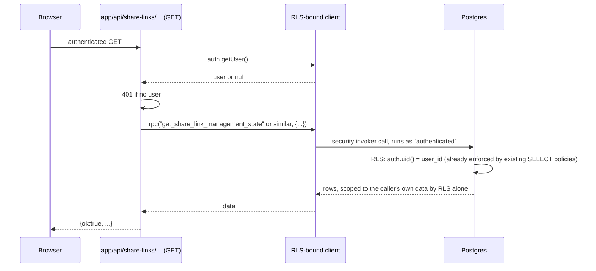

# Text2Task — Client Share Link Phase 1B: Owner Server Operations Mapping and Design

Date: 2026-08-05
Repository: `c:\Users\Home\projects\inboxshaper`
Branch: `main`
HEAD at mapping time: `ad2c338` — "Add Client Share Link Phase 1A foundation"
Status: **Mapping and design only. No file other than this report was created or modified. No SQL was executed, no Supabase project was accessed, no code was implemented, no build/test/lint was run, no Git state was changed.**

### Evidence labelling (same convention as the Phase 0 mapping)

- **[FACT]** — verified repository fact, independently re-confirmed for this report by direct `Read`/`Grep`/`Glob` against the current tree (not merely copied from the Phase 0 mapping).
- **[FACT, Phase 0]** — a fact from `docs/TEXT2TASK_CLIENT_SHARE_LINK_PHASE_0_MAPPING_2026-08-03.md` that this report did not independently re-verify line-by-line but has no reason to doubt (the codebase has not changed at the application-code layer since Phase 0 — only the three Phase 1A SQL migrations and their docs were added).
- **[REC]** — recommendation by this report. Not implemented, not agreed.
- **[UNKNOWN]** — could not be determined; requires human validation.

---

## 1. Executive verdict

**Phase 1B is buildable now, and its shape is largely dictated by a fact this repository's own Phase 1A migrations already established, not by open design taste: every owner-facing Client Share table (`project_share_links`, `share_link_tasks`, `share_link_resources`, `share_link_updates`, `share_messages`, `share_message_conversions`) grants `authenticated` SELECT only — no INSERT, UPDATE, or DELETE grant exists on any of them, and `service_role` fares no better (SELECT plus, at most, one narrow column-level UPDATE on `project_share_links.view_count`/`.last_viewed_at`, or a column-limited INSERT on `share_messages`). This was deliberate and is stated explicitly in the Phase 1A report: *"Owner mutations that affect V1 invariants are deferred to Phase 1B transactional owner operations."*

That single fact answers the "important design question" outright: **a plain server-side TypeScript route handler that calls `.insert()`/`.update()`/`.delete()` directly against these tables cannot work today, for any caller, authenticated or service-role, without first adding a new positive grant** — and adding one would reopen exactly the risk (R9/non-atomic configuration save, and the "no committed intermediate state exposes tables before their integrity triggers" invariant) Phase 1A's three-migration sequencing was built to close. **Recommended architecture: Option 1 — a small set of cohesive, narrowly-scoped PostgreSQL RPCs (a mix of `security invoker` for pure reads and `security definer` for state-changing writes, per the repository's own `AGENTS.md` rule 12 carve-out) behind thin authenticated Next.js route handlers.** Full reasoning in section 6.

Nothing about the recommended design weakens Phase 1A's read-only RLS/grant posture, the trigger-based cross-tenant checks already installed in migration `202608030005`, or the monotonic `configuration_version`/lifecycle invariants. Phase 1B is additive: new `security definer` functions that verify ownership themselves and then perform DML the calling role could never perform directly — the same pattern `AGENTS.md` rule 12 was written to describe before Phase 1B existed.

**VERDICT: READY FOR PHASE 1B.1.** This report has been through two correction passes. The first (this section's items 1-7 below) fixed seven load-bearing design defects against the approved product requirements (the Client Share Link handoff and its Addendum A). The second closed the one item the first pass could not close itself: risk P1-R7, the conflict between item 1's corrected secret-recovery design and `AGENTS.md` rule 7. **That conflict is now resolved.** The user has made an explicit human policy decision approving a narrow, explicit exception to rule 7, and `AGENTS.md` has been amended accordingly (see the current rule 7 text — the exception is scoped exactly to the `project_share_secret_material` design in section 8.0, nothing broader). **Phase 1B.1 may begin.** Phase 1B.2, which is the first slice that actually creates `project_share_secret_material`, remains constrained to build *exactly* the architecture the amended rule 7 and this report describe — not a looser or more general form of reversible secret storage.

1. **Secret recoverability.** The original report said the raw share secret is returned exactly once and never stored, matching the handoff's *default* posture (section 16.2: "store an encrypted copy only if the user must repeatedly reveal/copy the same link") but not its explicit conditional exception — and the handoff's own approved V1 flow (`5.1`, action "Copy client link": *"Copy the active secure link; disabled if the link is inactive"*, always available, not one-time) satisfies that exception directly. **Corrected**: a new, separate, fully-closed `project_share_secret_material` table stores AES-256-GCM-encrypted secret material, never a column on `project_share_links` (which `authenticated` can already SELECT). Full design in section 8. **This correction required a narrow, explicit exception to `AGENTS.md` rule 7** ("Share secrets never appear in... any reversible database column") as originally worded, and left `202608030003_client_share_owner_foundation.sql`'s own column comment on `secret_digest` ("no reversible or encrypted copy is stored in V1") as historical prose describing the pre-decision state. **This is now resolved**: the user has made the policy decision, `AGENTS.md` rule 7 has been amended (narrowly — the exception applies only to the exact `project_share_secret_material` architecture, not to reversible secret storage in general), and migration `202608030003` itself was **not** edited — it remains exactly as committed. Phase 1B.2 must instead add new `COMMENT ON` statements, in its own migration, clarifying that `secret_digest` remains the non-reversible verification value and that owner-recoverable encrypted material lives separately in the fully closed `project_share_secret_material` table (section 15). Tracked as risk P1-R7 (section 19), now marked **RESOLVED BY EXPLICIT HUMAN POLICY DECISION**.
2. **Atomic configuration save.** The original section 9 recommended four separate RPCs (settings, tasks, resources, update) called sequentially from the browser, reasoning that only settings touch `configuration_version`. That reasoning was correct about `configuration_version` but wrong about atomicity: a sequence of independently-committing calls can still leave a partially-published configuration if one fails mid-sequence, which is exactly what the handoff (section 19.3: *"Saving share configuration must not leave half-updated visibility mappings"*) and `AGENTS.md` rule 19 forbid. **Corrected**: a single cohesive `save_share_configuration` RPC (section 9) commits settings, task mapping, resource mapping, and an optional update publication together, in one transaction, while still only bumping `configuration_version` when an access-sensitive field actually changed.
3. **One active link per project.** The original section 10 treated this as an open Phase 1B product decision. It is not — Addendum A (28 July 2026) states plainly: *"V1 exposes one active link per project in the UI; the database schema supports multiple links from day one... This is locked before Phase 1 because it affects the schema."* **Corrected**: the rule is enforced, race-safely, inside `activate_share_link`/`reenable_share_link` via two-level row locking (section 10), and this report explicitly does **not** add a schema-level partial unique index, because that would foreclose the multi-link architecture Addendum A requires to remain available.
4. **`bigint`/JSON contract.** The original report's contracts used a bare `subtaskId: bigint` in JSON shapes. JavaScript `number` cannot losslessly represent every Postgres `bigint`, and `BigInt` is not JSON-serializable. **Corrected**: every subtask id crossing a JSON boundary is now a canonical decimal string (`/^[1-9][0-9]*$/`), cast to `bigint` explicitly inside the RPC.
5. **Preview.** The original report proposed a Phase 1B `.../preview` route that would, by its own admission, return owner-management state rather than the real public projection — contradicting the handoff's own rule (`5.1`: *"Preview: Open the public page in preview mode... without generating public activity"* — the **public page**, not a stand-in). **Corrected**: no preview route is proposed in Phase 1B; operation O is documented as a future contract/boundary only, deferred to Phase 3 once the real public projection builder exists.
6. **`public_id` generation** was previously unspecified. **Corrected**: fully specified in section 5.1 — generated server-side in TypeScript (not SQL, since Phase 1A deliberately does not install `pgcrypto`), with the existing `project_share_links_public_id_unique` constraint as the collision guard and a bounded retry.
7. **Duplicate ownership queries.** The original report proposed both a route-level `requireOwnedProject()` helper *and* authoritative ownership verification inside each RPC. **Corrected**: `require-owned-project.server.ts` is removed from Phase 1B's proposed files; every route performs only session authentication (`auth.getUser()`) and calls exactly one RPC, which is the sole, authoritative, TOCTOU-safe ownership check (it verifies and locks in the same transaction it acts in — a separate prior route-level SELECT could never do that).

**Nothing in this report authorizes production application.** Phase 1A's migrations remain unapplied to any database; Phase 1B is source-code design on top of them. Migration `202608030003` was not, and is not, edited by any pass of this report — only `AGENTS.md` and this report changed to reach the current, ready state.

---

## 2. Current repository architecture found

This section summarizes only what changed or matters most since the Phase 0 mapping (`docs/TEXT2TASK_CLIENT_SHARE_LINK_PHASE_0_MAPPING_2026-08-03.md`, read in full for this report, sections 5, 11, 12, 15, 16 in particular). The application codebase (everything outside `supabase/migrations/**` and `docs/**`) is **unchanged** since Phase 0 — independently re-confirmed for this report by re-reading `proxy.ts`, `lib/supabase/server.ts`, `lib/supabase/admin.ts`, `lib/supabase/requireDashboardUser.ts`, `lib/homepage-demo/tokens.server.ts`, `lib/homepage-demo/identity.server.ts`, `lib/analytics/analytics-paths.ts`, `package.json`, `app/api/task-resources/route.ts`, `app/api/projects/update/route.ts`, and `supabase/migrations/202606150002_transactional_project_bulk_actions.sql`, all of which match the Phase 0 mapping's claims byte-for-byte.

| Item | Finding |
|---|---|
| Framework | Next.js 16.1.6, App Router, TypeScript strict, Zod `^4.3.6` the only validation library [FACT] |
| Supabase clients | `lib/supabase/server.ts` (`createClient()`, RLS-bound to the caller — the default for authenticated routes); `lib/supabase/admin.ts` (`supabaseAdmin`, service-role, `import "server-only"`); `lib/supabase/client.ts` (browser, almost unused) [FACT] |
| Auth guard | `requireDashboardUser()` (`lib/supabase/requireDashboardUser.ts`) for Server Components; every `app/api/**` route inlines `supabase.auth.getUser()` + 401 — **no shared `requireApiUser()` helper exists** [FACT] |
| Ownership helper | **None shared.** `verifyProjectOwnership`/`verifyTaskOwnership` are defined twice, independently, in `app/api/task-resources/route.ts:68-112` and `app/api/task-resources/upload-and-create/route.ts:118-162` [FACT, re-verified] |
| Transaction pattern | Multi-row/multi-table mutations are pushed into `security invoker` PL/pgSQL RPCs, each: obtain `auth.uid()`, raise `P0001`/`UNAUTHORIZED` if null, lock owned rows with `for update`, mutate, `revoke ... from public, anon` + `grant execute ... to authenticated` (or `service_role`). Canonical example independently re-read for this report: `apply_project_bulk_action_transaction` (`202606150002_transactional_project_bulk_actions.sql`) [FACT, re-verified] |
| `security definer` usage | Exactly once in the whole schema before Phase 1A (`process_creem_webhook_event`) [FACT, Phase 0]. Phase 1B will be the second deliberate, reviewed use. |
| Crypto/token precedent | `lib/homepage-demo/tokens.server.ts`: `randomBytes(32).toString("base64url")` (43-char opaque token) + domain-separated **bare SHA-256** digest (`hashHomepageDemoToken`) [FACT, re-verified]. `lib/homepage-demo/identity.server.ts`: **keyed HMAC-SHA256**, `createHmac("sha256", secret).update(domain).update("\0").update(identity)`, secret loaded from an env var, base64url, **fails closed with a typed error if missing or under 32 bytes** [FACT, re-verified]. |
| PIN/password hashing dependency | **None.** No `bcrypt`, `argon2`, or `@node-rs/*` in `package.json` [FACT, re-verified]. `node:crypto`'s built-in `scrypt`/`scryptSync` is the only slow KDF available without a new dependency — and Phase 1A's migration already locked the exact profile (`N=16384, r=8, p=1, key_length=32`, 43-char unpadded base64url hash), so this decision is **no longer open**; Phase 1B must match it exactly. |
| Feature-flag pattern | `HOMEPAGE_DEMO_CONFIG` (`lib/homepage-demo/config.server.ts`): a frozen object built once from `process.env` at module load, bounded numeric parsing, consumed by an `assertXEnabled()` that throws a typed error mapped to **404** [FACT, re-verified]. |
| Email infrastructure | **None.** No `resend`/`nodemailer`/`@sendgrid/mail`/etc. dependency [FACT, re-verified]. Irrelevant to Phase 1B directly (no owner operation below requires email), but relevant to section 6's "unread-feedback count" note. |
| Route-handler test precedent | **Confirmed to exist** (Phase 0 did not check this specifically): `app/api/calendar/route.test.ts`, `app/api/calendar/events/route.test.ts`, `app/api/activity/product-event/route.test.ts`, etc. — `vi.mock("@/lib/supabase/server", ...)` replacing `createClient` with a hand-built chainable mock plus a mockable `getUser`, asserting on HTTP status per scenario [FACT, newly verified for this report by reading `app/api/calendar/route.test.ts`]. This is the exact shape new Phase 1B route tests should follow. |
| `proxy.ts` | Still has no `/share` branch of any kind — confirms Phase 1B (server operations only) does not need to touch it; that remains Phase 3 scope [FACT, re-verified]. |
| `lib/analytics/analytics-paths.ts` | Still excludes only `/admin*` and `/homepage-demo/review` — `/share` has not been added [FACT, re-verified]. Not a Phase 1B concern (no public route exists yet), but flagged in section 18 so it is not forgotten before Phase 3. |

---

## 3. Exact reusable files/functions, with paths

All independently re-verified by `Read`/`Glob`/`Grep` for this report (not copied unchecked from Phase 0).

| Reusable asset | Path | What Phase 1B reuses |
|---|---|---|
| RLS-bound server client | `lib/supabase/server.ts` — `createClient()` | Every new owner route calls this exactly as `/api/projects/update` and every other authenticated route do. RPCs are invoked through it (`supabase.rpc("...", {...})`), never through `supabaseAdmin`. |
| Service-role admin client | `lib/supabase/admin.ts` — `supabaseAdmin` | **Not needed by any Phase 1B owner operation** (see section 6) — owner mutations run as `security definer` RPCs invoked through the RLS-bound client, which already carries the caller's session for `auth.uid()`. Documented here only to rule it out explicitly. |
| Dashboard auth guard | `lib/supabase/requireDashboardUser.ts` | Not directly used by API routes (it redirects, which is wrong for a JSON API), but its `ensureUser` dependency (`lib/supabase/ensureUser.ts`) is available if a Phase 1B route ever needs the full `AppUser`/`plan` row — none of the operations in section 5 currently need it. |
| Canonical transactional-RPC template | `supabase/migrations/202606150002_transactional_project_bulk_actions.sql` — `apply_project_bulk_action_transaction` | The exact shape every Phase 1B RPC should follow: `v_user_id uuid := auth.uid()`; `if v_user_id is null then raise ... UNAUTHORIZED`; explicit input validation with typed P0001 codes; `for update` row locking before mutating; `revoke ... from public, anon`; `grant execute ... to authenticated`; `comment on function`. |
| Opaque-token generation | `lib/homepage-demo/tokens.server.ts` — `randomBytes(32).toString("base64url")` | The exact pattern for generating the new share secret (256-bit random, base64url) in `rotate_share_link_secret`'s and `activate_share_link`'s TypeScript caller. **Do not reuse `hashHomepageDemoToken`'s bare-SHA-256 digest function** — Phase 1A's schema comments and the Phase 0 mapping both require a **keyed HMAC**, matching `identity.server.ts`'s pattern instead (next row). |
| Keyed HMAC digest + fail-closed key validation | `lib/homepage-demo/identity.server.ts` — `createHomepageDemoIpIdentityDigest`, `getHomepageDemoIdentityHmacSecret` | The exact pattern for a new `lib/share/share-secret.server.ts`: `createHmac("sha256", secret).update(domain).update("\0").update(value).digest(...)`, secret from a new env var (e.g. `TEXT2TASK_SHARE_SECRET_HMAC_KEY_V1`), base64url, **≥32 bytes, fails closed with a typed error if missing/malformed** — do not silently fall back. |
| Feature-flag pattern | `lib/homepage-demo/config.server.ts` — `HOMEPAGE_DEMO_CONFIG`, `parseEnabledFlag` | Template for `TEXT2TASK_CLIENT_SHARE_ENABLED` if/when Phase 1B routes should be gate-able independently of the public page (see section 18, deferred unless requested). |
| Response envelope | `app/api/project-updates/apply/route.ts:66-84`, `app/api/projects/bulk-action/route.ts` — `{ok:true,...} \| {ok:false, code, error}` | The envelope every new Phase 1B route should return, per Phase 0's own recommendation, which this report adopts. |
| Zod-validated field-update route shape | `app/api/projects/update/route.ts` — `z.object({projectId: z.string().uuid(), field: z.enum([...]), value: ...})` | Template for the closed, purpose-specific top-level keys (`settings`/`tasks`/`resources`/`publishUpdate`) `PATCH /api/share-links/[id]/config` accepts (the merged D+K+L+M operation, section 9) — never a free-form key. |
| Route-handler test mocking pattern | `app/api/calendar/route.test.ts` | Template for every new `route.test.ts` (section 17). |
| RLS + trigger-based cross-owner enforcement | `supabase/migrations/202608030005_client_share_integrity_and_security.sql` — `enforce_share_link_task_integrity()`, `enforce_share_link_resource_integrity()` | **Already built, already installed, already tested.** Phase 0 (section 11.7) called a same-owner trigger a "new primitive required" — Phase 1A already shipped it. Phase 1B RPCs get cross-tenant task/resource rejection **for free**, as an unconditional second line of defense, regardless of any bug in the RPC's own pre-checks (see section 10). |
| Existing badge/count UI pattern | `app/components/dashboard/tasks-view.tsx:225-273` (`projectResourceCounts`), `app/components/dashboard/tasks/desktop-tasks-table.tsx:439-447` (superscript count) [FACT, Phase 0, not re-verified line-by-line but structurally consistent with `tasks-view.tsx`'s confirmed `getResolvedProjectId`/`openProjectResources` region read for this report] | Template for rendering operation N's per-project summary counts — **no new polling system**, a single batched read per project-list render. |
| `node:crypto` scrypt | Node built-in, no new dependency | The only slow KDF available for PIN hashing without adding a dependency; `N=16384, r=8, p=1, key_length=32` is **fixed** by the already-applied migration's CHECK constraints, not an open choice. |

---

## 4. Exact Phase 1A schema capabilities Phase 1B can rely on

Read directly from `supabase/migrations/202608030003_client_share_owner_foundation.sql`, `…004_client_share_session_foundation.sql`, and `…005_client_share_integrity_and_security.sql` (all three read in full for this report, in addition to being read multiple times across the correction passes documented in the Phase 1A SQL Editor package report).

### 4.1 `project_share_links` — the link's own state

| Fact | Detail |
|---|---|
| Columns | `id, user_id, project_id, public_id, secret_digest, secret_digest_version, state, expires_at, comments_enabled, client_facing_subtitle, content_direction, configuration_version, last_viewed_at, view_count, pin_hash, pin_salt, pin_hash_version, pin_scrypt_n, pin_scrypt_r, pin_scrypt_p, pin_key_length, created_at, updated_at, activated_at, disabled_at, rotated_at, revoked_at` |
| State vocabulary | Exactly `draft, active, disabled, expired, revoked` — **five values, not six.** There is no `rotated` state; rotation is `rotated_at` plus a `configuration_version` bump on an otherwise-`active` (or `disabled`) link. **This differs from the Phase 0 mapping's original proposal**, which suggested a six-value vocabulary including `rotated`; the delivered schema is simpler and correct — Phase 1B must design against the delivered five-value model, not the Phase 0 proposal. |
| Allowed transitions (enforced by `enforce_project_share_link_integrity()`) | `draft → active \| revoked`; `active → disabled \| expired \| revoked`; `disabled → active \| expired \| revoked`; `expired → active \| revoked`. `revoked` is terminal (`SHARE_LINK_REVOKED_STATE_TERMINAL`). `draft` cannot be returned to once left (`SHARE_LINK_DRAFT_STATE_IRREVERSIBLE`). |
| Multi-link support | **Structural, and deliberately left enforced by application logic, not the schema.** No unique constraint on `project_id`, no partial unique index on `state = 'active'`. Phase 1A did **not** implement the "one active link per project" partial index the Phase 0 mapping recommended (section 17.2) — and per Addendum A (28 July 2026, re-read for this correction pass), **this is intentional and locked, not an open decision**: *"V1 exposes one active link per project in the UI; the database schema supports multiple links from day one... This is locked before Phase 1 because it affects the schema."* Phase 1B enforces the V1 UI rule race-safely at the RPC layer (section 10) and must **not** add a schema-level unique index, which would foreclose the multi-link future the schema was deliberately left open for. |
| Immutable after insert | `user_id`, `project_id`, `public_id`, `created_at` (once set, `activated_at` too). |
| Monotonic | `configuration_version` (never decreases), `view_count` (never decreases), `last_viewed_at` (never moves backwards), `disabled_at`/`rotated_at`/`revoked_at` (never cleared or moved backwards). |
| **The exact set of columns whose change forces `configuration_version` to strictly increase** (`v_access_changed` in the trigger) | `secret_digest`, `secret_digest_version`, `state`, `expires_at`, `pin_hash`, `pin_salt`, `pin_hash_version`, `pin_scrypt_n/r/p`, `pin_key_length`, `comments_enabled`, `client_facing_subtitle`, `content_direction`. **Task selection, Resource selection, and update publication are NOT in this list** — they live in separate tables and do not touch `project_share_links` at all, so they never bump `configuration_version` (see section 8.1's precise reconciliation of what this means for session staleness, and section 9 for how they are nonetheless saved atomically alongside settings). |
| Rotation-specific enforcement | A `secret_digest` change requires `rotated_at` to have also increased **and** `configuration_version` to have increased, in the **same statement**; changing `secret_digest_version` without changing `secret_digest` is rejected (`SHARE_LINK_ROTATION_REQUIRES_SECRET_CHANGE`). |
| PIN completeness | All seven PIN columns are either **all** null or **all** present (`project_share_links_pin_completeness_check`); the v1 profile is `pin_hash_version = 1`, `pin_scrypt_n = 16384`, `pin_scrypt_r = 8`, `pin_scrypt_p = 1`, `pin_key_length = 32`, `pin_hash` exactly 43 base64url characters. |
| PIN encoding | `pin_hash` 32-512 base64url characters (fixed in the seventh correction pass), `pin_salt` 16-128 base64url characters, both `^[A-Za-z0-9_-]+$`. |
| Table privileges | `authenticated`: **SELECT only**. `service_role`: SELECT plus **column-scoped** `UPDATE (view_count, last_viewed_at)` only. **No role can INSERT, DELETE, or update any other column directly.** |

### 4.2 `share_link_tasks` / `share_link_resources` — curated content mappings

| Fact | Detail |
|---|---|
| `share_link_tasks` columns | `id, user_id, share_link_id, subtask_id (bigint), public_group, waiting_for_client_feedback, display_order, created_at, updated_at`. `unique(share_link_id, subtask_id)`. `public_group` CHECK: `in_progress, waiting_for_feedback, completed, coming_up`. |
| `share_link_resources` columns | `id, user_id, share_link_id, resource_id (uuid), public_label, can_download, display_order, created_at, updated_at`. `unique(share_link_id, resource_id)`. |
| Cross-tenant enforcement (already installed) | `enforce_share_link_task_integrity()`: rejects if the link isn't owned by `new.user_id`, if the task isn't owned by `new.user_id`, if the task is soft-deleted, or if the task's `project_id` doesn't equal the link's `project_id`. `enforce_share_link_resource_integrity()`: same shape, plus reconciling a Resource's direct `project_id` against a possible `task_id`-derived project and rejecting a Resource attributable to no project at all. |
| Table privileges | `authenticated` and `service_role`: **SELECT only.** No INSERT/UPDATE/DELETE grant to anyone. |

### 4.3 `share_link_updates` — versioned client-facing update text

| Fact | Detail |
|---|---|
| Columns | `id, user_id, share_link_id, body, version, published_at, created_by, is_current, created_at`. `unique(share_link_id, version)`; partial unique index on `(share_link_id) where is_current`. |
| Immutability | `body`, `version`, `published_at`, `share_link_id`, `user_id`, `created_by`, `created_at` are immutable after insert — **only `is_current` may change** (`enforce_share_link_update_integrity()`). |
| Ownership | `created_by` must equal `user_id`, which must equal the link's `user_id`. |
| Known ordering hazard, already discovered and fixed once | The Phase 1A SQL Editor package's own runtime-test harness hit exactly this bug during its own correction passes: inserting a second `is_current = true` row while the first still had it collides with the partial unique index. **The fix was to retire the old current row first, then insert the new one, in one transaction** — Phase 1B's `save_share_configuration` RPC's `publishUpdate` sub-part must follow that exact order (section 9, step 10). |
| Table privileges | `authenticated`: SELECT only. `service_role`: SELECT only. |

### 4.4 `share_messages` / `share_message_conversions` — explicitly out of Phase 1B

Confirmed unchanged from Phase 1A: `share_messages` requires `service_role` for any `author_type = 'client'` insert and an authenticated `auth.uid()` match for `author_type = 'owner'`; `authenticated` has SELECT only (no INSERT grant at all, even for owner replies — an owner reply, when it eventually ships, needs its own narrow `security definer` RPC or a `service_role`-mediated path, exactly like client messages). **No Phase 1B operation in section 5 touches these tables.** See section 6 (area 6) for the confirmation this report was asked to make explicit.

### 4.5 `share_browser_sessions` / `share_session_grants` — service-role only, not Phase 1B's to write

Both remain fully closed to `authenticated` (no grant at all). Phase 1B's rotation/disable/PIN/expiry operations interact with these tables **only indirectly**, through the `configuration_version` mechanism described in section 8 — Phase 1B never inserts, updates, or deletes a row in either table.

### 4.6 `share_rate_limit_buckets` / `share_link_events`

Reserved for abuse control (Phase 7 per the Phase 0 phased plan) and operational audit, respectively. `share_link_events` has **no actor/user_id column at all** — only `share_link_id`, `event_type`, `identity_digest`, `identity_digest_version`, `created_at`. `service_role` has `SELECT, INSERT, DELETE`; `authenticated` has **no grant whatsoever**. A Phase 1B `security definer` RPC can still write to it (definer privileges bypass the caller's own grants, using the function owner's), which section 14 recommends doing for a small set of owner-triggered event types.

### 4.7 `project_share_secret_material` — NOT part of Phase 1A; a new table Phase 1B must add

**Corrected in this pass (see the section 1 summary, correction 1).** This table does not exist in any applied or proposed Phase 1A migration. It is new schema Phase 1B introduces, to make the raw share secret durably recoverable for the handoff's approved "Copy client link" action. Full design, including the exact reasoning for why a column on `project_share_links` is unsafe, is in section 8. Summarized here for the schema inventory:

| Fact | Detail |
|---|---|
| Purpose | Store an AES-256-GCM-encrypted copy of the raw share secret, separately from `project_share_links.secret_digest` (the one-way HMAC digest, unchanged, still the sole basis for public verification). |
| Columns (proposed) | `share_link_id uuid primary key references project_share_links(id) on delete cascade`, `ciphertext bytea not null`, `nonce bytea not null`, `auth_tag bytea not null`, `encryption_version smallint not null`, `created_at timestamptz not null default now()`, `updated_at timestamptz not null default now()`. One row per link (replaced, not appended, on rotation). |
| Grants | **None to `anon`, `authenticated`, or `service_role`.** Reachable only through the two narrowly-scoped `security definer` RPCs in section 8 (which write/read it using the function owner's implicit privileges, needing no table grant at all). RLS enabled with no policies, matching the repository's established fully-closed pattern, as belt-and-suspenders even though no role has a grant regardless. |
| Why not a column on `project_share_links` | `authenticated` already has table-level `SELECT` on `project_share_links` (section 4.1). Adding a reversible-secret column there would make it readable by the caller's own session the moment it's added — no additional bug is even required, the exposure is the grant itself. A separate, grant-less table has no such path, by construction. |
| Relationship to existing prose | `AGENTS.md` rule 7 has been **amended** (a narrow, explicit exception approved by human policy decision — see section 1 and risk P1-R7, section 19, now resolved) to permit exactly this architecture. `202608030003`'s own `secret_digest` column comment ("no reversible or encrypted copy is stored in V1") was **not edited** — migration `202608030003` is not modified by this report — and now describes the pre-decision state; Phase 1B.2 must add new `COMMENT ON` statements in its own migration that supersede it without touching the committed file (section 15). |

---

## 5. Operation-by-operation architecture table

Every operation below assumes: `auth.uid()` obtained **inside** the RPC (never trusted from the client); every mutating RPC locks the target `project_share_links` row with `for update` before changing it; every RPC raises typed `P0001` `SCREAMING_SNAKE_CASE` errors for its own preconditions, on top of (never instead of) the trigger's own unconditional checks; no RPC ever returns `pin_hash`, `pin_salt`, or `secret_digest`; **every subtask id crossing a JSON boundary (request or response) is a canonical positive decimal string matching `/^[1-9][0-9]*$/`, never a JavaScript `number` or `BigInt`** — the route validates the string shape, the RPC casts it explicitly to `bigint` (`p_subtask_id::bigint` on a pre-validated string is safe; the RPC never receives or returns a raw numeric JSON value for a `bigint` column). **Corrected in this pass**: operations D, K, L, and M are merged into one combined operation (row "D+K+L+M") per the atomic-configuration-save requirement (section 9); operation O no longer has a Phase 1B implementation (section 5.2); a new operation, **REVEAL**, is added to support durable secret recovery (section 8).

| Op | Operation | Auth boundary | Input contract | Output contract | Pattern | Tables touched | Locking | Idempotent? | Event written | Session/grant effect | Slice |
|---|---|---|---|---|---|---|---|---|---|---|---|
| **A** | Read management state for one project | `auth.uid()` + `projects.user_id = auth.uid()` + `projects.deleted_at is null` | `{projectId: uuid}` | `{link: {id, publicId, state, expiresAt, hasPin: boolean, commentsEnabled, clientFacingSubtitle, contentDirection, configurationVersion, createdAt, activatedAt, lastViewedAt, viewCount} \| null, mappedTaskIds: string[] (decimal bigint strings), mappedResourceIds: uuid[], currentUpdate: {body, version, publishedAt} \| null}` — **never the secret; see REVEAL for that, and see section 5.2 for why this is not a preview** | `security invoker` RPC (SELECT-only; `authenticated` already has table SELECT + RLS) | `project_share_links`, `share_link_tasks`, `share_link_resources`, `share_link_updates` (reads only) | none needed (read) | Trivially (pure read) | none | none | **1B.1** |
| **B** | Create initial draft link | `auth.uid()` + owned, non-deleted project. **[REC] reject if `projects.is_archived`** (product decision, not schema-enforced — see section 10) | `{projectId: uuid}` | `{linkId: uuid, publicId: string}` — **no secret yet; draft has none** (see section 5.1 for exactly how `publicId` is generated) | `security definer` RPC | `project_share_links` (INSERT) | `for update` on the `projects` row (ordinary ownership-verification lock; **multiple simultaneous drafts for the same project are explicitly allowed** — a `draft` is not `active`, so it never competes with the one-active-link rule in section 10, and no cross-link lock is needed here) | Not idempotent (each call creates a new row); rely on UI submit-guard, matching `POST /api/tasks` project creation today | `link_created` (in-transaction) | none | **1B.2** |
| **C** | Activate a configured draft (generate the real secret) | `auth.uid()` + link owned + `state = 'draft'` **+ the one-active-link check** (section 10): no other non-`revoked` link for the same `project_id` may already be `state = 'active'` | `{linkId: uuid}` | `{secret: string, publicId: string}` — the **only** time the raw secret is returned directly from activation (it remains durably recoverable afterward via REVEAL — section 8) | `security definer` RPC. Secret generated in the **TypeScript caller** (`randomBytes(32).toString("base64url")`, mirroring `tokens.server.ts`), HMAC-digested there too; the digest, plus the AES-256-GCM-encrypted material (section 8), are passed to the RPC together | `project_share_links` (UPDATE: `state`, `activated_at`, `secret_digest`, `secret_digest_version=1`, `configuration_version+1`, all one statement); `project_share_secret_material` (INSERT, same transaction) | **Two-level, in this order**: `select ... from projects where id = v_project_id for update`, then `select ... from project_share_links where id = p_link_id for update` — see section 10 for why this exact order is required for the one-active-link check to be race-safe | Safe-idempotent by construction: activating an already-`active`/non-`draft` link, or a project that already has another active link, fails with a stable RPC-level code before the trigger even runs | `link_activated` (in-transaction) | Establishes the first valid `configuration_version` grants must match | **1B.2** |
| **D+K+L+M** | **Save share configuration** (settings, task selection, Resource selection, and an optional new published update, together) | `auth.uid()` + link owned + `projects.deleted_at is null`. Every submitted `subtaskId`/`resourceId` is still independently re-verified by the **existing, unconditional** triggers (section 10) regardless of this RPC's own pre-checks | `{linkId: uuid, settings?: {commentsEnabled?: boolean, clientFacingSubtitle?: string \| null, contentDirection?: "auto"\|"ltr"\|"rtl"}, tasks?: [{subtaskId: string /^[1-9][0-9]*$/, publicGroup: enum, waitingForClientFeedback: boolean, displayOrder: number}], resources?: [{resourceId: uuid, publicLabel: string, canDownload: boolean, displayOrder: number}], publishUpdate?: {body: string (1-5000 chars)}}` — every top-level group is optional; whichever are present are applied together, atomically | `{configurationVersion: number, taskIds: string[], resourceIds: uuid[], currentUpdate: {version, publishedAt} \| null}` | **One `security definer` RPC, `save_share_configuration`** (section 9 has the full transaction body design) | `project_share_links` (UPDATE, only if `settings` present and a value actually changed), `share_link_tasks` (DELETE + INSERT/UPDATE, only if `tasks` present), `share_link_resources` (DELETE + INSERT/UPDATE, only if `resources` present), `share_link_updates` (retire-then-insert, only if `publishUpdate` present) | `for update` on the `project_share_links` row, held for the **entire** transaction, serializing every sub-change together | Idempotent for the `tasks`/`resources` set-replace parts (replaying the same set produces the same state); idempotent-in-effect for `settings` (`is distinct from` skips a no-op version bump); **not** idempotent for `publishUpdate` (each call is a genuinely new version, same as before) | **[REC]** none in Phase 1B for the settings/content sub-parts (no vocabulary entry exists); see section 14 | Bumps `configuration_version` **exactly once**, and **only** if a submitted `settings` value actually changed an access-sensitive field — never because `tasks`, `resources`, or `publishUpdate` were also present in the same call (section 9 has the precise conditional logic) | **1B.4** |
| **E** | Set / replace / remove PIN | `auth.uid()` + link owned + `state <> 'revoked'` | `{linkId: uuid, pin: string (4-6 digits) }` to set/replace, or `{linkId: uuid, clear: true}` to remove. **Plaintext PIN is validated and scrypt-hashed in the TypeScript caller** (`node:crypto.scrypt`, `N=16384,r=8,p=1,keylen=32`, random salt) — only the hash/salt/params reach the RPC | `{configurationVersion: number, hasPin: boolean}` | `security definer` RPC. **The scrypt computation itself cannot happen in Postgres** — this is a two-step operation by construction (compute in Node, persist via RPC) | `project_share_links` (UPDATE: all 7 PIN columns together, or all null together; `configuration_version+1`) | `for update` | Idempotent for "set the same PIN twice" only in effect (each call still computes a fresh random salt, so the stored hash differs even for the same PIN — **this is correct and intentional**, not a bug: a stable hash for a repeated PIN would leak equality across links) | `pin_hash_version`-adjacent: **[REC]** no new event type exists for this; reuse none, or treat as folded into `link_created`/`link_activated`'s implicit "configuration established" narrative. Flag as a gap (section 19). | Bumps `configuration_version`; existing grants become stale per section 8 | **1B.3** |
| **F** | Set / replace / remove expiry | `auth.uid()` + link owned + `state <> 'revoked'` | `{linkId: uuid, expiresAt: string (ISO) }` or `{linkId: uuid, clear: true}` | `{configurationVersion: number, expiresAt: string \| null}` | `security definer` RPC | `project_share_links` (UPDATE: `expires_at`, `configuration_version+1` only if changed) | `for update` | Naturally idempotent (same `is distinct from` mechanism as settings) | none | Bumps `configuration_version` only if the value changed | **1B.3** |
| **G** | Disable access | `auth.uid()` + link owned + `state = 'active'` (matrix forbids disabling from any other state) | `{linkId: uuid}` | `{state: "disabled"}` | `security definer` RPC | `project_share_links` (UPDATE: `state='disabled'`, `disabled_at=now()`, `configuration_version+1`) | `for update` | Safe-idempotent (re-disabling an already-`disabled` link fails with a stable RPC-level code before the trigger's own transition-matrix rejection) | `link_disabled` (in-transaction) | Bumps `configuration_version` | **1B.2** |
| **H** | Re-enable (disabled → active) | `auth.uid()` + link owned + `state = 'disabled'` **+ the same one-active-link check as C**: no other non-`revoked` link for the same project may already be `active` | `{linkId: uuid}` | `{state: "active"}` | `security definer` RPC | `project_share_links` (UPDATE: `state='active'`, `configuration_version+1`) | **Same two-level lock order as C**: `projects` row, then this link's `project_share_links` row (section 10) | Safe-idempotent, same shape as G | **[REC]** reuse `link_activated` — the closed `share_link_events` vocabulary has **no distinct "re-enabled" event type** (section 19) | Bumps `configuration_version` | **1B.2** |
| **I** | Rotate the share secret | `auth.uid()` + link owned + `state in ('active','disabled')` (rotating a `draft` makes no sense — use C; rotating a `revoked` link must fail closed) | `{linkId: uuid}` | `{secret: string, publicId: string}` — the new raw secret, returned directly and also durably stored (encrypted) for later REVEAL | `security definer` RPC, secret generated client-side exactly as in C | `project_share_links` (UPDATE: `secret_digest`, `secret_digest_version+1`, `rotated_at=now()`, `configuration_version+1`, all one statement — the trigger requires exactly this combination); `project_share_secret_material` (UPDATE: **replace** `ciphertext`/`nonce`/`auth_tag`/`encryption_version`/`updated_at` in the **same transaction** — section 8 requires the digest and the encrypted material to change atomically together) | `for update` on the link row (covers both tables' changes within one transaction) | Not idempotent (each call mints a genuinely new secret) — and must not be, since a retried "rotate" that silently no-oped would leave the owner believing they invalidated a leaked link when they did not | `link_rotated` (in-transaction) | Bumps `configuration_version` — **the primary mechanism by which old sessions/grants become stale** (section 8) | **1B.3** |
| **J** | Revoke permanently | `auth.uid()` + link owned + `state <> 'revoked'` | `{linkId: uuid}` | `{state: "revoked"}` | `security definer` RPC | `project_share_links` (UPDATE: `state='revoked'`, `revoked_at=now()`, `configuration_version+1`) | `for update` | Safe-idempotent (re-revoking an already-`revoked` link is rejected by the trigger itself — `SHARE_LINK_REVOKED_STATE_TERMINAL` is unconditional, so this is safe even without an RPC-level pre-check, though one should still exist for a clean error code) | `link_revoked` (in-transaction) | Bumps `configuration_version`; terminal — no future grant can ever validate against a revoked link (`SHARE_GRANT_LINK_NOT_ACTIVE`); **[REC]** the `project_share_secret_material` row is left in place, not deleted, on revoke — a revoked link's secret is already useless (the trigger rejects any grant against a non-`active` link), so deleting it adds no security value and only removes an audit trail | **1B.3** |
| **N** | Read safe owner-management metadata (list/badge view) | `auth.uid()`, batched over the caller's **own** project ids only | `{projectIds: uuid[]}` (bounded, e.g. max 100, mirroring `apply_project_bulk_action_transaction`'s own 100-item cap) | `{[projectId]: {state, expiresAt, hasPin, createdAt, lastViewedAt, viewCount, taskCount, resourceCount, unreadCount: null}}` — **`unreadCount` is always `null`/absent in Phase 1B; see section 18, deferred until `share_messages` functionality exists** | `security invoker` RPC (pure read, batched for the project-list view, mirroring the existing `projectResourceCounts` pattern) | `project_share_links`, `share_link_tasks`, `share_link_resources` (reads/counts only) | none | Trivially | none | none | **1B.1** |
| **REVEAL** *(new operation, added by this correction — not in the original A-O list)* | Reveal the current shareable link, for Copy/Share/WhatsApp | `auth.uid()` + link owned + `state <> 'draft'` (nothing to reveal before activation) + `state <> 'revoked'` (a revoked secret is dead; **[REC]** do not reveal it, to avoid training the owner to treat a revoked link as still usable) | `{linkId: uuid}` | `{secret: string, publicId: string}` — same shape C/I return; the browser composes the full URL client-side (`https://.../share/<publicId>#<secret>`) exactly once per call | `security definer` RPC returns the stored `{ciphertext, nonce, authTag, encryptionVersion}` to the **TypeScript caller only**, which decrypts there (section 8) — **Postgres itself never sees, computes, or returns plaintext** | `project_share_secret_material` (SELECT), `project_share_links` (SELECT, for ownership/state check) | No write lock needed (pure read); ownership still verified via `project_share_links.user_id = auth.uid()` in the same query | Idempotent (repeatable read of the same stored secret; no state change) | **[REC]** none in Phase 1B | none — reveal does not change `configuration_version`; it discloses an already-valid secret again, it does not create a new one | **1B.3** |

### 5.1 Public ID generation (operation B)

**Fully specified in this correction pass; previously unstated.**

- **Where generated**: in the **TypeScript caller**, not in SQL. Phase 1A's migration `202608030003` deliberately does not install `pgcrypto` (its own header states this explicitly), so Postgres core has no general-purpose cryptographically-secure random-bytes function available for this (`gen_random_uuid()` exists in core since PG13 and *is* cryptographically random, but is a fixed 36-character hyphenated UUID shape, not the `^[A-Za-z0-9_-]{16,64}$` opaque-identifier shape the schema already expects — see below). Generating in Node, exactly like the share secret itself (section 8) and matching `lib/homepage-demo/tokens.server.ts`'s established pattern, keeps every piece of random-identifier generation in this feature in one place and one language.
- **Entropy and encoding**: `randomBytes(18).toString("base64url")` → 24 base64url characters, comfortably inside the already-shipped CHECK constraint `project_share_links_public_id_format_check: public_id ~ '^[A-Za-z0-9_-]{16,64}$'` (confirmed in `202608030003`, section 4.1). 18 random bytes is 144 bits of entropy — far more than needed for collision avoidance at any realistic scale (birthday-bound collision probability is negligible below billions of links), and the identifier is not a secret (it travels in the plain HTTP request path by design, per the handoff's own fragment-based URL scheme, section 16.2), so its entropy requirement is about **collision avoidance**, not secrecy — unlike the share secret itself, which the handoff's section 16.1 requires to carry ≥128 (preferably 256) bits specifically because it *is* the credential.
- **Why `public_id` is not itself treated as a secret**: it is sent in the plain HTTP request path (`GET /share/<public-id>`), the URL fragment (`#<secret>`) never reaches the server in the request line, and access is gated entirely by the fragment secret's HMAC verification, never by `public_id` being hard to guess. This matches the handoff's own architecture (section 16.2) exactly.
- **Uniqueness handling and collision retry**: `project_share_links_public_id_unique` (already shipped, `202608030003`) is the authoritative, final guard. `create_share_link_draft` generates a candidate, attempts the `INSERT`, and on a `23505` unique-violation **specifically and only** on that constraint, generates a fresh candidate and retries — bounded at 3 attempts, after which it raises a stable `SHARE_LINK_PUBLIC_ID_GENERATION_FAILED` (P0001) rather than looping indefinitely. At 144 bits of entropy this retry path is not expected to ever execute in practice; it exists as a defense-in-depth guard, not a normal code path.
- **Whether draft links receive `public_id` immediately**: **yes** — `public_id` is `not null` on the table (section 4.1) with no default, so it must be supplied at `INSERT` time; a draft link has a real, permanent `public_id` from the moment it is created, well before activation. It plays no security role until the link is activated and a secret exists to pair it with.
- **Exact tests** (added to section 17's list): `share_secret.server.test.ts` (or a small `share-public-id.server.ts`-specific test if the generator is factored into its own module) asserts the generated value's length/charset matches the CHECK constraint exactly; the `create_share_link_draft` migration test asserts the retry-on-`23505` logic is present in the function body and that it is bounded (not an unbounded loop); a repository-layer test asserts `SHARE_LINK_PUBLIC_ID_GENERATION_FAILED` is surfaced as a typed, distinguishable error rather than a generic 500.

### 5.2 Operation O: contract/boundary only — no Phase 1B implementation

**Corrected in this pass.** The original report proposed `app/api/share-links/[id]/preview/route.ts` in Phase 1B.1 while acknowledging it would return owner-management state (operation A's shape), not the real public projection. That is not an acceptable preview and is now removed entirely from Phase 1B's file list (section 15).

The handoff's own rule (`5.1`, action "Preview") is unambiguous: *"Open the public page in preview mode using the current authenticated user, without generating public activity."* **The public page**, not a facsimile of it. A "preview" built from operation A's data would drift from the real public projection the moment the two diverge even slightly (a field renamed, a status-mapping rule changed, a new denylisted field added) — silently showing the owner something that is not actually what a client would see, which is worse than no preview at all.

**Phase 1B therefore does not implement operation O.** It is documented here only as a **future contract/boundary**:

- Operation O's eventual implementation depends on Phase 3's `buildSharePublicProjection()` (or equivalent) existing as a single, shared function.
- The eventual preview route must call **that exact function**, with a `{countView: false}`-style flag (or equivalent), so the preview is provably the same code path a real client hits — never a parallel implementation.
- Until that function exists, **operation A's owner-management read (this section) is not a preview substitute** and must not be presented to the owner as one. A future dialog UI may show A's data as a *management summary* (state, counts, settings) — that is legitimate and already scoped into Phase 1B — but it must not be labeled or styled as "this is what your client sees."

---

## 6. Recommended RPC/server-route split

### 6.1 Why Option 1 (RPCs + thin route handlers), not Option 2, not a "justified hybrid"

Three independent, repository-specific facts rule out Option 2 (server-side TypeScript orchestration doing direct table writes) rather than merely disfavoring it:

1. **No grant path exists.** `authenticated` has SELECT-only on every owner-facing Client Share table; `service_role` has SELECT plus, at most, one narrow column-level UPDATE or column-scoped INSERT per table. A `.from("project_share_links").update(...)` call from *either* the RLS-bound server client *or* `supabaseAdmin` would be rejected by Postgres itself, regardless of how carefully the TypeScript layer checked ownership first — because Postgres, not the calling code, holds the actual DML permission. Only a `security definer` function, running with its owner's (the table-creating role's) privileges, can perform the write at all. This is not a style preference; it is the only mechanism that functions against the schema as delivered.
2. **The JS Supabase client has no multi-statement transaction primitive.** Each `.from(...).update()`/`.insert()`/`.delete()` call over PostgREST is its own auto-committing statement. `AGENTS.md` rule 19 requires curated-content changes and `configuration_version` changes to be "one transaction: lock `project_share_links`, apply the mutation, increment the version exactly once, and commit atomically." TypeScript-side orchestration across several separate PostgREST calls cannot satisfy that — a failure between calls leaves a partially-applied configuration (exactly R9 from the Phase 0 risk register: *"task mappings save, resource mappings fail, and a half-configured link is publicly live"*). A single PL/pgSQL function body is a single transaction by construction.
3. **The repository's own established convention already answers this question for every prior multi-table mutation** (`apply_project_bulk_action_transaction`, `apply_project_update_transaction`, `apply_task_bulk_status_transaction`, `update_project_client_identity_transaction`, `import_projects_transaction`) — none of them is TypeScript orchestration; all are RPCs. Phase 1B doing something structurally different for Client Share alone, with no new fact justifying it, would be the outlier, not the norm.

A "justified hybrid" (Option 3) was considered and rejected as unnecessary complexity: the *reads* (A, N, O) genuinely are simple enough to be either plain RLS-scoped `.select()` calls or trivial `security invoker` RPCs — no hybrid architecture is needed to express that; it falls out naturally from "reads use `invoker`, writes use `definer`," which is one architecture, consistently applied, not two.

### 6.2 The RPC/route split itself

| Layer | Responsibility | Never does |
|---|---|---|
| Route handler (`app/api/share-links/**`) | `auth.getUser()` + 401 (session authentication only — confirms a caller is signed in, nothing about which resources they own); Zod-parse the request body with a **closed, purpose-specific** schema (never a generic key/value patch); call exactly **one** RPC via `supabase.rpc(...)` on the RLS-bound client; map the RPC's typed P0001 codes to the `{ok:false, code, error}` envelope; map success to `{ok:true, ...}` | Never performs `.insert()/.update()/.delete()` against a Client Share table directly. **Never performs a separate ownership lookup of its own before calling the RPC** (corrected in this pass — section 10, item 2; issue 7 of this correction). The RPC's own `auth.uid()` + ownership check, taken inside the same transaction as its row lock, is the **sole** authoritative check — a route-level pre-check would not just be redundant, it would be a TOCTOU gap (the project's ownership could theoretically change between the route's check and the RPC's own transaction), so omitting it is a correctness improvement, not merely an efficiency one. |
| RPC (`security invoker`, reads) | SELECT-only aggregation for A/N; relies entirely on existing RLS (`auth.uid() = user_id`) plus the existing SELECT grant | Never mutates anything. |
| RPC (`security definer`, writes) | Obtain and validate `auth.uid()` itself (never trust a parameter); explicitly verify `project_share_links.user_id = auth.uid()` (or, for creation, `projects.user_id = auth.uid() and projects.deleted_at is null`); lock the target row `for update`; perform the DML; `revoke execute from public, anon`; `grant execute to authenticated` only — never to `service_role` (these are owner-authenticated actions, not service-role-invoked ones) | Never accepts a generic table/column/value triple (`AGENTS.md` rule 12's explicit prohibition); never uses dynamic SQL; never sets anything other than `search_path = public, pg_temp`. |
| Trigger layer (already installed) | Unconditional second line of defense — fires regardless of the RPC's own security mode, because `security definer` escalates **table-level grants**, not **trigger execution**. A bug in a Phase 1B RPC's own ownership check still cannot produce a cross-tenant row, because the trigger re-derives ownership independently from the database's own state. | — |

---

## 7. Authentication and ownership flow diagrams

### 7.1 Owner mutation (operations B, C, D+K+L+M, E, F, G, H, I, J, REVEAL)

```mermaid
sequenceDiagram
  participant Browser
  participant Route as app/api/share-links/... (route handler)
  participant SupaRLS as RLS-bound client (lib/supabase/server.ts)
  participant RPC as security definer RPC
  participant DB as Postgres (Client Share tables + triggers)

  Browser->>Route: authenticated request (session cookie)
  Route->>SupaRLS: auth.getUser()
  SupaRLS-->>Route: user or null
  Route->>Route: 401 if no user; Zod-parse closed request shape; 400 if invalid
  Route->>SupaRLS: rpc("<operation>", {...validated args, never user_id})
  SupaRLS->>RPC: invoke, carrying the caller's JWT
  RPC->>RPC: v_user_id := auth.uid(); raise UNAUTHORIZED if null
  RPC->>DB: select ... where id = p_link_id and user_id = v_user_id for update
  RPC->>RPC: raise a typed P0001 if not found/not owned/wrong state
  RPC->>DB: the actual UPDATE/INSERT/DELETE (definer privilege)
  DB->>DB: trigger re-verifies ownership/relationships unconditionally
  DB-->>RPC: success or trigger-raised P0001
  RPC-->>SupaRLS: jsonb result or exception
  SupaRLS-->>Route: data or PostgrestError
  Route-->>Browser: {ok:true, ...} or {ok:false, code, error}
```

### 7.2 Owner read (operations A, N, O)



---

## 8. Secret, PIN, expiry and session-invalidation lifecycle

### 8.0 Durable secret recovery (corrected in this pass)

**The original version of this report said the raw secret is returned exactly once and never stored, which is incompatible with the approved V1 owner workflow.** The handoff (`5.1`) lists `Copy client link` — *"Copy the active secure link; disabled if the link is inactive"* — as a persistent, always-available post-activation action, alongside `Share`, `WhatsApp`, and `Manage access`, not a one-time reveal at creation. The handoff's own storage rule (`16.2`, `18.2`) is explicitly conditional: *"Store only a keyed HMAC/digest for verification; store an encrypted copy only if the user must repeatedly reveal/copy the same link."* Given `Copy client link` must keep working after the activation response is long gone, that condition is met, and a digest alone cannot satisfy it — an HMAC digest is one-way by design and cannot reconstruct the secret it was computed from.

**Design:**

| Aspect | Design |
|---|---|
| Storage | New table `project_share_secret_material` (section 4.7) — **never a column on `project_share_links`**, because `authenticated` already holds table-level `SELECT` on that table (section 4.1); any reversible-secret column added there becomes readable through a grant that already exists, with no further bug required. The new table gets **no grant to `anon` or `authenticated`** (and, per this report's recommendation, none to `service_role` either — reachable only via the two `security definer` RPCs below), plus RLS enabled with no policies, matching the repository's established closed-table pattern. |
| Columns | `share_link_id uuid primary key references project_share_links(id) on delete cascade`, `ciphertext bytea not null`, `nonce bytea not null` (the AES-GCM IV, 12 bytes), `auth_tag bytea not null` (the GCM authentication tag, kept separate from `ciphertext` — Node's `Cipheriv.getAuthTag()` returns it distinctly, and storing it separately makes a future key-rotation/re-encryption job simpler than parsing a combined blob), `encryption_version smallint not null`, `created_at timestamptz not null default now()`, `updated_at timestamptz not null default now()`. One row per link — **replaced**, not appended, on rotation (matches "rotation must atomically replace both the digest and encrypted secret material," below). |
| Encryption algorithm | AES-256-GCM, via Node's built-in `node:crypto` (`createCipheriv("aes-256-gcm", key, nonce)`) — **no new dependency**, and consistent with the repository never having installed `pgcrypto` (confirmed absent from `202608030003`'s header) or any other crypto library beyond Node's own. Encryption and decryption happen **only** in server-only TypeScript (`lib/share/share-secret-encryption.server.ts`, `import "server-only"`) — Postgres never receives, stores, or returns plaintext; the RPCs only ever move already-encrypted bytes. |
| Key | A **dedicated, versioned** environment variable, e.g. `TEXT2TASK_SHARE_SECRET_ENCRYPTION_KEY_V1` — **deliberately separate from** the share-secret HMAC key (`TEXT2TASK_SHARE_SECRET_HMAC_KEY_V1`, section 3) and from `TEXT2TASK_HOMEPAGE_DEMO_IDENTITY_HMAC_SECRET_V1`. Loaded and validated exactly like `identity.server.ts`'s `getHomepageDemoIdentityHmacSecret()`: base64url, decodes to **exactly 32 bytes** (AES-256 requires a 32-byte key, not merely "at least" 32 — unlike the HMAC keys, which only need a minimum length), and **fails closed** (throws a typed error) if the variable is missing, malformed, or the wrong length — never a silent fallback to a default or a shorter key. |
| Additional authenticated data (AAD) | The GCM cipher binds `share_link_id` as AAD on every encrypt/decrypt call. This is **new** (no existing repository precedent uses AAD), added here because it costs nothing and closes a real, if narrow, gap: without it, a ciphertext/nonce/tag triple copied from one link's row into another's (by a bug, or a privileged operator with raw database access) would decrypt "successfully" into the wrong link's secret; with AAD bound to `share_link_id`, GCM's authentication tag verification fails loudly instead. |
| `encryption_version` | Exists specifically to allow introducing a `..._V2` key later without a hard cutover: a future migration/backfill job could re-encrypt existing rows under the new key and bump `encryption_version` per row, while decryption code branches on the stored version to pick the right key. **Not implemented in Phase 1B** — the column exists to make it possible without a schema change when it's needed, per the task's explicit request to document key rotation even though building the rotation job itself is out of scope now. |
| How it's returned to the owner | The two RPCs that touch this table (`activate_share_link`/`rotate_share_link_secret` write it; the new `reveal_share_link_secret` reads it — section 5's REVEAL row) are both `security definer`, verify `auth.uid()` ownership of the link before touching anything, and return the **encrypted** `{ciphertext, nonce, authTag, encryptionVersion}` back to the calling **TypeScript route handler only**. The route handler — never the browser — decrypts. **The browser receives only the reconstructed public URL** (or, more precisely, the raw secret string used to compose it) — never the ciphertext, the digest, the encryption key, the PIN hash, or the PIN salt. |
| Rotation atomicity | `rotate_share_link_secret` (operation I) updates `project_share_links.secret_digest`/`secret_digest_version`/`rotated_at`/`configuration_version` **and** replaces the `project_share_secret_material` row's `ciphertext`/`nonce`/`auth_tag`/`encryption_version`/`updated_at` **in the same transaction** — both succeed or both roll back; there is no intermediate state where the digest reflects a new secret but the encrypted material still reflects the old one, or vice versa. |
| Failure handling | If the encryption key is missing/malformed, `share-secret-encryption.server.ts` throws **before** the RPC is ever called — activation/rotation fails loudly (the owner sees an error, gets no half-configured link) rather than persisting corrupt or plaintext data. If decryption fails during REVEAL (wrong key version, corrupted row, tampered AAD), the route returns a generic `500 {ok:false, code:"SHARE_LINK_SECRET_UNAVAILABLE"}` and logs the failure server-side with a structured `{stage, category}` object — never the raw crypto error, which could contain key material in a stack trace. |
| The owner loses the HTTP response after activation | **This is exactly the scenario this correction fixes.** Previously: unrecoverable, the owner had to rotate (invalidating the link's public identity was never actually necessary, just annoying and destructive of anything already shared). Now: the owner calls REVEAL and gets the same secret back, no rotation needed, no disruption to anyone who already has the link. |
| Redaction | Same rule as the HMAC digest and everywhere else in the repository: `ciphertext`, `nonce`, `auth_tag`, and any decrypted plaintext are **never** written to `console.error`, analytics, or any log — a decryption failure is logged by its typed error code only, never by dumping the bytes that failed to decrypt. |
| **Policy status: RESOLVED** | `AGENTS.md` rule 7's original wording ("Share secrets never appear in analytics, logs, error messages, telemetry, or any reversible database column") and `202608030003`'s own `secret_digest` column comment ("no reversible or encrypted copy is stored in V1") were both written under the pre-correction assumption. This design was a **deliberate, product-directed reversal** of that assumption, grounded in the handoff's own conditional clause and the approved V1 workflow. The user has since made the explicit human policy decision approving a narrow exception, and `AGENTS.md` rule 7 has been amended accordingly — narrowly, to exactly this architecture, not to reversible secret storage in general. Migration `202608030003` was **not** edited; its column comment is now historical prose, superseded (not replaced) by new `COMMENT ON` statements Phase 1B.2 adds in its own migration (section 15). Tracked as risk P1-R7 (section 19), now **RESOLVED BY EXPLICIT HUMAN POLICY DECISION**. |

### 8.1 `configuration_version` and grant staleness

**The mechanism is `configuration_version`, not a session-row mutation — and this is a deliberate correction to the Phase 0 mapping's original proposal, made necessary by what Phase 1A actually shipped.** Phase 0 (section 17.3) proposed a single `share_sessions` table and recommended deleting its rows on rotate/disable. Phase 1A instead split identity (`share_browser_sessions`) from per-link authorization (`share_session_grants`), and the grant-integrity trigger checks `new.granted_configuration_version <> v_link_configuration_version` **only at grant-insertion time**. There is no trigger that re-validates an *existing* grant's version against the link's *current* version — that check has to happen at read time, in whatever future code path consumes a grant (Phase 3's public projection route, not yet built).

This means:

- Rotating the secret (I), setting/replacing/removing a PIN (E), setting/clearing expiry (F), disabling (G), and revoking (J) all bump `configuration_version` **atomically, as part of the same UPDATE that makes the change**, purely by the existing trigger's own `v_access_changed` logic — Phase 1B's RPCs do not need to (and structurally cannot, since they have no grant on `share_session_grants`) touch any session/grant row directly.
- **This only actually invalidates anything once a future consumer re-checks `granted_configuration_version` against the live `project_share_links.configuration_version` on every read**, not merely at the moment a grant was issued. Phase 1B does not build that consumer (it is Phase 3's public projection/session-resolution path), but this report records it here as a **load-bearing requirement for that future work** — a Phase 3 that only checks the version at grant-creation time would silently reopen exactly the "old sessions remain valid after rotation" risk (Phase 0's R10), even though Phase 1A's schema was built specifically to make that check possible.
- **Task/Resource selection (K, L) and update publication (M) do not bump `configuration_version`, and this is correct, not an oversight** (see section 9) — they are content changes, not access changes, and the future public read path is expected to read them live on every request (matching the repository's blanket "no caching, no `unstable_cache`, `no-store` everywhere" convention), so no version-based staleness signal is needed for them.
- PIN removal specifically: clearing all seven PIN columns to `null` is itself a `v_access_changed` event (the completeness check requires all-or-nothing), so it bumps `configuration_version` exactly like setting a PIN does — a grant issued while a PIN was required becomes stale the same way a rotation makes one stale, once the future read path checks the version.

**[UNKNOWN, flagged for Phase 3 design, not Phase 1B's to resolve]**: whether the future public session-resolution path should *also* proactively mark stale `share_session_grants` rows as `revoked_at` (an explicit cleanup) in addition to the read-time version check, for audit-trail clarity. Not required for correctness (the version check alone is sufficient to deny access), but may be wanted for the owner-facing "who has accessed this" picture. Left open.

---

## 9. Atomic configuration-save design

**Corrected in this pass.** The original version of this section recommended keeping settings (D), task selection (K), Resource selection (L), and update publication (M) as four separate RPCs called sequentially from the browser, reasoning that only settings participate in `configuration_version`. That reasoning about `configuration_version` was correct (section 4.1's `v_access_changed` list genuinely does not include task/resource/update-content changes) — but the conclusion drawn from it was wrong. Per-operation atomicity is not the same thing as **configuration-save** atomicity: a sequence of independently-committing calls (settings saved, tasks saved, resources failed) can still leave a partially-published configuration visible to any reader in between, even though each individual call was itself a valid, complete transaction. That is precisely what the handoff forbids (`19.3`: *"Saving share configuration must not leave half-updated visibility mappings"*) and what `AGENTS.md` rule 19 requires a single transaction to prevent.

**Corrected design: one cohesive RPC, `save_share_configuration`, replacing operations D, K, L, and M** (now presented as the single merged row "D+K+L+M" in section 5). Its transaction body, in order:

1. `v_user_id := auth.uid()`; raise `UNAUTHORIZED` if null.
2. `select ... from project_share_links where id = p_link_id for update` — lock the link row for the duration of the whole call.
3. Verify `project_share_links.user_id = v_user_id` and, via a join, `projects.deleted_at is null`; raise typed P0001 codes otherwise.
4. If `p_tasks` is supplied: validate every `subtask_id` shape (already-cast `bigint`, positive) before touching the table — the **existing, unconditional trigger** (`enforce_share_link_task_integrity`) remains the authoritative cross-tenant check regardless, but a pre-check produces a friendlier error.
5. If `p_resources` is supplied: same shape validation ahead of `enforce_share_link_resource_integrity`.
6. If `p_settings` is supplied: compute whether any of `comments_enabled`/`client_facing_subtitle`/`content_direction` actually differs from the current row (mirroring the trigger's own `is distinct from` logic, so the RPC's own before/after comparison and the trigger's agree).
7. `update project_share_links set ...` — apply the settings sub-change (a no-op `update` with no differing values if `p_settings` was omitted or unchanged), **incrementing `configuration_version` in the same statement if and only if step 6 found a genuine access-sensitive change.**
8. If `p_tasks` is supplied: `delete from share_link_tasks where share_link_id = p_link_id and subtask_id <> all(p_subtask_ids)`, then upsert the submitted set.
9. If `p_resources` is supplied: the same delete-then-upsert shape against `share_link_resources`.
10. If `p_publish_update` is supplied: `update share_link_updates set is_current = false where share_link_id = p_link_id and is_current` **first**, then `insert ... (version = coalesce(max(version),0)+1, is_current = true)` **second** — this exact order is not a style choice; it is the fix the Phase 1A SQL Editor runtime-test harness already proved necessary once (section 4.3) for the identical partial-unique-index collision.
11. `return jsonb_build_object(...)` with the shape in section 5's D+K+L+M row.
12. Commit — everything from steps 4-10 that was actually requested succeeds together, or the whole call rolls back and nothing changed.

**Why `configuration_version` still only reflects genuine access changes, even though this RPC can also touch content**: step 6/7's version-bump decision is scoped **only** to the `settings` sub-change, independent of whether `tasks`, `resources`, or `publishUpdate` were also present in the same call. Saving a new task selection alongside unchanged settings still does not bump the version; saving changed settings alongside an unchanged task selection still does. Combining several sub-changes into one transaction for atomicity does not, and must not, imply they share one invalidation signal — they don't, and section 8's reasoning for why content changes shouldn't bump the version is unaffected by where the content change's SQL statement happens to live.

**Narrow lifecycle RPCs remain separate, exactly as the correction instructs**: `activate_share_link` (C), `disable_share_link` (G), `reenable_share_link` (H), `set_share_link_pin`/`clear_share_link_pin` (E), `set_share_link_expiry`/`clear_share_link_expiry` (F), `rotate_share_link_secret` (I), `revoke_share_link` (J), and `reveal_share_link_secret` (REVEAL) are **not** folded into `save_share_configuration` — they are security/lifecycle transitions with their own preconditions (state-machine position, the one-active-link check, secret material handling), not part of "what does the setup dialog's single Save button do." Folding them in would re-create the "generic table-operation" complexity `AGENTS.md` rule 12 warns against, for no atomicity benefit the handoff actually requires (nothing in `19.3` asks for activation and settings-save to be one transaction).

---

## 10. Cross-tenant and cross-project rejection design

**Already substantially solved by Phase 1A, not a Phase 1B primitive to build.** The Phase 0 mapping (section 11.7, R2) called a same-owner trigger "the single most important gap" and "a new primitive required." Migration `202608030005` already installed exactly that trigger, on both mapping tables, before this report was written. Phase 1B's job here is narrower than Phase 0 anticipated:

1. **Reuse, do not duplicate.** No Phase 1B RPC should re-implement task/resource ownership logic that the trigger already enforces — the RPC's own pre-check exists only to produce a friendlier, RPC-specific error code before the insert is attempted, not as the actual security boundary.
2. **Corrected in this pass: no shared route-level ownership helper is proposed.** The original report proposed `requireOwnedProject({supabase, userId, projectId})` (`lib/supabase/require-owned-project.server.ts`) to be called by every route handler before it invokes an RPC. That is now removed from Phase 1B's file list (section 15) and from this design: every route in section 5 already funnels through exactly one `security definer` RPC (operation B included — `create_share_link_draft` verifies `projects.user_id = auth.uid() and projects.deleted_at is null` **inside its own transaction**, the same way every other RPC verifies its own target). A route-level pre-check would not add a real security boundary (the RPC's own check is unconditional and authoritative regardless), and it would introduce a genuine correctness gap the RPC-only design avoids: a SELECT performed by the route, followed by a separate RPC call moments later, is a textbook time-of-check-to-time-of-use window — nothing prevents the two from disagreeing if project ownership or deletion state changed in between (unlikely, but the RPC's own in-transaction check has zero such window, so there is no reason to keep the weaker one alongside it). If a genuinely different, non-RPC use case for a shared ownership helper emerges later (none currently exists in Phase 1B), it should be proposed then, against that concrete need.
3. **One active link per project is already locked by product decision (Addendum A), not an open Phase 1B question — and its concurrency design is now fully specified.** Phase 1A deliberately did **not** add a partial unique index for this (`create unique index ... on project_share_links(project_id) where state = 'active'`), and this report explicitly recommends **against** ever adding one: Addendum A (28 July 2026) states *"V1 exposes one active link per project in the UI; the database schema supports multiple links from day one... This is locked before Phase 1 because it affects the schema."* A schema-level unique index would permanently foreclose the multi-link database capability Addendum A requires to remain available — the V1 restriction is a **UI/application rule enforced against a schema deliberately left more permissive**, not a rule the schema itself should ever express.

   **Race-safe enforcement design**, used identically by `activate_share_link` (C) and `reenable_share_link` (H) — the only two operations that can ever create a second simultaneously-`active` link for the same project:

   ```sql
   -- 1. Lock the owning project first (a stable, single lock target per
   --    project, so two concurrent activate/re-enable calls for two
   --    DIFFERENT links of the SAME project serialize against each other
   --    here, before either reaches its own link row).
   select id into v_project_id
     from public.projects
     where id = (select project_id from public.project_share_links where id = p_link_id)
     for update;

   -- 2. Only then lock the specific target link row.
   select ... into v_link
     from public.project_share_links
     where id = p_link_id and user_id = v_user_id
     for update;

   -- 3. With the project-level lock held, the "any other active link?"
   --    check is now race-safe: no concurrent activate/re-enable for this
   --    project can be mid-flight and unobserved.
   if exists (
     select 1 from public.project_share_links
     where project_id = v_project_id
       and id <> p_link_id
       and state = 'active'
   ) then
     raise exception using errcode = 'P0001', message = 'SHARE_LINK_ANOTHER_LINK_ACTIVE';
   end if;

   -- 4. Proceed with the actual state transition (unchanged from section 5).
   ```

   Locking the **project** row before the **link** row (not the reverse, and not only the link row) is what makes the check race-safe: two concurrent requests activating two *different* draft links for the *same* project both attempt to lock the same `projects` row first, so the second one blocks until the first's transaction fully commits (or rolls back) — by the time the second acquires the lock, the first's activation is either visible (and the `exists` check correctly rejects the second) or it never happened (and the second proceeds normally). Locking only the link row would not serialize these two calls against each other at all, since they target different rows.

   **Exact treatment, now fully defined:**

   | Case | Treatment |
   |---|---|
   | Multiple drafts for the same project | **Always allowed**, no lock or check needed at creation (operation B) — a `draft` is never `active`, so it cannot violate the rule. |
   | Disabled links | Allowed to coexist with one `active` link for the same project — `disabled` is not `active`. Re-enabling one (H) is exactly where the check applies. |
   | Expired links | Same as disabled — `expired` is not `active`, coexistence is fine; re-activating one from `expired` (allowed by the state matrix, section 4.1) goes through `activate_share_link`'s same check. |
   | Activating a **replacement** link while an old one is still active | Rejected by design: the owner must first disable or revoke the currently-active link (an explicit, separate action) before activating a new one. This is a deliberate product-safety property, not an accidental limitation — it prevents an owner from silently having two different active links (and two different secrets) for the same project without realizing it, and it matches "the V1 UI exposes one active link" literally. |
   | Re-enabling an old (disabled) link while a different link for the same project is currently active | **Rejected** by the same check (step 3 above) — re-enabling is exactly a transition into `active`, and the rule is "no more than one `active` link per project," full stop, regardless of whether the newly-`active` link is newly activated or re-enabled. |
   | Revoked links | Never participate in the check at all (`state = 'active'` never matches a `revoked` row), and can never transition back to `active` regardless (the state matrix makes `revoked` terminal). |

4. **Archived-project creation gate is a Phase 1B/application-layer decision, not a schema one.** None of the Phase 1A triggers reference `projects.is_archived` at all — only `deleted_at`. Section 5's `[REC]` to block *creating* a new draft link for an archived project (while still permitting management of an existing one) must be implemented in the RPC/route layer, by reading `projects.is_archived` directly; it cannot be inherited from the trigger.

---

## 11. Project archive/delete lifecycle integration

| Event | Current repository behavior [FACT, Phase 0, structurally unchanged] | Phase 1B behavior |
|---|---|---|
| Project archived (`is_archived=true`) | Set via `apply_project_bulk_action_transaction`; does not touch `deleted_at` | **[REC]** Block operation B (create) for an archived project. **Permit** every other operation (C-M) on an already-existing link — the owner can still finish configuring, disable, rotate, or revoke a link for a project they've since archived. |
| Project restored | `is_archived=false`, `archived_at=null`; does **not** clear `deleted_at` | No special handling needed; Phase 1B's `deleted_at is null` gate (below) is what actually matters. |
| Project soft-deleted (`deleted_at` set) | Only soft-delete exists; there is no hard delete anywhere in the repository | **Hard gate on every single Phase 1B operation, including reads**: every RPC must verify `projects.deleted_at is null` (for B) or, for operations against an existing link, verify the link's own `project_id` still resolves to a non-deleted project. This satisfies the non-negotiable "deleted/archived/private records must not become shareable accidentally" rule at the owner-management layer; the *public* read path (Phase 3, not built) will need the identical check independently, since Phase 1B's gate only protects the owner's own management UI, not a future anonymous reader. |
| Project permanently deleted | Does not exist as a distinct operation today (confirmed unchanged) | Not applicable; soft-delete's `on delete cascade` from `projects` to `project_share_links` would apply only if a hard delete were ever added later. Not a Phase 1B concern. |
| User account deleted | `auth.users` deletion cascades to `projects` and, transitively, to `project_share_links` via `on delete cascade` | Not a Phase 1B concern; the cascade is already correct. |

---

## 12. Error and response contract

Adopting the `{ok:true, ...} | {ok:false, code, error}` envelope (Phase 0's own recommendation, matching `app/api/project-updates/apply/route.ts` and `app/api/projects/bulk-action/route.ts`).

| Layer | Error shape |
|---|---|
| Route: no session | `401 {ok:false, code:"UNAUTHENTICATED"}` |
| Route: Zod validation failure | `400 {ok:false, code:"INVALID_REQUEST", error: parsed.error.flatten()}` |
| RPC: link not found or not owned | `404`-mapped `{ok:false, code:"SHARE_LINK_NOT_FOUND"}` — **deliberately the same response whether the link genuinely doesn't exist or belongs to another owner**, matching the repository's existing "never reveal whether an id exists" convention used elsewhere for public routes; for an *authenticated owner* route this is a milder concern than the public path, but costs nothing to apply consistently. |
| RPC: wrong state for the requested transition (e.g., activating an already-active link) | `409 {ok:false, code:"SHARE_LINK_STATE_CONFLICT", error:"..."}` — a **stable, RPC-level** code, distinct from (and checked before) the trigger's own P0001 codes, so a route can distinguish "you tried an invalid transition" from "something is actually broken." |
| RPC: trigger-raised P0001 that somehow still fires (defense-in-depth caught something the RPC's own pre-check missed) | `500 {ok:false, code: <raw P0001 message>, error:"..."}` — logged server-side with the full detail; the client-facing `error` string stays generic, matching `app/api/project-updates/apply/route.ts:594-597`'s "no raw error object in the sensitive paths" convention. |
| Unexpected/unhandled exception | `500 {ok:false, code:"INTERNAL_ERROR"}`, `console.error` with a structured `{stage, category}` object, matching the repository-wide convention. |

---

## 13. Idempotency and concurrency strategy

Covered per-operation in section 5's table; summarized, and corrected in this pass for the merged save RPC and the one-active-link locking:

- **Standard row locking**: every mutating RPC other than activate/re-enable opens with `select ... from project_share_links where id = p_link_id and user_id = v_user_id for update`, exactly mirroring `apply_project_bulk_action_transaction`'s `for update of project`. This serializes two concurrent requests against the *same* link (e.g., a double-submitted disable, or a rotate racing a PIN change) — the second waits for the first's transaction to commit or roll back, then re-evaluates state from the now-current row.
- **Two-level locking for `activate_share_link` (C) and `reenable_share_link` (H) only**: `projects` row `for update`, **then** the target `project_share_links` row `for update`, in that order — section 10 has the full design and the exact reason the ordering (project first) is what makes the one-active-link check race-safe across *different* links of the *same* project, which a single link-level lock cannot do.
- **`save_share_configuration`'s single lock covers every sub-change in one call**: one `for update` on the `project_share_links` row, held for the entire transaction, serializes settings/tasks/resources/update-publish together — there is no separate lock per sub-change, because they are no longer separate calls (section 9). A concurrent second `save_share_configuration` call against the same link (e.g., two browser tabs) waits for the first to fully commit, then operates against the now-current state; a concurrent call against a *different* link is unaffected (different lock target).
- **No client-supplied idempotency key anywhere in Phase 1B.** The repository has exactly one precedent for one (`apply_attempt_id` in the Client Updates apply flow), and it exists specifically because that operation is long-running and externally retried. None of Phase 1B's operations are long-running; each is a single fast transaction, so a request-scoped `for update` lock plus a stable state-conflict error code is sufficient, matching the simpler precedent (`apply_project_bulk_action_transaction` has no idempotency key either).
- **The set-replace sub-parts of `save_share_configuration` (tasks, resources) are idempotent by construction** — the contract is "the mapping now equals exactly this set," so replaying the same request twice produces the same final state both times, no special-casing needed. The `publishUpdate` sub-part is not idempotent (each call is a genuinely new version), same as before.

---

## 14. Event/audit strategy

**Deliberate deviation from the "best-effort, post-commit, never-throws" pattern documented in Phase 0 (section 14.2), with the justification stated here rather than silently diverging:** that pattern (`lib/analytics/internal-events.server.ts`, `lib/activity/log-product-event.server.ts` — 1250ms timeout race, typed result union, never rethrows) exists specifically to protect a client-facing outcome from a **slow, external, best-effort side effect** (an analytics insert, eventually an email). Writing a `share_link_events` row from inside a Phase 1B `security definer` RPC is neither slow nor external — it is one more `insert` against the same local database, inside the same transaction that is already happening. **[REC]** write these rows in-transaction, not best-effort:

| Operation | Event written |
|---|---|
| B (create) | `link_created` |
| C (activate) | `link_activated` |
| H (re-enable) | `link_activated` (reused — see section 19, no distinct code exists) |
| G (disable) | `link_disabled` |
| I (rotate) | `link_rotated` |
| J (revoke) | `link_revoked` |
| D+K+L+M (`save_share_configuration`), E, F, REVEAL | **[REC] none in Phase 1B** — these are settings/content/disclosure operations, not lifecycle transitions, and the closed event vocabulary has no codes for them. Do not widen the CHECK constraint speculatively (`AGENTS.md`'s own precedent — Phase 0 section 10.2 — explicitly warns against "repeatedly widening a closed constraint"); revisit only if a real product need for a settings-audit trail (or a "secret revealed" audit trail) emerges. |

Every written row uses `identity_digest = null, identity_digest_version = null` (there is no actor column on `share_link_events` at all; ownership is derivable via `share_link_id → project_share_links.user_id`, and no content is ever written per the table's own no-metadata design).

---

## 15. Exact proposed new files

All paths follow the repository's established conventions (kebab-case, `.server.ts` suffix for server-only modules, colocated `.test.ts`, `YYYYMMDDNNNN_snake_case.sql` for migrations).

**Corrected in this pass**: the migration and file lists below reflect the merged `save_share_configuration` RPC (issue 2), the new `project_share_secret_material` table and its RPCs (issue 1), the removed preview route (issue 5), and the removed `require-owned-project.server.ts` helper (issue 7).

### 15.1 Migrations (one per implementation slice, per the "small and reviewable" requirement)

| File | Slice | Contents |
|---|---|---|
| `supabase/migrations/2026MMDD0001_client_share_owner_reads.sql` + `.test.ts` | 1B.1 | `get_share_link_management_state(p_project_id uuid) returns jsonb` (operation A), `list_share_link_summaries(p_project_ids uuid[]) returns jsonb` (operation N). Both `security invoker`, `grant execute to authenticated`. |
| `supabase/migrations/2026MMDD0002_client_share_lifecycle_operations.sql` + `.test.ts` | 1B.2 | **`create table public.project_share_secret_material` (section 4.7/8.0, no grants to any role, RLS enabled with no policies)**, `create_share_link_draft`, `activate_share_link` (now also inserts the first `project_share_secret_material` row and performs the two-level one-active-link lock, section 10), `disable_share_link`, `reenable_share_link` (also performs the two-level lock). All `security definer`. **`update_share_link_settings` is removed from this migration** — it no longer exists as a standalone RPC (section 9). |
| `supabase/migrations/2026MMDD0003_client_share_access_operations.sql` + `.test.ts` | 1B.3 | `set_share_link_pin`, `clear_share_link_pin`, `set_share_link_expiry`, `clear_share_link_expiry`, `rotate_share_link_secret` (now also atomically replaces the `project_share_secret_material` row, section 8.0), `revoke_share_link`, **`reveal_share_link_secret` (new — returns encrypted material to the caller only, section 5's REVEAL row)**. All `security definer`. |
| `supabase/migrations/2026MMDD0004_client_share_configuration_save.sql` + `.test.ts` | 1B.4 | **`save_share_configuration`** (single RPC replacing the three previously-separate `replace_share_link_tasks`/`replace_share_link_resources`/`publish_share_link_update` RPCs — section 9's exact transaction design). `security definer`. |

### 15.2 Application code

| File | Slice | Purpose |
|---|---|---|
| `lib/share/share-contracts.ts` + `.test.ts` | 1B.1 | Framework-free Zod schemas shared by every route below; the single source of truth for each operation's input/output shape from section 5, **including the decimal-string `subtaskId` shape (`/^[1-9][0-9]*$/`) used everywhere a task id crosses a JSON boundary**. |
| `lib/share/share-links-repository.server.ts` + `.test.ts` | 1B.1-1B.4 | Thin wrapper around `supabase.rpc(...)` calls for every RPC in 15.1 — the one place that knows the RPC names, so a future rename touches one file. |
| `app/api/share-links/route.ts` + `.test.ts` | 1B.2 | `POST` → create draft (B); `GET ?projectId=` → operation A. |
| `app/api/share-links/summary/route.ts` + `.test.ts` | 1B.1 | `GET ?projectIds=` → operation N (batched). |
| `app/api/share-links/[id]/activate/route.ts` + `.test.ts` | 1B.2 | `POST` → operation C. |
| `app/api/share-links/[id]/config/route.ts` + `.test.ts` | 1B.4 | **`PATCH` → the merged operation D+K+L+M (`save_share_configuration`)** — replaces the original report's separate `[id]/route.ts` PATCH (settings only), `[id]/tasks/route.ts`, `[id]/resources/route.ts`, and `[id]/updates/route.ts`, all four of which are **removed** from this file list; one route, one RPC, one atomic call, matching section 9. |
| `app/api/share-links/[id]/disable/route.ts` + `.test.ts` | 1B.2 | `POST` → operation G. |
| `app/api/share-links/[id]/enable/route.ts` + `.test.ts` | 1B.2 | `POST` → operation H. |
| `app/api/share-links/[id]/pin/route.ts` + `.test.ts` | 1B.3 | `PUT` → operation E (set/replace); `DELETE` → operation E (remove). |
| `app/api/share-links/[id]/expiry/route.ts` + `.test.ts` | 1B.3 | `PUT`/`DELETE` → operation F. |
| `app/api/share-links/[id]/rotate/route.ts` + `.test.ts` | 1B.3 | `POST` → operation I. |
| `app/api/share-links/[id]/revoke/route.ts` + `.test.ts` | 1B.3 | `POST` → operation J. |
| `app/api/share-links/[id]/reveal/route.ts` + `.test.ts` **(new)** | 1B.3 | `POST` → the new REVEAL operation. Returns `{secret, publicId}`; the route itself never logs either value. |
| `lib/share/share-secret.server.ts` + `.test.ts` | 1B.2 (used by C) and 1B.3 (used by I) | Raw secret generation (`randomBytes(32).toString("base64url")`) + keyed HMAC-SHA256 digest, mirroring `identity.server.ts`'s fail-closed key-loading pattern, keyed by a new env var (`TEXT2TASK_SHARE_SECRET_HMAC_KEY_V1`). |
| `lib/share/share-secret-encryption.server.ts` + `.test.ts` **(new)** | 1B.2 (used by C), 1B.3 (used by I and REVEAL) | AES-256-GCM encrypt/decrypt for `project_share_secret_material` (section 8.0): key loading and validation (fail-closed, exactly 32 bytes, its own dedicated env var `TEXT2TASK_SHARE_SECRET_ENCRYPTION_KEY_V1`, distinct from the HMAC key above), nonce generation, `share_link_id`-bound AAD, `encryption_version` tagging. **No repository precedent exists for this file** — genuinely new code, not a reuse of an existing helper (section 3 confirms no `createCipheriv`/AES pattern exists anywhere in `lib/` today). |
| `lib/share/share-public-id.server.ts` + `.test.ts` **(new, or folded into `share-secret.server.ts`)** | 1B.2 (used by B) | `public_id` generation exactly as specified in section 5.1: `randomBytes(18).toString("base64url")`, with the bounded-retry-on-`23505` logic living in `create_share_link_draft`'s own RPC body (not this module — this module only generates candidates). |
| `lib/share/share-pin.server.ts` + `.test.ts` | 1B.3 | `node:crypto.scrypt` hash/verify at the exact `N=16384,r=8,p=1,keylen=32` profile the migration already fixed; random salt generation; PIN shape validation (4-6 digits). |

**Removed from the original report's file list, per this correction**: `lib/supabase/require-owned-project.server.ts` + `.test.ts` (issue 7 — no remaining Phase 1B use case; every route calls exactly one authoritative RPC); `app/api/share-links/[id]/preview/route.ts` + `.test.ts` (issue 5 — no Phase 1B preview implementation, section 5.2); `app/api/share-links/[id]/tasks/route.ts`, `.../resources/route.ts`, `.../updates/route.ts` and their tests (issue 2 — folded into the single `.../config/route.ts`).

**No UI files are proposed in this report.** Section 20 (implementation slices) confirms Phase 1B is deliberately server-only, per the task's own instruction that this is mapping/design, and per the natural boundary between "server operations exist and are tested" and "a dialog calls them" (the latter belongs to whatever slice actually renders `ShareWithClientDialog`, out of this report's scope).

---

## 16. Exact proposed modified files

| File | Change | Why |
|---|---|---|
| **None required for Phase 1B itself.** | — | Every Phase 1B file is additive (new migrations, new `lib/share/**`, new `app/api/share-links/**`). No existing file needs to change for the server operations in section 5 to exist and be callable. |

**Explicitly not modified by Phase 1B, and why each is correctly out of scope:**

- `proxy.ts` — no public `/share` route exists yet (Phase 3).
- `lib/analytics/analytics-paths.ts` — same reason; the analytics-exclusion risk (Phase 0's R1) only matters once a public page exists to be excluded.
- `app/components/dashboard/tasks-view.tsx`, `desktop-tasks-table.tsx`, `mobile-task-card.tsx` — no UI entry point is part of this report's scope; wiring a "Share with client" action into these is Phase 0's "Phase 2A" (UI unification) and "Phase 2B" (owner-side UI), not Phase 1B.
- `AGENTS.md` — **now modified, by explicit human policy decision, not by Phase 1B code.** Rule 7 has been amended with a narrow, explicit exception scoped exactly to the `project_share_secret_material` architecture in section 8.0 (see the current rule 7 text) — the general prohibition on reversible secret storage is preserved; only this one, tightly-specified table is exempted. This is the only `AGENTS.md` change; no Phase 1B implementation slice is expected to modify it further. Rules 12, 15, 16, 18, 19, 21, 22 remain fully anticipated and satisfied by this design without needing any change.

---

## 17. Exact proposed tests

Every new file in section 15 gets a colocated `.test.ts`, matching the repository's universal convention (`include: ["**/*.test.ts", "**/*.test.tsx"]`, no `__tests__` directory). **Corrected in this pass**: the `require-owned-project` and preview tests are removed; a `reveal` route test, a `share-secret-encryption.server.test.ts`, a `share-public-id.server.test.ts`, and explicit bigint-as-decimal-string contract assertions are added; the migration test count for 1B.4 now covers one merged RPC instead of three.

| Test file | Shape | Precedent followed |
|---|---|---|
| `supabase/migrations/2026MMDD000N_*.test.ts` (×4) | **Static SQL-contract tests only** — asserts on the migration's own text: function exists, `security invoker` vs `security definer` as designed, `set search_path = public, pg_temp`, `revoke ... from public, anon`, `grant execute ... to authenticated` and to no other role, the exact `auth.uid()`/`raise exception ... P0001` shape is present in the function body, no dynamic SQL (`execute` as a statement, not `execute p_sql`-style string execution), no generic table/column parameter. The 1B.2 migration's test additionally asserts `project_share_secret_material` has **zero** `grant` statements of any kind and RLS enabled with no policies (mirroring `share_browser_sessions`'s "defines no user-facing policy of any kind" assertion in the existing `202608030004...test.ts`, read in full for the original report). The 1B.3 migration's test asserts `reveal_share_link_secret`'s body never constructs or returns plaintext (greps for the absence of any decryption call in SQL — decryption must only ever happen in the TypeScript caller). The 1B.4 migration's test asserts `save_share_configuration`'s body performs the retire-then-insert order for `share_link_updates` (section 9, step 10) and that the `configuration_version` increment is conditioned on the settings sub-change only, not on the presence of `tasks`/`resources`/`publishUpdate` parameters. **Must never open a database connection.** | `202608030005_client_share_integrity_and_security.test.ts`'s `extractFunctionBody`/`bodies[name]` pattern (read in full for this report) is the exact template. |
| `lib/share/share-contracts.test.ts` | Pure Zod schema tests — valid/invalid shapes for each operation's input contract from section 5, **including explicit cases proving `subtaskId: "123"` (string) is accepted and `subtaskId: 123` (number) or a `BigInt` literal is rejected**, and that a leading zero (`"0123"`) or a non-digit character fails `/^[1-9][0-9]*$/`. | `lib/activity/product-event-contracts.ts`'s sibling test (Phase 0 section 7.9's citation) for the "closed schema with an enumerated denylist comment" style. |
| `lib/share/share-links-repository.server.test.ts` | Mocked `supabase.rpc(...)` calls; asserts the repository passes through the exact arguments and surfaces RPC errors as typed results, never throwing raw Postgrest errors up to the route. | New pattern, closest existing analogue is `lib/homepage-demo/*-repository.server.ts` (not read in full for this report — **[UNKNOWN]**, verify their exact shape before implementation). |
| `lib/share/share-secret.server.test.ts` | Asserts token length/charset, digest determinism for a fixed input, and that a missing/malformed HMAC key throws the fail-closed error rather than falling back to any default. | `lib/homepage-demo/tokens.server.ts`'s own (unread-for-this-report, but implied by its exported surface) test conventions — **[UNKNOWN]**, confirm a `tokens.server.test.ts` exists before treating it as a hard precedent; not found by this report's `Glob` calls, which only targeted the source file. |
| `lib/share/share-secret-encryption.server.test.ts` **(new)** | Asserts an encrypt-then-decrypt round trip recovers the original plaintext; asserts a wrong/tampered `auth_tag` or mismatched AAD (wrong `share_link_id`) fails decryption rather than silently returning wrong data; asserts a missing/malformed/wrong-length (not exactly 32 bytes) encryption key throws the fail-closed error before any encrypt/decrypt is attempted; asserts the module never logs plaintext, key material, or ciphertext on any code path (a `console.error` spy asserting no argument contains the test's own plaintext fixture). | New; no direct precedent (section 3 confirms no existing AES pattern). Fail-closed key-loading shape modeled on `identity.server.ts`'s `getHomepageDemoIdentityHmacSecret`. |
| `lib/share/share-public-id.server.test.ts` **(new)** | Asserts generated values are exactly 24 base64url characters and always match `project_share_links_public_id_format_check`'s pattern; asserts distinct calls produce distinct values (basic sanity, not a statistical entropy test). | `lib/homepage-demo/tokens.server.ts`'s generation shape. |
| `lib/share/share-pin.server.test.ts` | Asserts the hash/verify round-trip at the exact fixed scrypt profile, that two hashes of the same PIN differ (distinct salts), and that a wrong PIN fails verification. | New; no direct precedent exists (no PIN hashing anywhere else in the repository, confirmed in section 2/3). |
| `app/api/share-links/**/*.test.ts` (one per new route in section 15.2's corrected list) | `vi.mock("@/lib/supabase/server", ...)` replacing `createClient`, a mockable `getUser`, and either a mocked `rpc(...)` result or a mocked table chain — asserting 401 with no session, 400 on invalid body, the correct RPC name and arguments on success, and the correct `{ok:false, code}` on each RPC-level error path. The `.../config/route.ts` test additionally asserts a request combining `settings`, `tasks`, `resources`, and `publishUpdate` in one body results in exactly one `rpc("save_share_configuration", ...)` call, never four separate ones. The `.../reveal/route.ts` test asserts the response body never contains `ciphertext`/`nonce`/`authTag` keys, only `secret`/`publicId`. | `app/api/calendar/route.test.ts` (read in full for this report — section 2). |

**Explicitly not proposed**: executable/runtime integration tests against a live disposable Supabase project for these new RPCs. Per this task's own "do not execute SQL, do not access Supabase" instruction, and matching the exact multi-pass precedent this repository just finished living through for Phase 1A (static tests first, a separate, later, explicitly-authorized SQL Editor runtime-verification pass), **runtime verification of the Phase 1B RPCs — including, critically, the one-active-link race-safety design in section 10, which a static test can only confirm is *present in the SQL text*, never that it actually prevents a race under real concurrency — is a distinct, later, explicitly-authorized step**, structured the same way Phase 1A's was, not something this mapping report should pre-empt or fold in.

---

## 18. Explicit deferred scope

Confirmed **out of Phase 1B**, consistent with the task's own area-6 confirmation and `AGENTS.md`:

- **Client comments and owner replies** (`share_messages`, `share_message_conversions`) — no Phase 1B operation reads, writes, or references these tables. `AGENTS.md` rule 2 and rule 14 remain fully intact and untouched.
- **The professional project timeline** (`project_timeline_events`) — no Phase 1B operation writes to it. The only legitimate future crossing point remains the conversion-record pattern Phase 0 documented (section 10.4): a comment becomes a Client Update only through the **existing, unmodified** `apply_project_update_transaction` flow, with a conversion row written *after* that commits — and that entire mechanism is itself deferred (it depends on `share_messages` existing functionally, which is deferred). This report identifies the boundary without implementing it, per the task's area 6.
- **The public route, session exchange, PIN verification against a real anonymous request, and the public projection builder** — all Phase 3, per the Phase 0 phased plan, unaffected by anything in this report.
- **`unread-feedback count`** (operation N's `unreadCount` field) — structurally present in the output contract as `null`, per the task's own phrasing ("when that later feature exists"). Cannot be computed before `share_messages` has real rows, since it is `count(*) where status='new' and author_type='client'`.
- **The `/share` analytics-path exclusion** (`lib/analytics/analytics-paths.ts`) and the `proxy.ts` `/share` header branch — both remain Phase 3 concerns (no public route exists for them to protect yet), confirmed still unimplemented in section 2.
- **A schema-level one-active-link-per-project partial unique index** — **corrected in this pass: this is not merely deferred, it is deliberately never added**, per Addendum A's explicit requirement that the database remain capable of multiple links per project (section 10). The rule is permanently an application-layer (RPC) concern, not a future schema tightening.
- **Owner reply to a client message** — would need its own narrow path (the `share_messages` grants give `authenticated` no INSERT at all, not even for `author_type='owner'`), deferred with the rest of client communication.
- **Rate limiting on any Phase 1B route** — `share_rate_limit_buckets` exists but is unused by anything in this report; abuse control for owner-authenticated routes was never in the Phase 0 risk register as a Phase 1 concern (R14 is about *public* endpoints), and this report does not introduce a new reason to add it now.
- **A distinct `share_link_events` code for "re-enabled from disabled"** — flagged in section 19 as a discovered gap, resolution deferred (reuse `link_activated` for Phase 1B).

---

## 19. Risks and unresolved discoveries

| # | Risk/discovery | Severity | Resolution status |
|---|---|---|---|
| P1-R1 | **Phase 3's future grant-consuming read path must re-validate `granted_configuration_version` against the live `configuration_version` on every request, not only at grant creation.** Nothing in the current schema enforces this automatically; Phase 1B's entire invalidation-by-version-bump design (section 8.1) is silently defeated if that future check is skipped or implemented only at grant-issue time. | **High**, but explicitly a Phase 3 responsibility, not Phase 1B's to fix — recorded here so it is not rediscovered the hard way later. | Documented, unresolved, deferred by design. |
| P1-R2 | **`share_link_events`'s closed event vocabulary has no distinct code for "re-enabled from disabled."** Reusing `link_activated` for both the original activation and every subsequent re-enable is honest about what's cheap now, but loses a real distinction an owner-activity audit might eventually want. | Low | Deferred; reuse `link_activated` for Phase 1B (section 14). A follow-up migration to widen the CHECK constraint is a one-line, low-risk change whenever it's wanted. |
| P1-R3 | **Corrected in this pass — downgraded from Medium/open to Low/resolved-by-design.** The one-active-link-per-project rule has no database-level enforcement (by deliberate, permanent design — Addendum A requires the schema to stay multi-link-capable, section 10), so it depends entirely on `activate_share_link`/`reenable_share_link`'s own two-level locking being correct. This report now fully specifies that locking (section 10); the residual risk is purely "a future code change to those two RPCs introduces a bug that breaks the lock ordering," not "the rule is unspecified." | Low | Design fully specified (section 10); a static migration test can confirm the SQL text performs the two-level lock in the right order, but only runtime verification (deferred, per this task's own constraints) can prove it is actually race-safe under real concurrent load. |
| P1-R4 | **`lib/homepage-demo/*-repository.server.ts` and `lib/homepage-demo/tokens.server.test.ts` were not read in full for this report** (only `tokens.server.ts` and `identity.server.ts` themselves were independently re-verified) — the repository pattern for a "*-repository.server.ts" file's exact shape is asserted by inference from the Phase 0 mapping (section 12.4/20) rather than independently confirmed here. | Low | **[UNKNOWN]**, labeled as such in sections 3/17. Should be spot-checked at the start of implementation slice 1B.1, before `share-links-repository.server.ts` is written, so it actually matches the established shape rather than inventing a new one. |
| P1-R5 | **Node's `crypto.scrypt` default `maxmem` may reject `N=16384` at the default limit for very small `r`/`p` combinations on some Node builds** — the migration's fixed profile (`N=16384, r=8, p=1`) requires roughly `128 * N * r` bytes of working memory (~16 MiB here), which is comfortably under Node's default 32 MiB `scrypt` `maxmem`, so this is very unlikely to be a real problem, but it was not empirically tested (no SQL/code execution was permitted for this report). | Low | Flag for implementation-time verification of `lib/share/share-pin.server.ts`'s first real test run; not a design blocker. |
| P1-R6 | **This report's proposed route count is larger than a single "small, reviewable" PR would comfortably contain if implemented all at once** — mitigated entirely by the slice structure in section 20, which is why the slicing matters more than usual here. Corrected in this pass: the merged `save_share_configuration` route actually **reduces** the count from the original report's 15 routes (removing the separate tasks/resources/updates/preview routes, adding one `config` route and one `reveal` route), so this risk is now smaller than originally recorded, not larger. | Informational | Addressed by section 20's ordering; not a defect in the design itself. |
| P1-R7 | **RESOLVED BY EXPLICIT HUMAN POLICY DECISION.** The secret-recovery design (section 8.0) originally conflicted with `AGENTS.md` rule 7's unqualified prohibition on reversible secret storage, and with `202608030003`'s own `secret_digest` column comment ("no reversible or encrypted copy is stored in V1"). The user has since reviewed and approved a narrow, explicit exception; `AGENTS.md` rule 7 has been amended to permit exactly the `project_share_secret_material` architecture in section 8.0 (fully-closed table, no grants, AES-256-GCM, versioned fail-closed key, `share_link_id`-bound AAD, `security definer`-only access, server-only decryption) and nothing broader. Migration `202608030003` was **not** edited — its column comment remains historical prose describing the pre-decision state; Phase 1B.2 supersedes it with new `COMMENT ON` statements in its own migration (section 15), not an edit to the committed file. | Resolved (was High) | **No longer blocking.** Phase 1B.1 may begin now. Phase 1B.2 remains constrained to implement *exactly* the amended-rule-7 architecture — not a looser or more general form of reversible secret storage — and must add the clarifying `COMMENT ON` statements described above. |
| P1-R8 *(new, added by this correction)* | **Encryption-key rotation (the AES key itself, distinct from share-secret rotation) is designed but not implemented.** `encryption_version` exists to make it possible later; no re-encryption/backfill job is proposed in Phase 1B. | Low | Deferred; documented in section 8.0 as future work the schema is prepared for, not a Phase 1B deliverable. |
| P1-R9 *(new, added by this correction)* | **`public_id` collision retry (section 5.1) is defense-in-depth only** — at 144 bits of entropy, the bounded 3-attempt retry is not expected to ever actually execute, and this report has not (and cannot, without executing code) empirically verified the retry logic's correctness beyond static review. | Low | Flag for implementation-time verification via `share-public-id.server.test.ts`'s mocked-collision test case (section 17). |

No risk above requires re-opening any Phase 1A migration, weakening any RLS/grant/trigger posture, or executing SQL to resolve. P1-R1 and P1-R8 are deferred-by-design (out of Phase 1B's scope entirely); P1-R2, P1-R3, P1-R9 are addressed by the design already proposed in this report, with only runtime verification remaining; P1-R4, P1-R5 are ordinary implementation-time verification items; **P1-R7, the one genuine blocker the first correction pass surfaced, is now resolved** by the user's explicit policy decision and the resulting `AGENTS.md` amendment. **No risk in this table currently blocks Phase 1B.1.**

---

## 20. Phase 1B implementation slices, in the safest order

The user's own suggested slicing is adopted essentially as proposed, because the repository's actual grant posture (section 1) maps onto it cleanly with no forcing required:

**Corrected in this pass**: 1B.1 no longer includes `require-owned-project.server.ts` or the preview route (removed); 1B.2 now also creates `project_share_secret_material` and implements the two-level one-active-link lock; 1B.3 now includes the new REVEAL operation and rotation's atomic secret-material replacement; 1B.4 is now one merged RPC (`save_share_configuration`) instead of three separate ones. The slice count remains **5**. **Corrected again in this pass**: risk P1-R7 (the `AGENTS.md` rule 7 conflict) is now resolved by explicit human policy decision — 1B.2 is no longer gated on anything and is ready to begin along with the rest of Phase 1B whenever the user proceeds.

### Phase 1B.1 — Contracts and owner-read operation
**Scope:** `share-contracts.ts`, the two `security invoker` read RPCs (A, N) and their migration, the repository wrapper, and the `GET`-only routes (`/api/share-links?projectId=`, `/api/share-links/summary`). **No mutation exists yet — nothing can be created, changed, or destroyed by this slice, and no preview route is proposed at all (section 5.2).** Lowest possible risk starting point; proves the RPC-invocation and auth plumbing before any write exists. **Ready to begin now.**

### Phase 1B.2 — Create/activate/disable lifecycle, and the durable secret-material table
**Scope:** operations B, C, G, H (operation D is no longer part of this slice — it merged into 1B.4). Creates `project_share_secret_material` (section 4.7/8.0) and the two `security definer` RPCs that populate/protect it structurally (`create_share_link_draft`, `activate_share_link`). The first place ownership verification and row locking under write concurrency actually matter, and the first place the **two-level project-then-link lock** (section 10) is implemented, since both `activate_share_link` and `reenable_share_link` need it. Deliberately excludes PIN/expiry/rotation/reveal (1B.3) and configuration save (1B.4) so the *lifecycle state machine itself* (draft→active→disabled→active…) plus the one-active-link invariant are proven correct and reviewed in isolation before the more security-sensitive PIN/secret-disclosure work lands on top of it. **No longer gated on anything** — risk P1-R7 is resolved (the `AGENTS.md` rule 7 exception is approved and amended). This slice's migration must implement the encrypted-material architecture *exactly* as the amended rule 7 and section 8.0 specify (no broader reversible-storage pattern), and must add the new `COMMENT ON` statements (section 15) that supersede `202608030003`'s now-historical `secret_digest` comment **without editing that committed migration**.

### Phase 1B.3 — PIN/expiry/rotation/revoke/reveal and the session-invalidation contract
**Scope:** operations E, F, I, J, REVEAL. The most security-sensitive slice (secret generation, scrypt hashing, AES-256-GCM encrypt/decrypt, the exact rotation-atomicity requirement across **two** tables now — `project_share_links` and `project_share_secret_material` together — and documenting, not implementing, the Phase 3 dependency in section 8.1). Sequenced after 1B.2 so the state machine and the secret-material table it builds on already exist and are already tested.

### Phase 1B.4 — Atomic configuration save
**Scope:** the single merged `save_share_configuration` RPC (operations D+K+L+M, section 9), replacing what the original report split into three separate content RPCs. Builds on an existing, already-activatable link from 1B.2. Exercises the already-installed cross-tenant triggers (section 10) as the primary safety net, and the exact insert-order fix already proven necessary for `share_link_updates` (section 4.3), now inside one larger transaction rather than a standalone one.

### Phase 1B.5 — Tests, documentation and manual verification package
**Scope:** any test gaps left by the preceding four slices; a Phase 1B equivalent of the Phase 1A SQL Editor package (`docs/client-share-phase1b-...`) if and when real runtime verification against a disposable Supabase project is separately authorized, exactly mirroring the Phase 1A precedent this repository just completed; an update to this report or a new short Phase 1B completion report recording what shipped versus what this mapping proposed.

**Why this order is the safest available, not merely the requested one:** each slice is buildable and independently testable (statically) without any prior slice's *code* existing — 1B.4 does not call anything from 1B.3, for example — but the **review risk** decreases in this order: 1B.1 has zero blast radius (read-only), 1B.2 introduces state mutation and the new secret-material table, 1B.3 concentrates every genuinely security-critical primitive (secrets, PINs, rotation and reveal atomicity across two tables) into one focused, smaller review, and 1B.4 is pure content-selection with the strongest pre-existing safety net (the triggers). Reordering 1B.3 before 1B.2 was considered and rejected: PIN/rotation/reveal logic is easier to review correctly once the surrounding state machine and the secret-material table it operates on already exist and are already tested, not before. **Risk P1-R7 (the `AGENTS.md` rule 7 conflict) is resolved** — no slice, including 1B.2, is currently gated on anything; the full five-slice sequence is ready to begin.

---

## 21. Acceptance checklist

Per slice, before considering it done:

- [ ] Every new migration's colocated `.test.ts` passes, asserting: `security invoker` for reads / `security definer` for writes, `set search_path = public, pg_temp`, `auth.uid()` obtained and null-checked inside every `security definer` function, `revoke ... from public, anon`, `grant execute ... to authenticated` and to no other role, no dynamic SQL, no generic table/column/value parameter.
- [ ] Every new RPC's static test confirms it never returns `pin_hash`, `pin_salt`, or `secret_digest` in its `jsonb` result (grep the function body for the raw column names outside a `where`/`select ... into` clause).
- [ ] Every new route's `.test.ts` confirms: 401 with no session; 400 on a malformed body (closed Zod shape, `.uuid()`/`.int().positive()` throughout, never a bare `z.string()`); the exact RPC name/arguments called on success; the `{ok:false, code}` envelope on every RPC-level failure.
- [ ] No existing migration, migration test, RLS policy, grant, or trigger was modified.
- [ ] No new grant was added to `anon` anywhere.
- [ ] `AGENTS.md` rules 12, 15, 16, 18, 19, 21, 22 independently re-checked against the new migration's text, not merely assumed satisfied.
- [ ] `npx.cmd vitest run` for the new files (and the existing Phase 1A migration tests, to confirm no regression) passes.
- [ ] `npm.cmd run build` passes, if and when the user explicitly requests a build for that slice (per `AGENTS.md` rule 4 — do not run one unprompted).
- [ ] No SQL was executed against any Supabase project during implementation of the slice; static tests only, exactly as this report and every Phase 1A correction pass before it maintained.

**Added by this correction pass:**

- [x] **Risk P1-R7 (the `AGENTS.md` rule 7 conflict) is resolved.** The user made the explicit human policy decision, `AGENTS.md` rule 7 was amended (narrowly, to the exact `project_share_secret_material` architecture), and migration `202608030003` was left unedited. Confirm slice 1B.2's migration still matches the amended rule exactly (fully-closed table, no grants, AES-256-GCM, versioned fail-closed key, `share_link_id`-bound AAD, `security definer`-only access) and adds the new `COMMENT ON` statements superseding `202608030003`'s historical `secret_digest` comment — this checklist item now verifies conformance, not permission-to-proceed.
- [ ] `project_share_secret_material`'s migration test confirms **zero** `grant` statements target it (to any role, including `service_role`) and that RLS is enabled with no policies.
- [ ] `reveal_share_link_secret`'s (and `activate_share_link`'s and `rotate_share_link_secret`'s) static test confirms the SQL body never computes, compares, or returns plaintext — only `ciphertext`/`nonce`/`auth_tag` bytes move through Postgres; decryption/encryption happen only in `share-secret-encryption.server.ts`.
- [ ] Every JSON request/response schema in `share-contracts.ts` that carries a subtask id uses the decimal-string shape (`/^[1-9][0-9]*$/`), never a bare `z.number()`, `z.bigint()`, or an unvalidated string.
- [ ] No `app/api/share-links/[id]/preview/route.ts` (or any other Phase 1B preview route) exists anywhere in the diff.
- [ ] No route handler performs its own ownership `SELECT` before calling an RPC — grep the diff for `require-owned-project` or an equivalent pattern and confirm it is absent.
- [ ] `create_share_link_draft`'s static test confirms the public-id collision-retry loop is present and **bounded** (not an unbounded `loop`).
- [ ] `activate_share_link`'s and `reenable_share_link`'s static tests confirm the two-level lock order (`projects` row `for update`, then the target `project_share_links` row `for update`) is present in that exact order in the function body.

---

## 22. Recommended first implementation prompt

> Implement Phase 1B.1 only, exactly as corrected in
> `docs/TEXT2TASK_CLIENT_SHARE_LINK_PHASE_1B_MAPPING_2026-08-05.md`
> sections 5 (operations A, N; note operation O has no Phase 1B
> implementation per section 5.2 — do not build a preview route),
> 15.1-15.2 (corrected file list — note `require-owned-project.server.ts`
> is intentionally absent, section 10 item 2), 17 (test list), and 20
> (Phase 1B.1 scope). Create the migration
> `supabase/migrations/2026MMDD0001_client_share_owner_reads.sql` defining
> `get_share_link_management_state` and `list_share_link_summaries` as
> `security invoker` RPCs granted only to `authenticated`, plus its
> colocated static `.test.ts` following the exact pattern in
> `supabase/migrations/202608030005_client_share_integrity_and_security.test.ts`.
> Create `lib/share/share-contracts.ts` (including the decimal-string
> `subtaskId` shape, section 5's intro paragraph),
> `lib/share/share-links-repository.server.ts`, and the two new read-only
> route handlers listed in section 15.2 for slice 1B.1
> (`app/api/share-links/route.ts`'s `GET`, `app/api/share-links/summary/route.ts`),
> each with a colocated `.test.ts` following
> `app/api/calendar/route.test.ts`'s mocking pattern. Do not create any
> `security definer` RPC, any mutation route, any preview route, any
> ownership-helper file, or any file listed under a later slice. Do not
> execute SQL or access Supabase — static tests only. Do not modify
> `proxy.ts`, `lib/analytics/analytics-paths.ts`, any dashboard UI
> component, `AGENTS.md`, or any existing Phase 1A migration or its test.
> Run only `npx.cmd vitest run` targeted at the new and existing
> Client Share test files; do not run a full build unless separately
> asked. Report back with the exact files created and the targeted test
> result before proceeding to 1B.2. Note that 1B.2 is no longer gated on
> anything (risk P1-R7, the `AGENTS.md` rule 7 conflict, is resolved by
> explicit human policy decision and the amended rule 7 text already in
> place) — but 1B.2's migration must still implement the encrypted
> `project_share_secret_material` architecture *exactly* as amended rule
> 7 and section 8.0 specify, and must add new `COMMENT ON` statements
> superseding `202608030003`'s historical `secret_digest` comment
> without editing that already-committed migration.
